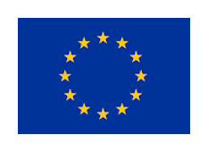

# Acknowledgements

The CyberRangeCZ Platform is a fork of the KYPO CRP software, a registered trademark of Masaryk University. We gratefully acknowledge the foundational work of the KYPO CRP team and its contributors.

## Relationship to KYPO CRP

*   **Origin:** This project, CyberRangeCZ Platform, is derived from the KYPO CRP software.
*   **Independence:** CyberRangeCZ Platform is an independent project and is not maintained by, endorsed by, or officially affiliated with the owners of the KYPO CRP trademark. We are responsible for all modifications and additions to the original codebase.
*   **Original License:** The original KYPO CRP software was released under the MIT License. A copy of the MIT License is included in the `LICENSE` file in the root directory.

## Funding Acknowledgements

### Original KYPO CRP Funding

|       |                           |
| ----------- | ------------------------------------ |
| {: style="display: block; margin: 0 auto; width: 82px; height: 60px;"} | This activity is supported by the [CONCORDIA project](https://www.muni.cz/en/research/projects/43025), which has received funding from the European Union's Horizon 2020 Research and Innovation program under Grant Agreement No 830927.  |
|  | This research is supported by the Security Research Programme of the Czech Republic 2015-2022 (BV III/1 - VS) granted by the Ministry of the Interior of the Czech Republic under No. [VI20202022158 – Research of New Technologies to Increase the Capabilities of Cybersecurity Experts](https://www.muni.cz/en/research/projects/48647). |
|  | This research was supported by the Security Research Programme of the Czech Republic 2015–2020 (BV III/1 – VS) granted by the Ministry of the Interior of the Czech Republic under No. [VI20162019014 – Simulation, detection, and mitigation of cyber threats endangering critical infrastructure](https://www.muni.cz/en/research/projects/31984). |
|  | This research was supported by the Security Research Programme of the Czech Republic 2010-2015 (BV III/1 – VS) granted by the Ministry of the Interior of the Czech Republic under No. [VG20132015103 – Cybernetic Proving Ground](https://www.muni.cz/en/research/projects/23884). |

## Honorable Mentions
These people helped us to make this open-source project more secure.

| Name                                                          | Company                                                                                                                                                                                                                                                                        |
|---------------------------------------------------------------|--------------------------------------------------------------------------------------------------------------------------------------------------------------------------------------------------------------------------------------------------------------------------------|
| [Xavier Marrugat](https://www.linkedin.com/in/xaviermarrugat) |  &nbsp;&nbsp;    i2CAT, member of the CIC4CYBER project development team for the Cybersecurity Agency of Catalonia |
