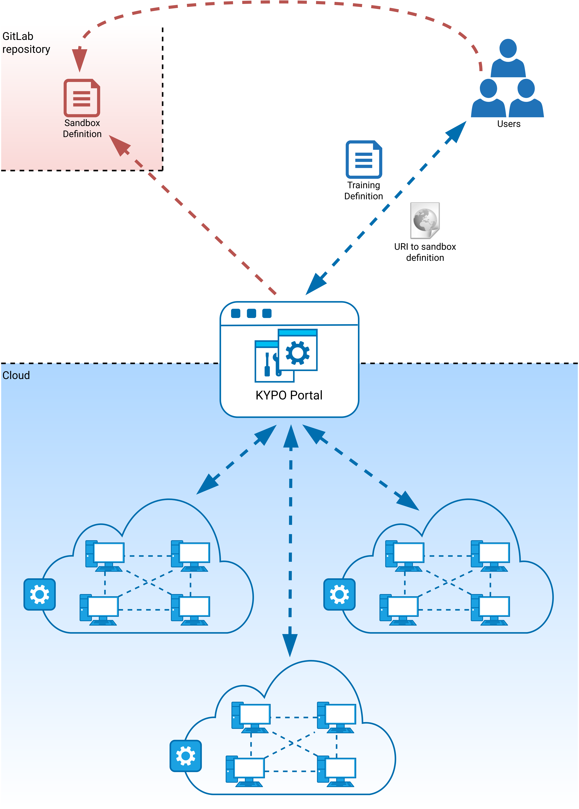

## Architecture
We have designed the KYPO cyber range as a cloud platform, which allows for achieving maximum flexibility, scalability, and cost-effectiveness. A lot of development effort has been dedicated to user interactions within KYPO CRP – that allows us to offer access through a web browser. The following conceptual architecture displays the key architectural constructs in the designed system.

### Cloud
The engine of our environment is based on the cloud platform OpenStack. It controls large pools of compute, storage, and networking resources, all managed through APIs or a dashboard. It is mostly deployed as infrastructure-as-a-service in both public and private clouds where virtual servers and other resources are made available to users.

### KYPO Portal
A graphical user interface for simple interaction of users with the KYPO CRP, easy access to sandboxes, and to the other functionalities. Represents the mediator between users and microservices that are running in the background. For more detailed information about microservices see [Platform Components](../../operation-guide/platform-components/). 

### GitLab repositories 
Repositories are used to store created sandbox definitions by users. Then they are loaded by respective microservice when needed to create a sandbox in the cloud. 

### Users  
Users have different roles with a different scope of work within KYPO CRP. They can create and manage trainings, manage other users and they are also responsible for designing sandboxes via sandbox definitions. 

## Workflow
To create a training, the following steps must be performed (also includes the creation of a sandbox). These steps are not necessary performed by a single user. Usually, they are divided among several users with [specified roles](../../operation-guide/users-and-groups/roles/).

!!! note
    It is assumed that a created KYPO CRP instance is connected to the OpenStack cloud service and through the respective microservice, it is able to create and manage sandboxes inside the cloud via available APIs.

1. Sandbox definition is created and stored as a GIT repository. 
2. Sandbox definition is created in the KYPO Portal by entering the URI to the respective GIT repository. 
3. A pool of sandboxes with a specified sandbox definition is created. 
4. Training definition is created independently on the sandboxes. 
5. Training instance is created based on an available training definition. 
6. Unlocked pool (specifically created for its training instance) is assigned to the training instance. 
7. Tokens are published to players. 
8. Players access training run using the obtained access token. 
9. The organizer of training instance is watching the progress of trainees and see their results. 
10. When the training instance is finished, the results of all players are available and ready for the next evaluation. 
