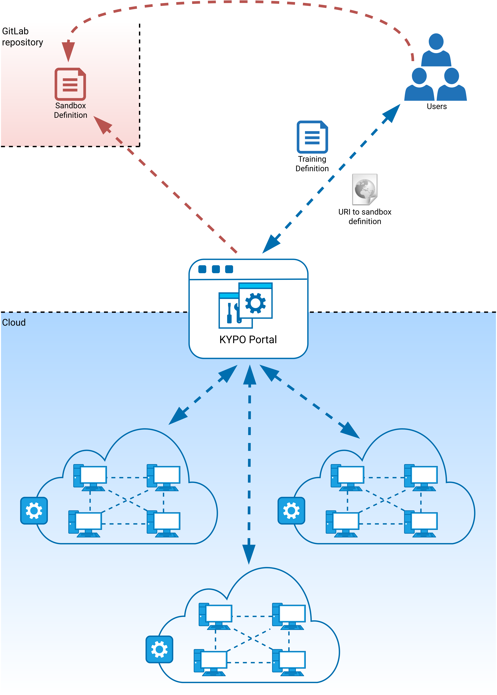

## Architecture
We have designed the KYPO cyber range as a cloud platform, which allows for achieving maximum flexibility, scalability, and cost-effectiveness. A lot of development effort has been dedicated to user interactions within KYPO CRP – that allows us to offer access through a web browser. The following conceptual architecture displays the key architectural constructs in the designed system.

### Cloud
The engine of our environment is based on the cloud platform OpenStack. It controls large pools of compute, storage, and networking resources, all managed through APIs or a dashboard. It is mostly deployed as infrastructure-as-a-service in both public and private clouds where virtual servers and other resources are made available to users.

### KYPO Portal
A graphical user interface for simple interaction of users with the KYPO CRP, easy access to sandboxes, and to the other functionalities. Represents the mediator between users and microservices that are running in the background. For more detailed information about microservices see [Platform Components](../../operation-guide/platform-components/). 

### GitLab repositories 
Repositories are used to store created sandbox definitions by users. Then they are loaded by respective microservice when needed to create a sandbox in the cloud. 

### Users  
Users have different roles with a different scope of work within KYPO CRP. They can create and manage trainings, manage other users and they are also responsible for designing sandboxes via sandbox definitions. 

