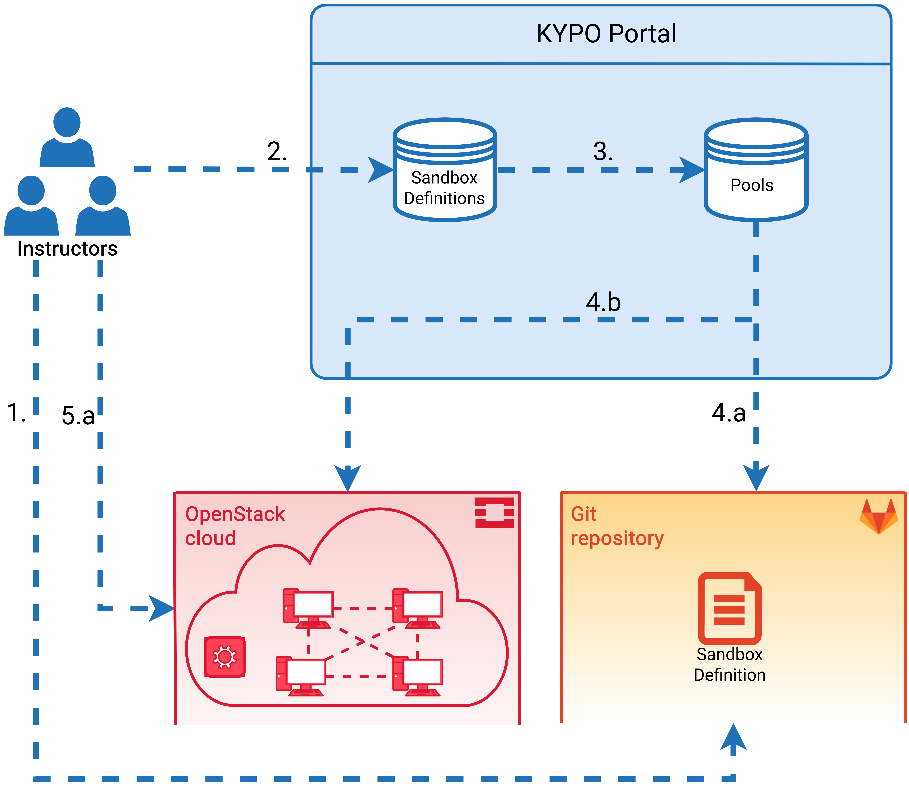

Before starting a training run, several steps must be performed. These steps are not necessarily performed by a single user and they are usually divided among several users with an [instructore role](../../operation-guide/users-and-groups/roles/). The whole workflow of creating training is divided into two parts, as it also includes the creation of the sandboxes. 

1. [Creating sandboxes](#sandboxes-creation)
2. [Creating training](#training-creation)

!!! note
    It is assumed that a created KYPO CRP instance is connected to the OpenStack cloud service and through the respective microservice, it is able to create and manage sandboxes inside the cloud via available APIs.

### Sandboxes creation
1. A sandbox definition is created by instructors according to this [format](../../operation-guide/sandboxes/sandbox-definition) and stored as a GIT repository. 
2. In the KYPO Portal, a record about the sandbox definition is created via the [Sandbox definition page](../../user-guide/sandbox-agenda/sandbox-definition/) by entering the URI to the respective GIT repository from the previous step.
3. From the sandbox definition created in the KYPO Portal, a pool with a specified size can be created by following these [steps](../../user-guide/sandbox-agenda/pool/#create-pool). 
4. Sandboxes in the cloud are allocated by clicking the allocation button of the respective pool. Two actions are automatically performed:
    1. The respective sandbox definition is downloaded from the GIT repository, parsed, and processed. 
    2. Sandboxes are created in the cloud according to the sandbox definition. 

### Training creation
1. Training definition can be created via the [Create Training Definition](../../user-guide/training-agenda/training-definition/#add-a-new-definition) page independently on the sandbox definition.
2. Training instance can be created via the [Create/Edit Training Instance](../../user-guide/training-agenda/training-instance/#createedit-training-instance) page. One of the required fields is the selection of the available training definition. 
3. An unlocked pool of sandboxes is assigned to the training instance in the second panel [Assign Pool](../../user-guide/training-agenda/training-instance/#2-assign-pool) when editing Training Instance.

!!! warning
    Sandboxes in the assigned pool must be created according to the sandbox definition which is created in accordance with the training definition. 

4. Each training instance has partialy a generated access token which is published to trainees so they can access [Training runs](../../user-guide/training-agenda/training-run/#training-run). 
5. Trainees [access Training Run](../../user-guide/training-agenda/training-run/#1-access-training) using the obtained access token. Trainees can resume their accessed training runs if the training instance is still active.
5. Each training run has assigned a specific sandbox and trainees can access machines in this sandbox using a Spice console.
6. An organizer of training instance can watch a real-time progress of trainees and can see their [training run results](../../user-guide/training-agenda/training-run/#training-run-results) during the game. 

When the training instance is finished, the [results](../../user-guide/training-agenda/training-instance/#results-of-training-instance) are available and ready to be downloaded for the next evaluation.
