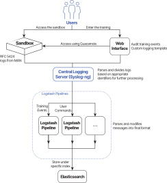

# CyberRangeCZ Platform Logging Architecture Overview
In the CyberRangeCZ Platform project, we design the architecture for logging using the **Syslog-ng**, **Rsyslog**, **Elasticsearch**, and **Logstash** technologies. These technologies were integrated into the **CyberRangeCZ Platform** using the **Java Logback**, **Ansible** roles, and many others. In this documentation, we show the overall architecture and its internals.

## Overall Architecture
Our logging architecture is based on the  [`RFC5424`](https://tools.ietf.org/html/rfc5424). The benefit of RFC5424 logs is that it includes structured data and defines a specific format that can be automatically parsed by Syslog-ng or other central logging server technologies. Using this specification, we do not need any regular expressions to distinguish between different logs (e.g., **bash commands**, **msf commands** or others). We also do not need any regular expressions to parse the message events.

The overall architecture is shown in the following figure:

In this architecture, the logs are forwarded from hosts or any other sandbox components to MAN. This is done using Rsyslog implementation that defines the template representing the RFC5424 structure, including Structured Data for meta-data fields as **pool_id**, **sandbox_id**, etc. In the case of local deployment, the logs from sandboxes are stored on MAN. In the case of server deployment, the logs are further redirected to the central logging server using Syslog-ng without any modification. At the CyberRangeCZ Platform central logging server, the logs are parsed based on the **programname**, and further sent to the particular Logstash pipeline (based on the programname). In the particular Logstash pipeline, the data are transformed into the final form and further sent to Elasticsearch instance under specific **index**, e.g., **crczp.logs.console.${programname}.pool=XYZ.sandbox=XYZ** where **${programname}** is, e.g., in the case of bash commands bash.command (the Elasticsearch index have to be in lowercase).
