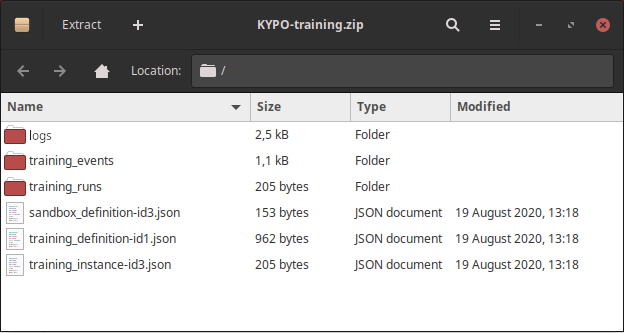

## Enable command logging
Command logging is enabled on host VMs by using a number of Ansible roles. If the organizer wants to log terminal commands, these roles must be added to the playbook of the sandbox definition. (More about sandbox definition creation: [Sandbox definition creation process](../../../user-guide/sandbox-agenda/sandbox-definition/#create-sandbox-definition))

* **Bash command logging** can be enabled by using the [KYPO Sandbox Logging Commands](https://gitlab.ics.muni.cz/kypo-crp/useful-ansible-roles/kypo-sandbox-logging-bash) Ansible role. 

* **Metasploit framework command logging** can be enabled by using the [KYPO Sandbox Logging Msfconsole Commands](https://gitlab.ics.muni.cz/kypo-crp/useful-ansible-roles/kypo-sandbox-logging-msf) Ansible role.

!!! warning
    To forward logs from `host` VM to the `MAN` the [KYPO Sandbox Forward to MAN](https://gitlab.ics.muni.cz/kypo-crp/useful-ansible-roles/kypo-sandbox-logging-forward) Ansible role must be enabled with any combination of before mentioned roles. If this role is not added to the sandbox definition, logged data will **not** be accessible.

## Accessing logged data
The training organizer can access all logged data (training events or commands) by exporting the training instance in the [Training Instance Overview](../../../user-guide/training-agenda/training-instance#training-instance-overview). All data can be found in the exported archive in the corresponding files stored in the JSON format. 




## Local deployment with vagrant

If you are using the local  vagrant deployment configuration from the [kypo-crp-local-demo](url) project and want to access logged data via the [Training Instance Overview](../../../user-guide/training-agenda/training-instance#training-instance-overview), you need to additionally set up the forwarding from `MAN` to your local machine. To manually set up this forwarding follow these steps. 

**1. Create new port forwarding rule in VirtualBox Manager:**
   
Open the VirtualBox Manager and in the `Advanced Network settings` of your KYPO VM session click on the **Port Forwarding** button:


In the `Port Forwarding Rules` create a new rule for log forwarding with `Guest IP` of `172.19.0.22`, `Guest Port` of `515`, and with any `Host port`, e.g. `8015`. For example the `Log Forwarding` rule:

 
 
**2. Set the KYPO Head IP for sandbox service:**

Open the [kypo-sandbox-service-config.yml](https://gitlab.ics.muni.cz/kypo-crp/prototypes-and-examples/kypo-crp-local-demo/-/blob/master/docker-config-files/kypo-sandbox-service-config.yml) file (located in the `/vagrant/configuration/sandbox-service/kypo-sandbox-service-config.yml`) and under the `application_configuration` uncomment and set the `kypo_head_ip` to the IP address of your local machine. 

!!! note 
    If you don't uncomment the `kypo_head_ip` attribute all logs will be stored on the **MAN** in the `/data/idm-logs/man.log` file. 

!!! note
    You can check if your data are getting into the ELK infrastructure by using the following command inside the `elasticsearch` docker container to list all data stored in the Elasticsearch:
    ```
    curl -XGET "http://localhost:9200/kypo*/_search?pretty=true"
    ```

**3. Start the KYPO platform:**

After the `kypo-sandbox-service-config.yml` is updated you can start the KYPO platform (if platform is already running you must restart it) using the following command in `/vagrant` directory:
```
docker-compose up
```

**4. Update syslog-ng configuration in the MAN:** 

After you have build your sandbox you need to change the forwarding of the syslog-ng in the MAN. Access the MAN via ssh (How to access MAN: [Sandbox SSH Access](../../../operator-guide/sandboxes/sandbox-ssh-access)). When you are in the MAN open the syslog-ng log forwarding configuration:
```
sudo vim /etc/syslog-ng/conf.d/forward-rfc5424-messages.conf
```

Here in the `destination d_kypo_head` section change the `port(515)` to the Host port you set in the VirtualBox Manager in the first step and save your changes. Following example from the first step your configuration should look like this (with exception in IP address which should be the one you set in second step):
```
# EVENTS Log Source
source s_host {
    network(
       ip(0.0.0.0) 
       port(514) 
       transport(tcp)
       flags(syslog-protocol)
    );
};

destination d_kypo_head {
    network(
        "147.251.69.18"
        port(8015)
        transport(tcp)
        ip-protocol(4)
        flags(syslog-protocol)
    );
};

# EVENTS Log Pairing
log {source(s_host); destination(d_kypo_head);};
```

**5. Restart the syslog-ng service on MAN:**

As the last step you need to the restart syslog-ng service on the MAN by using the following command:

```
sudo systemctl restart syslog-ng.service 
```

!!! note
    Wait a few seconds until the syslog-ng restarts.
