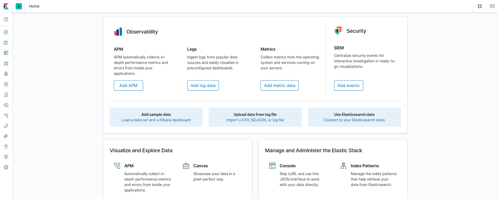

The KYPO platform doesn’t contain full ELK Stack (Kibana is missing), and thus it isn’t possible to visualize raw data right from Elasticsearch. We are providing you with a workaround for running ELK Stack locally and visualizing exported data using Kibana.

1. Clone repository [elk-portal-commands-events](https://gitlab.fi.muni.cz/cybersec/elk-la/elk-portal-commands-events).
2. Run ELK by following the instructions in the [README](https://gitlab.fi.muni.cz/cybersec/elk-la/elk-portal-commands-events/-/blob/master/README.md) file of the repository. 
3. Download training instance results from the [Training Instance Overview](../../user-guide-basic/training-agenda/training-instance.md#training-instance-overview).
4. Go to the **elk-portal-commands-events** folder and insert the data to your local Elasticsearch instance using the command: 
```
./insert-events.sh <PATH-TO-DOWNLOADED-TRAINING-INSTANCE-RESULTS>
```
5. Visit Kibana UI on the page `http://localhost:5601/`. You should see page like this:
   


