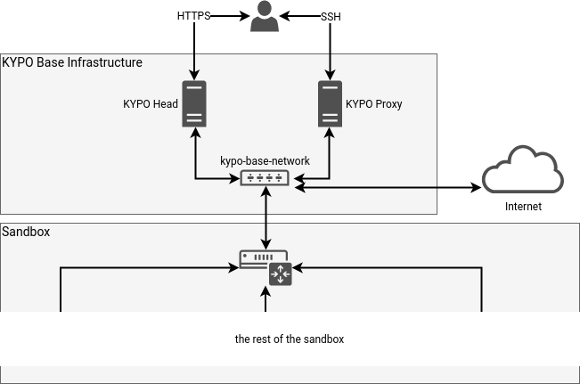

# Overview

!!! note
    If you want to deploy KYPO CRP as a proof of concept to verify its usability for your project or create Training definitions for KYPO CRP, consider using [KYPO lite](https://gitlab.ics.muni.cz/muni-kypo-crp/devops/kypo-lite) deployment tool for easy zero-configuration deployment.

This guide contains the steps that are needed to prepare the KYPO Cyber Range Platform (KYPO CRP) for cyber exercises and the creation of emulated virtual environments.

Before the deployment, check the [OpenStack Requirements](openstack-requirements.md) section, which describes the requirements for the OpenStack cloud platform to be supported by KYPO CRP.

If you meet the OpenStack Requirements follow with setting up the [Deployment Environment](https://gitlab.ics.muni.cz/muni-kypo-crp/devops/kypo-crp-tf-deployment#preparing-the-deployment-environment).

The deployment process is divided into 2 major sections:

* [Deployment of OpenStack base resources](https://gitlab.ics.muni.cz/muni-kypo-crp/devops/kypo-crp-tf-deployment/-/blob/master/BASE.md) contains steps that will help you to create all the necessary objects within the OpenStack cloud platform for the KYPO CRP to run. It deploys these resources:
    * **KYPO Kubernetes Cluster node**: The server running Kubernetes Controller & Worker services hosting the KYPO CRP head services.
    * **KYPO Proxy**: The server used only for SSH access to all sandboxes.
    * **KYPO Base Network**: The network where both servers and all sandboxes are connected.
    * **KYPO Security Groups**: The firewall rules for all KYPO CRP instances.
    * **KYPO Images**: The OpenStack images necessary for KYPO CRP to work.
    * Optionally **KYPO Flavors**:  The OpenStack flavors necessary for KYPO CRP to work. Only for OpenStack deployments with administrator credentials.

    

* [Deployment of KYPO-CRP Helm application](https://gitlab.ics.muni.cz/muni-kypo-crp/devops/kypo-crp-tf-deployment/-/blob/master/HELM.md) contains steps that will help you create configuration files and deploy KYPO CRP with Helm to the KYPO Kubernetes Cluster node in the OpenStack cloud platform.
