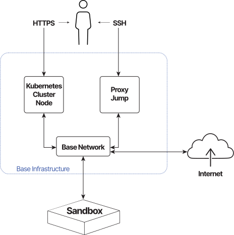

# Overview

!!! note
    If you want to deploy CyberRangeCZ Platform as a proof of concept to verify its usability for your project or create Training definitions for CyberRangeCZ Platform, consider using [CRCZP lite](https://github.com/cyberrangecz/devops-crczp-lite) deployment tool for easy zero-configuration deployment.

This guide contains the steps that are needed to prepare the CyberRangeCZ Platform for cyber exercises and the creation of emulated virtual environments.

Before the deployment, check the [OpenStack Requirements](openstack-requirements.md) section, which describes the requirements for the OpenStack cloud platform to be supported by CyberRangeCZ Platform.

If you meet the OpenStack Requirements follow with setting up the [Deployment Environment](https://github.com/cyberrangecz/devops-tf-deployment?tab=readme-ov-file#preparing-the-deployment-environment).

The deployment process is divided into 2 major sections:

* [Deployment of OpenStack base resources](https://github.com/cyberrangecz/devops-tf-deployment/blob/master/BASE.md) contains steps that will help you to create all the necessary objects within the OpenStack cloud platform for the CyberRangeCZ Platform to run. It deploys these resources:
    * **Kubernetes Cluster node**: The server running Kubernetes Controller & Worker services hosting the Head services.
    * **Proxy Jump**: The server used only for SSH access to all sandboxes.
    * **Base Network**: The network where both servers and all sandboxes are connected.
    * **Security Groups**: The firewall rules for all CyberRangeCZ Platform instances.
    * **CyberRangeCZ Platform Images**: The OpenStack images necessary for CyberRangeCZ Platform to work.
    * Optionally **Flavors**:  The OpenStack flavors necessary for CyberRangeCZ Platform to work. Only for OpenStack deployments with administrator credentials.

    

* [Deployment of Helm application](https://github.com/cyberrangecz/devops-tf-deployment/blob/master/HELM.md) contains steps that will help you create configuration files and deploy CyberRangeCZ Platform with Helm to the Kubernetes Cluster node in the OpenStack cloud platform.
