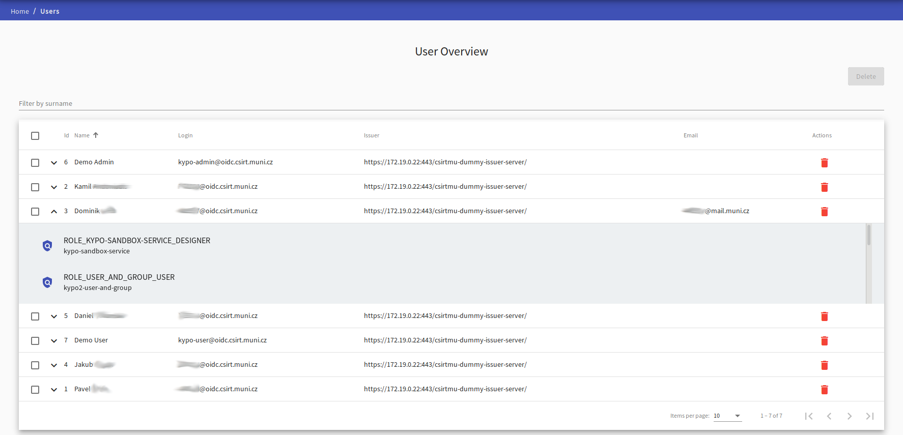
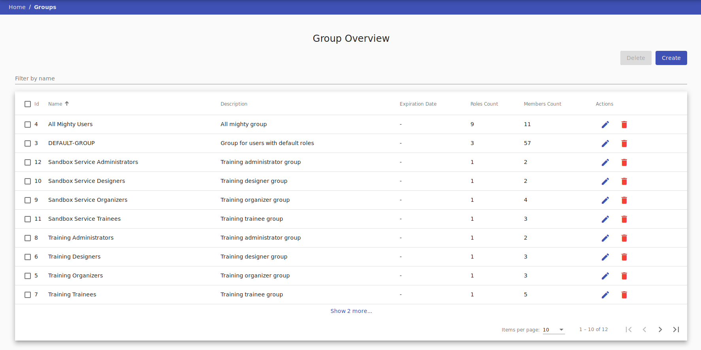
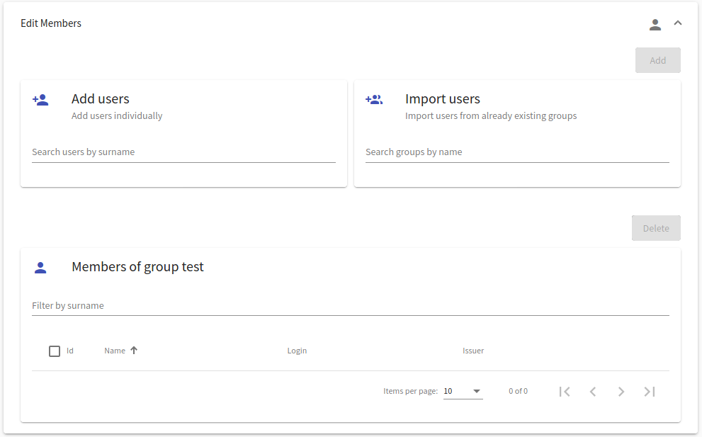
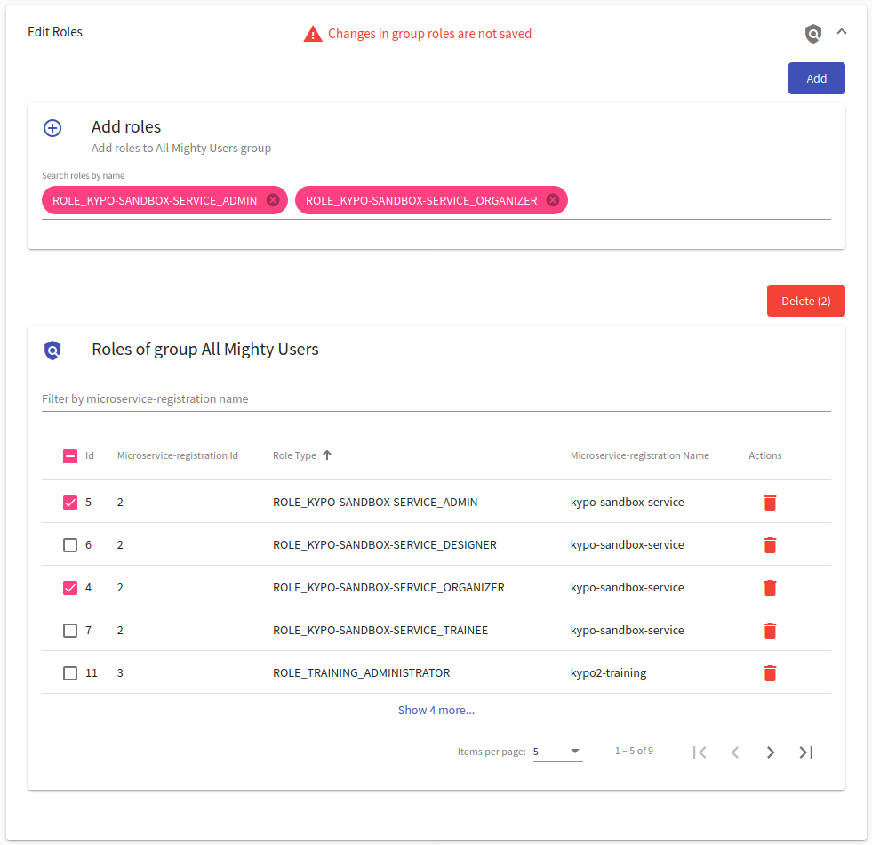
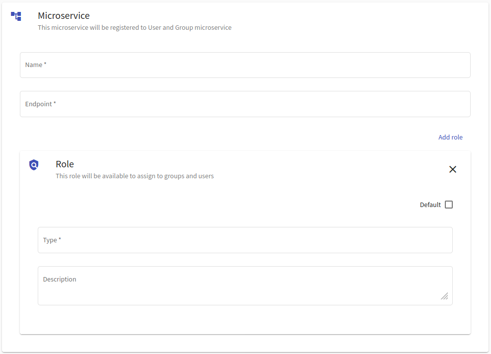

# Administration 
That administration agenda is available only for KYPO portal users with the role `ROLE_USER_AND_GROUP_ADMINISTRATOR`. This agenda is used for assigning roles (e.g. designer, organizer or administrator) to the other users to be able to work in the KYPO portal as expected. By default, all the logged-in users are assigned to `DEFAULT-GROUP` that contains all the basic roles that are essential to play a game (for that reason it is not required to do some extra step for students that enroll to the class for playing a game in KYPO portal).

An administrator can access one of the following pages: 

* [User Overview](#user-overview), 
* [Group Overview](#group-overview),
* [Microservice Registration](#microservice-registration), 

by clicking particular button on the front page of KYPO Portal:

  

or by clicking button in the left panel in the section Administration: 

  

## User Overview 
The page is used to list all users that had logged into the KYPO platform using arbitrary OIDC Provider (MUNI, KYPO, ...). An administrator can view their roles by clicking expand button :material-chevron-down:{: .grey .icon } (next to the name of the user) which expands the row with the list of roles of a particular user. One user can be deleted by clicking on delete button :material-delete:{: .red .icon } or multiple users can be deleted by checking users with checkboxes situated on the left side of the row and clicking the  button.  

## Group Overview 
The page is used to list all groups created in the KYPO platform. Groups are important because roles are not assigned to users but to groups. The user acquires access to the KYPO portal based on the roles of the groups they belong to.

 

To create a new group, the administrator must click on  button that redirects him to the page [Create Group](#createedit-group). A group that already exists can be edited by clicking on  button that redirects administrator to page [Edit Group](#createedit-group). One group can be deleted by clicking on :material-delete:{: .red .icon } button or multiple groups can be deleted by checking groups with checkboxes situated on the left side of the row and by clicking on  button.  

### Create or Edit Group

The page consists of three panels:

[1. Create/Edit Group](#1-createedit-group) 
[2. Edit members](#2-edit-members) 
[3. Edit roles](#3-edit-roles)

During the creation of a group, the second and third panels are disabled. To make them accessible, the administrator must fill the required fields in the first panel and either click on: 
1.  that will create the new group and redirect the administrator back to Group Overview.  
2.  that will stay on the page and allow the administrator to edit **members** and **roles** of the group.

#### 1. Create/Edit Group
Here, administrator is required to provide a `Name` and `Description` for a new group, and optionally `Expiration Date`. The `Expiration Date` field is useful in the cases when the administrator will create a group of designers, e.g., for a particular semester. After filling up all the necessary fields, click on the  button to save the group. Then panels `Edit members` and `Edit roles` will be rolled down. 

#### 2. Edit members
Here the administrator can add users individually or can import all users from the group. The part `Add users` provide an easy way to search for users whose administrator would like to add to the group. Administrator can also add all users from the specific group in the part `Import users`. Click on the `Add` button to add picked up all users to the group. All users will be added to the group and will be present in the list in the part `Members of group`. A user or multiple users can be removed via the common way mentioned before.

#### 3. Edit roles 
Here the administrator can assign roles to the group. The part `Add roles` provide an easy way to search for roles which the administrator would like to assign to the group. Click on the `Add` button to assign all picked up role to the group. Assigned users will be present in the list in the part `Roles of group`. A role or multiple roles can be removed via the common way mentioned before.

## Microservice Registration
This page is used to register a new microservice which is then used in the background of the platform. The recommended way is to import the [kypo2-security-commons library](https://gitlab.ics.muni.cz/kypo-crp/backend-java/kypo2-security-commons) into service and register microservice during startup.

