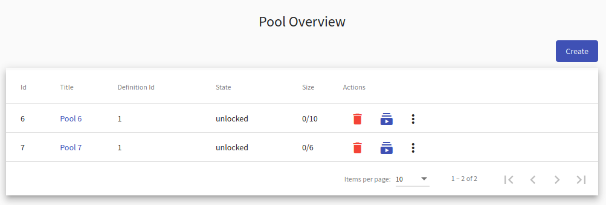
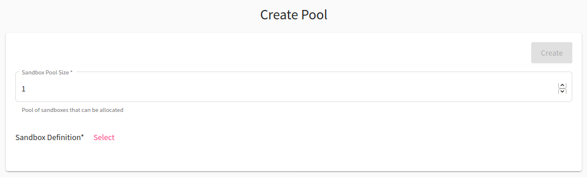
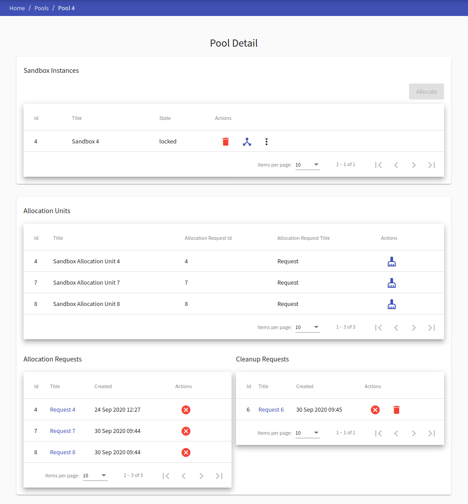
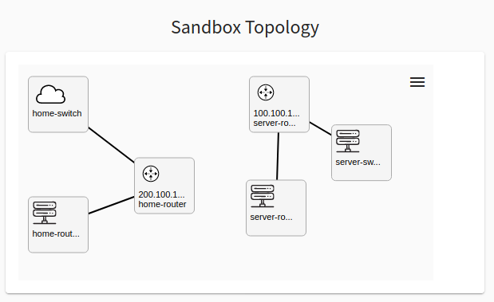
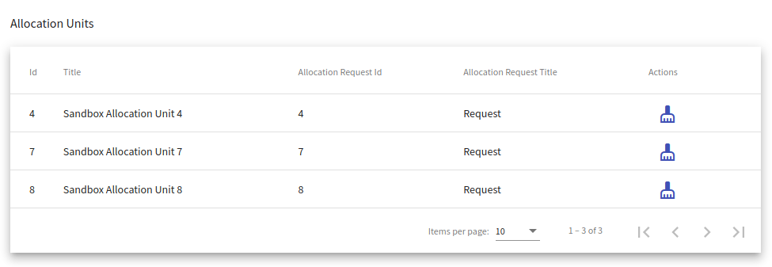
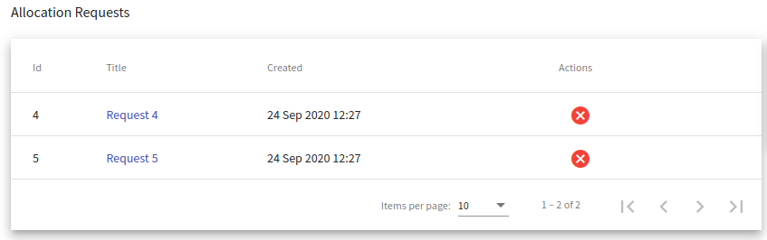
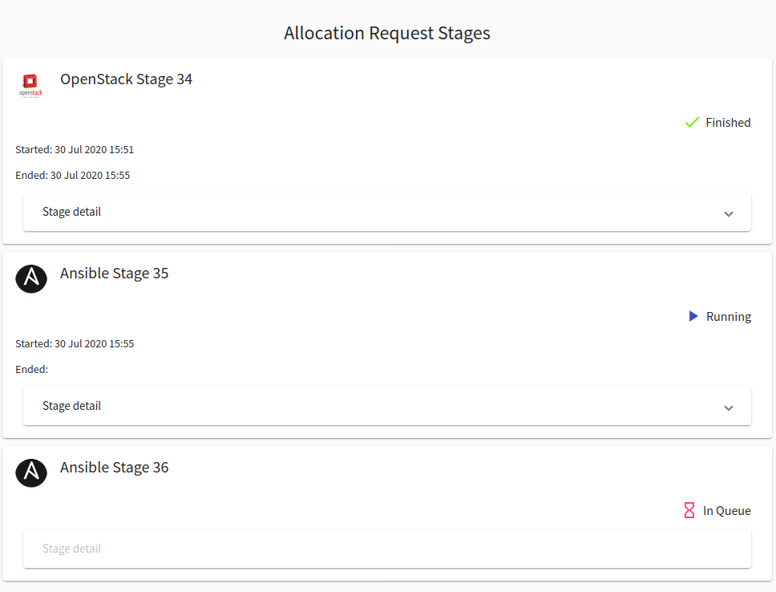
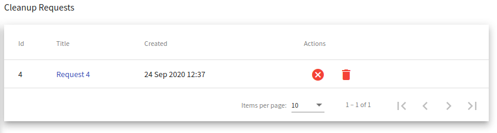

# Pool
A user with the role `ROLE_KYPO-SANDBOX-SERVICE_ORGANIZER` uses sandbox agenda to create and manage so-called sandbox pools. Pools are groups of sandbox instances created according to the sandbox definition associated with the pool. The process of creation of sandboxes in the pool is called allocation. An organizer can access the [Pool Overview](#pool-overview) by clicking on the **Pool** button on the front page of KYPO Portal:

  

## Pool Overview

Pool Overview displays a list of all pools that are accessible in the KYPO portal. In the following table, each row represents one pool. 

Organizers can click on the title of each pool to see a more [detailed view](#pool-detail) of the given pool. The last column of this table contains [actions](#actions) :material-delete:{: .red .icon} &nbsp; :material-youtube-subscription:{: .blue .icon} &nbsp; :material-dots-vertical:{: .grey .icon}  that can be executed on the given pool: 

??? trash-can "Delete"
    If the organizer clicks the delete button, following confirmation window will be opened:

    

    After confirming, the given pool will be deleted from the KYPO portal.

    !!! info
        Pools that are **locked** or **not empty** cannot be deleted.

??? allocate-all "Allocate all"
    If the organizer clicks the **allocate all** button, the allocations of all missing sandboxes will start.

    !!! info 
        More about allocation in the [pool detail](#pool-detail) section. 

??? plus-one "Allocate one"
    If the organizer clicks the **allocate one** button, the allocations of one new sandbox will start.

    !!! info 
        More about allocation in the [pool detail](#pool-detail).

??? clear-all "Clear"
    If the organizer clicks the **clear** button, all allocation requests and sandboxes will be deleted from the given pool.

    !!! info
        All sandboxes must be unlocked and all allocation requests must be finished/stopped.   

??? download "Download"
    If the organizer clicks the **download** button, pop up will be displayed to download ZIP archive. Archive contains configuration with SSH access to particular sandbox. More about SSH access can be found [here](../../sandboxes/sandbox-ssh-access).

    !!! info
        All sandboxes must be unlocked and all allocation requests must be finished/stopped. 

??? lock "Lock"
    If the organizer clicks one the **lock** button, the state of the given pool changes from **unlocked** to **locked**. The lock symbolizes that pool is in use with some training instance.

??? unlock "Unlock"
    If the organizer clicks one the **unlock** button, the state of the given pool changes from **locked** to **unlocked**. Unlock symbolizes that pool is not in use with any training instance.   

!!! Note
    Actions 3. - 6. can be accessed in the menu shown after clicking on the **more options** button :material-dots-vertical:{: .grey .icon}.

 To create a new pool, click on the  button. The organizer will be redirected to page [Create Pool](#create-pool).

## Create Pool
The page contains a short form that needs to be filled out before creating a new pool. The field **Sandbox Pool Size** specifies the number of created sandboxes. The organizer also must select one of the available [sandbox definitions](./sandbox-definition.md) created by the sandbox designer. Sandbox definitions define the topology of sandboxes and user configuration of virtual machines created in a sandbox. After filling out all the fields, confirm the creation of a new pool by clicking on the  button.
 

## Pool detail
When the organizer clicks the title of a given pool in **Pool overview** he will be redirected to the **Pool detail** page:
  

This page consist of 4 tables: 

1. [Sandbox Instances](1-sandbox-instances)
2. [Allocation Units](2-allocation-units)
3. [Allocation Requests](3-allocation-requests)
4. [Cleanup Requests](4-cleanup-requests)

In the top right corner, there is a  button that can be used to start the allocation of all missing sandboxes in the pool.

### 1. Sandbox Instances

The organizer can see all of the allocated sandboxes in the **Sandbox Instances** table. In the **Actions** column of the table there are buttons :material-delete:{: .red .icon} &nbsp; :bootstrap-topology:{: .blue .icon} &nbsp; :material-dots-vertical:{: .grey .icon}. These buttons represent actions that can be executed on the given sandbox:

??? trash-can "Delete"
    If the organizer clicks the delete button, following confirmation window will be opened:

    

    After the confirmation, new [cleanup request](#3-cleanup-requests) for a given sandbox instance will be created.

    !!! info 
        Only unlocked sandboxes can be deleted.

??? topology "Display topology"
    If the organizer clicks the display topology button, they will be redirected to page with the virtual network topology of the given sandbox:

    

??? lock "Lock"
    If the organizer clicks the **lock** button, he can change the state of sandbox instance from **unlocked** to **locked**. Lock symbolizes that the sandbox instance is connected to a training run. 

??? unlock "Unlock"
    If the organizer clicks the **more options** button :material-dots-vertical:{: .grey .icon} button and then the **unlock** button, he can change the state of sandbox instance from **locked** to **unlocked**. Unlock symbolizes that the sandbox instance can be connected to a training run. 

!!! Note
    Actions lock and unlock can be accessed in the menu shown after clicking on the **more options** button :material-dots-vertical:{: .grey .icon} and only one of these actions is always available, depending on the current state of the sandbox.

### 2. Allocation Units

Each sandbox that is allocating or has been allocated is tied with the allocation unit. It is the object which manages allocation requests and cleanup requests. Sandbox whose at least one stage of allocation request fails cannot be used. In this case allocation request must be canceled and then allocation unit deleted using the **create cleanup request** button :bootstrap-cleaning-services:{: .blue .icon} in column **Actions**. If the allocation request is not canceled, the allocation unit cannot be deleted. In case that all stages of the allocation request are finished, **create cleanup request** button works the same as the delete button in the Sandbox Instances table. 

### 3. Allocation Requests

In the **Allocation Requests** table, the organizer can see all allocation requests. In the **Actions** column there is **cancel** button :material-close-circle:{: .red .icon }. If the organizer clicks this button, the ongoing allocation will be canceled and a given sandbox will not be allocated. 

!!! note
    Canceled finished allocation request will invalidate the created sandbox, so it cannot be used.  

To gain access to the stage details of allocation the organizer can click the title of a given request. This will redirect him to the **Request-detail** page:
 

!!! note
    Organizer can click **Stage detail** button to see the details of given stage.

### 4. Cleanup Requests

In the **Cleanup Requests** table, the organizer can see all cleanup requests. With the completion of cleanup requests the associated **sandbox instance**, **allocation request** and **allocation unit** are deleted from the KYPO portal. In the **Actions** column there are two buttons :material-close-circle:{: .red .icon } &nbsp; :material-delete:{: .red .icon }:

??? cancel "Cancel request"
    If the organizer clicks the **cancel** button, the ongoing cleanup request will be canceled and a given sandbox won't be removed.

??? trash-can "Delete request"
    If the organizer clicks the **delete** button, the cleanup request will be deleted.
