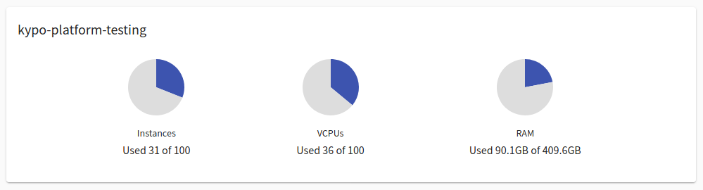
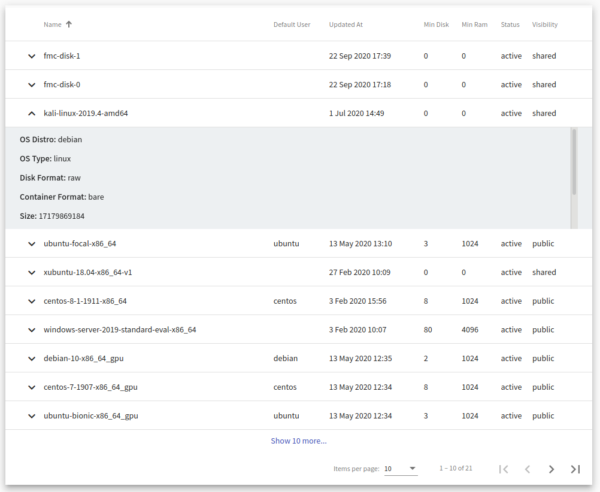

# Resources
A user with the role `ROLE_KYPO-SANDBOX-SERVICE_ORGANIZER` can see resources that are available in cloud service. An organizer can access the [Resources Overview](#pool-overview) by clicking on the **Resources** button on the front page of KYPO Portal:

  

or by clicking **Resources** button in the left panel in the section Sandboxes: 

  

## Resources Overview

Resources Overview consist of two panels:

### 1. Usage statistics of cloud server
* **kypo-platform-testing** -- the name of a cloud server,
* **Instances** -- created VMs in cloud server,
* **VCPUs** -- virtual CPUs currently in use by all instances,
* **RAM** -- the amount of the main memory currently in use by all instances.

### 2. Overview of OS images
Provides a list of available OS images that can be installed on VMs. Each row contains the following values of image parameters:

* **Name** -- the unique name of the OS image.
* **Default User** -- user used to login to VM, or connect via SSH.
* **Updated At** -- last time image was updated.
* **Min Disk** -- minimum amount of disk memory to boot image, in gigabytes.
* **Min Ram** -- minimum amount of main memory to boot image, in megabytes.
* **Status**
* **Visibility** -- public, private, community, shared.

Click extend button :material-chevron-down:{: .icon .grey} to show **detailed information** about image: 

* **OS Distro** -- common name of operating system distribution.
* **OS Type** -- linux or windows.
* **Disk Format** -- format of the underlying disk image, specifies how the VM disk image stores information.
* **Container Format** -- indicates whether image also contains metadata about VM (bare = no metadata).
* **Size** -- the size of the image, in bytes.
* **Created At** -- time of the creation.
* **Tags** -- used to filter images.

