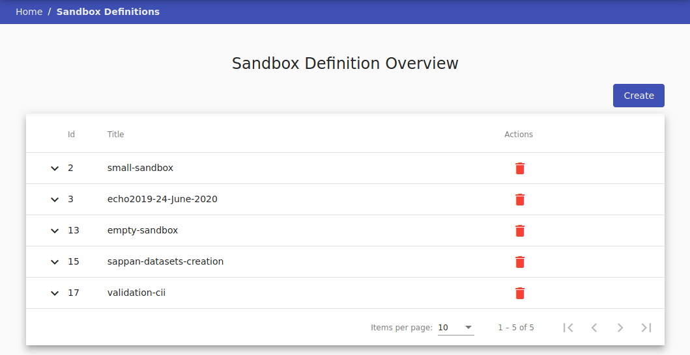

# Sandbox Definitions 
A user with role `ROLE_KYPO-SANDBOX-SERVICE_DESIGNER` is responsible for creating sandbox definitions that are used to allocate sandboxes in the cloud. Designer has available the button **Sandbox Definition** on the front page in the Sandboxes agenda, which will redirect him to the page [Sandbox Definition Overview](#Sandbox Definition Overview). 

  

## Sandbox Definition Overview
The designer uses this page to lists all sandbox definitions that can be used by sandbox organizers to create a pool of sandboxes for training instances. The page consists of a table where each row represents one sandbox definition. Click the expand button :material-chevron-down:{: .icon} to show detailed info about sandbox definition. The definition that is not assigned to any pool can be deleted using the delete button :material-delete:{: .red .icon }. A new sandbox definition can be added by clicking on  button that redirects the designer to the [Create Sandbox Definition](#create-sandbox-definition) page. 

 

## Create Sandbox Definition
To create a sandbox, it needs to be somehow described what it should look like. So first, the sandbox definition needs to be created. It contains every information needed to create a sandbox instance in a cloud. In the current version, the sandbox definition is created outside the KYPO platform and then stored as the GIT repository. The process of creation is described [here](../../sandboxes/sandbox-definition.md). 

So the page in KYPO portal contains only one panel with two required fields: 

* **GitLab URL** - git clone SSH URL of sandbox definition, 
* **Revision** - a revision parameter typically, but not necessarily, names a commit object (mostly master).

If these fields are correct, a new sandbox definition is created by clicking  button. 

