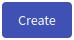

# Training Instance
Users with the role `ROLE_TRAINING_ORGANIZER` can use the training agenda to create and manage training instances. An organizer can access the page [Training Instance Overview](#training-instance-overview) by clicking **Training Instance** button on the front page of KYPO Portal:

  

or by clicking **Instance** button in the left panel in the section Trainings: 

  

## Training Instance Overview
An organizer use **Training Instance Overview** page to lists all training instances that are available to him (ones that the given organizer created or is a co-author of). 

  

On this page, the organizer can do the following actions:
1. Click  or :material-pencil:{: .blue .icon} button to redirect to the page [Create/Edit Training Instance](#create/edit-training-instance).
2. Click on the name of the training instance to redirect to the [Summary of Training Instance](#summary-of-training-instance) page.
3. Click the name of the pool (if training instance has assigned pool) to redirect to the page with pool detail). 
4. Click the access token to redirect to the page where the access token is displayed and is easily copyable. 
5. Click :material-delete:{: .red .icon} button to delete training instance.
6. Click :material-dots-vertical:{: .grey .icon} and then click :material-download:{: .grey .icon} button to download the results of the training instance. 

## Create/Edit Training Instance 
The page consists of three panels: 

[1. Create/Edit Training Instance](#1-createedit-training-instance)
[2. Assign pool](#2-assign-pool) 
[3. Edit Organizers](#3-edit-organizers) 

During the creation of training instance, the second and third panels are disabled. To make them accessible, the organizer must fill the required fields in the first panel and either click: 
1.  that will create the new training instance and redirect organizer back to Training Instance Overview. 
2.  that will allow the organizer to edit **co-organizers** and assing **pools** to instance.

  

### 1. Create/Edit Training Instance 
An organizer can use this panel to edit basic information about the training instance. The title is used to identify training instance among others but doesn't have to be unique. The start time and end time defines the time frame when trainees can access training run of the appropriate training instance. Both time values must be in the future and start time must be before the end time. The access token is used by the trainees to access a game. The organizer must also choose a Training Definition, but he can only choose from:

* Released training definitions + definitions created by the organizer, if he has also the designer role. 
* All definitions (released/unreleased), if he has the administrator role. 

### 2. Assign pool 
An organizer can use this panel to assign a pool with sandboxes to the training instance. The organizer chooses from the list of [pools](../sandboxes/pool.md) created by sandbox organizer. It is necessary to properly choose the pool. A locked pool cannot be assigned to the training instance.

### 3. Edit Organizers 
Allows the organizer to add other organizers to participate in managing training instances. Those organizers have the same rights against the training instance as the author, e.g. co-organizers can edit training instance or see the progress of trainees and results of training instance.

## Summary of Training Instance 
Provides a summary of the entire run of the training instance and allows the organizers to see the state of training runs and perform certain actions.
The page consists of three panels: 

[1. Overview](#1-overview) 
[2. Active Training Runs](#2-active-training-runs) 
[3. Archived Training Runs](#3-archived-training-runs)

  

### 1. Overview
Displays basic information about training instance as shown in the figure. Provides links to display token and link to the detail of the assigned pool. Click on  button to redirect to the [Progress of Training Instance](#progress-of-training-instance) page to see the game progress of participants in time. Click on another button  to redirect to the [Results of Training Instance](#results-of-training-instance)  page to see summary results of training instance visualized on various graphs and in tables. 

### 2. Active Training Runs
Lists active training runs. They are either in the running state or finished state (trainee completed all levels).   All active training runs have assigned sandboxes from the pool. The organizer is able to delete the assigned sandbox from OpenStack by clicking :material-delete:{: .red .icon}. Be careful when deleting the sandbox from a training run in the running state. The trainee won`t to be able to complete the remaining levels. Those training runs should be archived after that, so trainees could not resume training run. 

Button to archive training run cause, that the state of a training run is changed to archived, reference to sandbox is removed and the training run is displayed among archived training runs.  

### 3. Archived Training Runs 
Lists training runs whose references to sandboxes in OpenStack were removed and their state has been changed to archived. 

## Progress of Training Instance 
Page visualize individual progress of trainees in training runs. The organizer can see the time of particular events made by trainees, like the start of the training run, taken hints, completed level, etc. It is also possible to filter finished and unfinished training runs. 

  

## Results of Training Instance 
The page displays a panel with five tabs:
 
[1. Score Development](#1-score-development)
[2. Score Scatter Plot](#2-score-scatter-plot)
[3. Progress](#3-progress) 
[4. Assessments](#4-assessments) 
[5. Overview](#5-overview)

### 1. Score Development 
Tab displays a graph with the real-time development of the score of the trainees that are marked in the table under the graph. The graph also displays various types of events (displayed by a small circle). To visualize events taken by trainees, check/uncheck a checkbox displayed next to the table with participants. 

  

### 2. Score Scatter Plot 

  

### 3. Progress 

  

### 4. Assessments 
Displays statistics of individual assessment answers.
 

  

### 5. Overview 
Displays all graphs and tables in one tab. They are displayed one below each other.