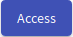

# Training Runs
Users only with role `ROLE_TRAINING_TRAINEE` can use the training agenda to access training run which is designed to play a game. After a successful login, the trainee is directly forwarded to the page [Training Runs Overview](#training-runs-overview) without any further action. Users with additional roles must click on the **Training Run** button on the front page of the KYPO Portal: 

  

or by clicking **Run** button in the left panel in the section `Trainings` to redirect to the Training Run Overview page.

  

## Training Runs Overview
The page consists of two panels: 

[1. Access Training](#1-access-training)
[2. Table with the list of training runs](#2-table-with-the-list-of-training-runs) 

  

### 1. Access Training
Here, enter an access token provided by the organizer of training instance to the access token prefix field (pasted access token is split into prefix and PIN). By clicking on  button the system checks if the training instance is running (it is between the start and end time) and if is there any free sandbox. If those conditions are fulfilled the trainee will access the training run (particular game) with assigned unique sandbox.

!!! note
    If trainee already accessed training run in particular training instance and not finished yet, the training run will be resumed. 

### 2. Table with the list of training runs
Lists all training runs of the logged-in trainee. Each row of the table represents a training run of a particular training instance (trainee can access multiple training runs within training instance). The training run can be unfinished or finished. An unfinished run can be resumed using the button :material-launch:{: .blue .icon} or entering the access token in the Access Training panel.   
A trainee can view the results of the finished training run by clicking :material-poll-box:{: .blue .icon} button.  

## Training Run

In the training run, trainees will go through predesigned levels. In the current version, there are several types of level:

[1. Assessment level](#1-assessment-level)
[2. Info level](#2-info-level) 
[3. Game level](#3-game-level)

Above each content of level, a bar is displayed. The bar lists levels in order. The finished levels are marked by , the current level is highlighted in blue and the following levels are gray.

### 1. Assessment Level 
At the assessment level, a trainee must answer the different types of questions. Assessment can be a questionnaire or test. If it is a test, the trainee should try his best to get the best score, because questions are scored. Some of the questions can be required and must be answered to proceed to the next level. 

There are three types of questions: 

* **Free Form Question (FFQ)** - trainees are asked to provide the text answer to the predefined field. 
* **Multiple Choice Questions (MCQ)** - trainees are asked to select only correct answers from the choices offered as a list.
* **Extended matching item (EMI)** - trainees are asked to pair items in row and column. 

  

### 2. Info Level
The info level is used to provide important information to trainees in text form but also can contain message to welcome players in the game.

  

### 3. Game Level 
At the game level, the trainee must complete the assignment whose content is on the left side of the page. On the right side sandbox schema is displayed. The layout of that schema could be shown based on the provided controls (see the following figure):

  

Right click on the selected network node (host or router), the following menu will be opened:

  

* **Generate console URL** - connect to Spice console for a particular network node (this is provided by OpenStack cloud). When you will connect to that Spice you will see the following console in a new browser tab. You will provide a login and password and then you will be able to do the appropriate actions here:

    

        
    

* **Resume** - resuming a suspended virtual machine is analogous to waking up a computer that has been in sleep mode.
* **Reboot** - rebooting a virtual machine is analogous to restarting a computer.
* **Suspend** - suspending a virtual machine is analogous to putting a computer into sleep mode. 

## Training Run Results

When the trainee will finish a predefined game, he will see the visualizations of him and the other player's behavior in the game, e.g., as follows:

  

