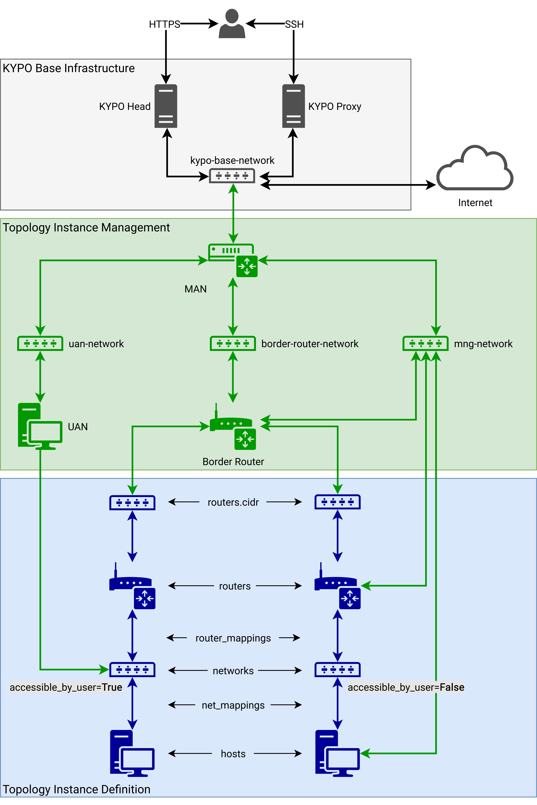

# Topology Instance

The KYPO OpenStack Driver transforms a [Topology Definition](/sandboxes/sandbox-topology/topology-definition) with the [Topology Instance Management](#topology-instance-management) sub-infrastructure into the HEAT Orchestration Template which the OpenStack cloud platform uses to create a virtual infrastructure we call a KYPO Topology Instance.

As mentioned above a KYPO Topology Instance is defined by 2 parts:

* [**Topology Definition**](/sandboxes/sandbox-topology/topology-definition): A user-defined topology.
* [**Topology Instance Management**](#topology-instance-management): The KYPO OpenStack Driver defined sub-infrastructure.

!!! note
    For clarity reasons, there are missing links from **mng-network** to **UAN**, left **Router**, and left **Host**.

## Topology Instance Management

Every Topology Instance is created with management sub-infrastructure which consists of the following.

* Three special nodes.
    * **MAN (Management Access Node)**: The only node connected to the network outside of the Topology Instance.
        The network must be specified as a `base_network` in the [sandbox-service configuration](/installation/kypo-platform-configuration).
        The Topology Instance is accessible only through the OpenStack cloud hypervisor or MAN.
    * **UAN (User Access Node)**: The node is connected to MAN through **uan-network** and all user-defined [Networks](/sandboxes/sandbox-topology/topology-definition#networks) with attribute `accessible_by_user` set to **True**.
        Then users can access [Hosts](/sandboxes/sandbox-topology/topology-definition#hosts) and [Routers](/sandboxes/sandbox-topology/topology-definition#routers) through these networks.
    * **Border Router**: The node is connected to MAN through **border-router-network** and all user-defined [Routers](/sandboxes/sandbox-topology/topology-definition#routers) through an automatically created network for every Router.

* Multiple networks that link nodes together.
    * **mng-network (management network)**: all nodes in the Topology Instance are connected to this network. So every node is accessible from `MAN` and through it can be configured. `CIDR` of this network should be specified in the configuration. The IP address range of this network can be overridden in the [sandbox-service configuration](/installation/kypo-platform-configuration).
    * **uan-network**: this network serves only for connection between UAN and MAN nodes.
    * **border-router-network**: this network serves only for connection between Border Router and MAN nodes.
    * Networks between every [Router](/sandboxes/sandbox-topology/topology-definition#routers) and Border Router mentioned above.
