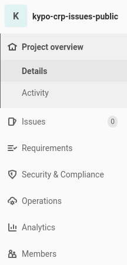
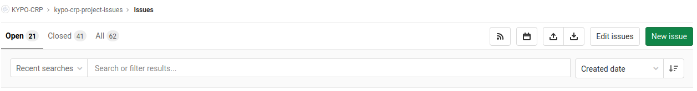
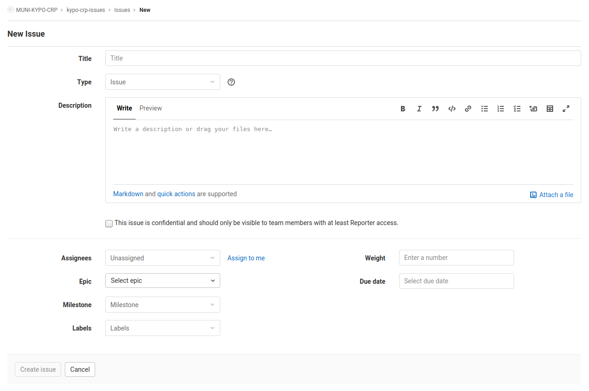
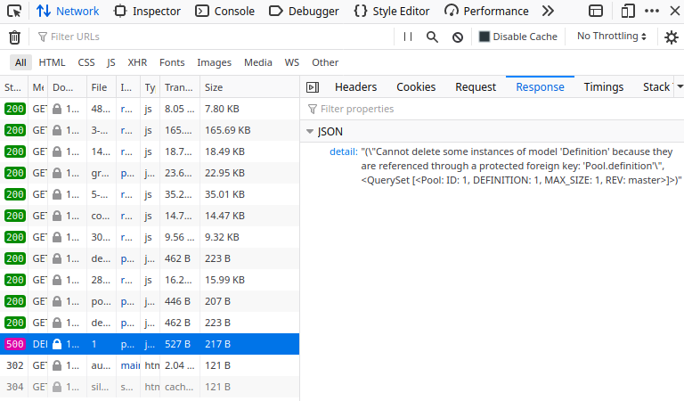
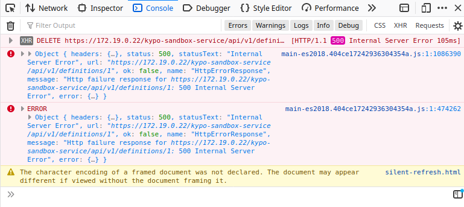

Reporting bugs is a great way for anyone to help improve the KYPO platform. To report bugs, we use the GitLab lightweight issue tracker system. Before reporting a bug, please consider the following points:
  
  * Read the [FAQ](./faq.md) to see if your issue isn't already a well-known question.
  * Check if someone hasn't already filed the bug by searching or running custom queries in the issues repository. If so, put "**thumb up**" on the bug.
  * Don't use the issue system to ask support questions. Use the **support@kypo.cz** for that.
  * Don't reopen issues that have been marked **"wontfix"** without finding consensus to do so on **support@kypo.cz**.
  * If you find a security issue or a bug, contact us at **security@crp.kypo.muni.cz**

## How to report a bug

A good bug report should be clear and concise without any missing key points. Any lack of clarity may lead to misunderstanding and may slow down the development process as well. Well-written bug reports are incredibly helpful. If you find a bug please create a bug report.

  1.  Go to GitLab repository [kypo-crp-issues]({{ page.meta.kypo_crp_issues_url }}).
  2.  In the menu on the left side, click `Issues`.
  
  3.  In the top menu above the list of issues click `New issue`.
  
  4.  Add a detailed [description](#bug-description).
  5.  Submit the issue.

!!! warning "Bug fix" 
    A bug should be fixed as soon as possible, but it doesn't mean it will be fixed in the next release. It depends on the severity and priority of the reported bug. 

## Bug description
On the new issue page, there is a form that needs to be properly filled out to report a bug. 

### Title
A Bug title is read more often than any other part of the bug report. It should say all about what comes in the bug (easy to understand). The title is often used to refer to this specific bug if the bug has been reported earlier or has been fixed. Make sure it clearly summarizes what the bug is and mentions the location or category.

 "Problem on website" is a dreadful summary. "Login fails with a 500 error message on check-out page in Firefox, but works in Safari" is great.

Try to strike the perfect balance between brevity and information.

### Description 
The following information is requested for bug reports to save time for developers. Bug report without an accurate description doesn't have to be taken into account and can be closed immediately. Given below are the essential features in the bug description report.

#### Summary (optional)

If the title isn't enough, you can add a short defect report summary/description. Please put a few words if possible, including when and how the bug occurred, what is actual (what actually happens), and expected (what you should see instead) behavior.

#### Environment

The environment for the KYPO platform instance can vary widely, but be as specific as you can. You should always follow the given bug report environment template and put in as much information as you can unless otherwise specified — it helps cut down on unnecessary information.

  * **Versions of Microservices**: Which versions of the microservices are you using? Please provide a list of microservices with their version.
  * **Web browser**: Which browser and its version did you use when you experienced the error? 
  * **Technologies**:  What are your versions of used technologies (Docker, Docker Compose, etc.)? 
  * **Reproducibility Rate**: How many times have you been able to reproduce the error, using the exact steps you've taken to activate the bug? It's also useful to report how many times the bug has been reproduced vs. the number of attempts it's taken to reproduce the issue, in case it's an intermittent occurrence.

#### Steps to reproduce

We number our steps from beginning to end, so developers can easily follow through by repeating the same process. We prefer to keep step numbers relatively whittled down by using the ">" symbol.

Example description for steps to reproduce a bug:

1. ***Go to Training Definition Overview > Create*** (this would take the user to the training definition creation page)
2. ***Fill necessary fields > Create and continue editing***
3. ***Search for designers > Add*** 

Steps like "Open App" and "Login," aren't necessary either, unless the issue relies directly upon these actions being taken.

#### Screenshots

Take a Screenshot of the instance of failure with proper captioning to highlight the defect. Highlight unexpected error messages with light red color, if not obvious. It draws attention to the important area. Also, try to reproduce a bug with the opened `Network` tab in the browser console (F12). If you notice some error, take a screenshot of the response as follows: 

If everything is OK, check the `Console` tab for error on the front-end side. If so, take a screenshot. 

#### Additional information (optional)
Provide information that doesn't match the previous features, e.g., in short, describe steps you have already taken to work around the bug.

### Assignee
Please, do not assign anybody! The bugs will be assigned to developers by the designated member. 

### Labels 
Choose the appropriate `bug` label. 

