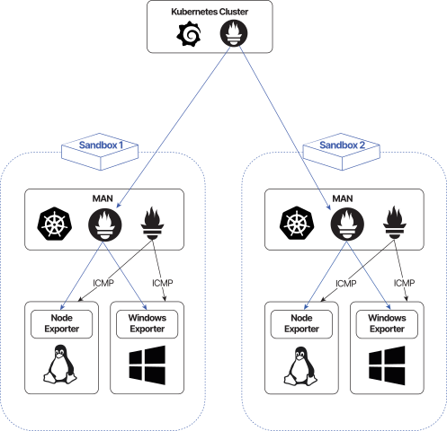

CyberRangeCZ Platform supports sandbox monitoring functionality. These resources can be currently monitored:

* Operating System resources via [Node Exporter](https://github.com/prometheus/node_exporter) respectively [Windows Exporter](https://github.com/prometheus-community/windows_exporter)
* ICMP network availability of management IP addresses
* TCP port availability of selected network interfaces

This is the architecture of the monitoring solution:



## Deployment
Monitoring can be deployed with [CyberRangeCZ Platform deployment tools](https://github.com/cyberrangecz/devops-tf-deployment) together with the deployment of CyberRangeCZ Platform. To enable monitoring, set the following variables in [tfvars](https://github.com/cyberrangecz/devops-tf-deployment/blob/master/tf-head-services/tfvars/deployment.tfvars-template) file:

* **enable_monitoring** - set to true
* **man_flavor** - each man node hosts monitoring components. Using a flavor with 2 CPUs, 4 GB of RAM, and 80 GB HDD is recommended.
* **os_region** - set the region used by CyberRangeCZ Platform in the OpenStack project.
* **openid_configuration_insecure** - set to true if CyberRangeCZ Platform is not using tls certificate from a trusted CA.

## Operating System Monitoring
CyberRangeCZ Platform is able to automatically deploy Operating System monitoring based on **monitor-os** group in **topology.yml**. Available settings:

* undefined - no Operating System monitoring will be performed.
* list of hosts or routers - only specified hosts/routers will be monitored.
* [] - all hosts and routers will be monitored.

## ICMP network availability
CyberRangeCZ Platform is able to automatically check ICMP network availability based on **monitor-icmp** group in **topology.yml**. Available settings:

* undefined - no ICMP monitoring will be performed.
* list of hosts or routers - only specified hosts/routers will be monitored.
* [] - all hosts and routers will be monitored.

## TCP port availability
CyberRangeCZ Platform is able to check the availability of TCP ports on specified network interfaces of hosts and routers in **topology.yml** by including [monitoring_targets](topology-definition.md#monitoring_targets) section.

## Monitoring dashboards
Monitoring dashboards can be accessed at https://crczp-fqdn/grafana. The default username is admin. Password is autogenerated by the deployment and can be retrieved by running following command in the [deployment directory](https://github.com/cyberrangecz/devops-tf-deployment/tree/master/tf-head-services):
```
terraform output -raw monitoring_admin_password
```
The following dashboards are available in the CRCZP folder:

* Node Exporter Full - Linux Operating System metrics
* Windows Exporter Dashboards - Windows Operating System metrics
* ICMP exporter - ICMP metrics
* Sandbox network availability - ICMP and TCP network availability
