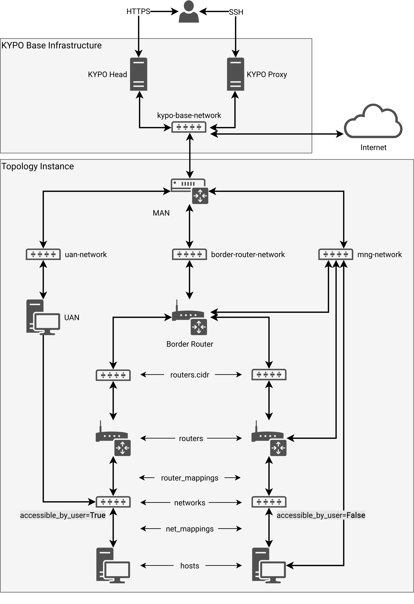

## Sandbox

A Topology Instance of a Sandbox is created in the cloud platform and connected to the [KYPO Base Infrastructure](../../../installation-guide/base-infrastructure) which mainly consists of 2 servers and a network.

* **KYPO Head**: The server where the KYPO platform is installed.
* **KYPO Proxy**: The server used only for SSH access to all sandboxes.
* **KYPO Base Network**: The network where both servers and all sandboxes are connected through MAN ([more about management nodes](../sandbox-topology/topology-instance#topology-instance-management)).



## Sandbox SSH Access

We differentiate between 2 types of SSH access based on privileges.

* [**Management access**](#management-access): For those who manages sandboxes or KYPO platform (role `instructor`).
* [**User access**](#user-access): For everyone else (role `trainee`).

### Management Access

Access to the sandbox nodes is through the **KYPO proxy** and a **MAN** node as jump hosts and a **mng-network**.

1. Download the SSH access zip file from [Pool Overview](../../../user-guide-basic/sandbox-agenda/pool/#pool-overview) page.

2. Extract the `ssh-access.zip` file to the `~/.ssh/` directory.

    ```shell
    $ unzip ssh-access.zip -d ~/.ssh/
    ```

    Extracted files:

    * `~/.ssh/pool-id-ID-sandbox-id-ID-management-config`: the SSH configuration file.
    * `~/.ssh/pool-id-ID-sandbox-id-ID-management-source.sh`: the source script that will set the `ssh` command and the KYPO proxy SSH private key.
    * `~/.ssh/pool-id-ID-management-key`: the pool management SSH private key.
    * `~/.ssh/pool-id-ID-management-key.pub`: the pool management SSH public key.

    !!! note
        The configuration file and the source script are generated for every sandbox of the pool.

3. Execute the extracted source script in the current shell using the `source` command with the path to the KYPO proxy SSH private key.

    ```shell
    $ source ~/.ssh/pool-id-ID-sandbox-id-ID-management-source.sh PATH_TO_KYPO_PROXY_PRIVATE_KEY
    ```

4. Connect to any virtual machine specified in the SSH configuration file, e.g.:

    ```shell
    $ ssh man
    ```

### User Access

Access to the sandbox nodes is through the **KYPO proxy**, a **MAN** node, and a **UAN** node as jump hosts and an `accessible_by_user` networks.

!!! warning "Sandbox definition set up"
    You will not be able to use this approach if you did not set up the sandbox definition correctly!

    * Set user access to networks in the sandbox definition file `sandbox.yml`, e.g., set an attribute `accessible_by_user` of the network to value `True` or leave it undefined as it is a default value. See [Topology Definition](../sandbox-topology/topology-definition#networks).

    * Set user access to hosts connected to user-accessible networks, e.g., apply Ansible role [kypo-user-access](https://gitlab.ics.muni.cz/CSIRT-MU-public/ansible-roles/kypo-user-access/-/tree/master/) to specified hosts in the file `provisioning/playbook.yml` of the sandbox definition.

    !!! warning
        The SSH config file will be generated with the hosts directive `User` set to `user-access`, therefore set variable `kypo_user_access_username` to value `user-access` or modify the SSH config file later.

1. Download the SSH access zip file from [Game Level](../../../user-guide-basic/training-agenda/training-run/#3-game-level) of the Training Run page with topology visualization.

2. Extract the `ssh-access.zip` file to the `~/.ssh/` directory.

    ```shell
    $ unzip ssh-access.zip -d ~/.ssh/
    ```

    Extracted files:

    * `~/.ssh/pool-id-ID-sandbox-id-ID-user-config`: the SSH configuration file.
    * `~/.ssh/pool-id-ID-sandbox-id-ID-user-source.sh`: the source script that will set the `ssh` command and the KYPO proxy SSH private key.
    * `~/.ssh/pool-id-ID-sandbox-id-ID-user-key`: the sandbox user SSH private key.
    * `~/.ssh/pool-id-ID-sandbox-id-ID-user-key.pub`: the sandbox user SSH public key.

3. Execute the extracted source script in the current shell using the `source` command with the path to the KYPO proxy SSH private key.

    ```shell
    $ source ~/.ssh/pool-id-ID-sandbox-id-ID-user-source.sh PATH_TO_KYPO_PROXY_PRIVATE_KEY
    ```

4. Connect to any virtual machine specified in the SSH configuration file, e.g.:

    ```shell
    $ ssh uan
    ```
