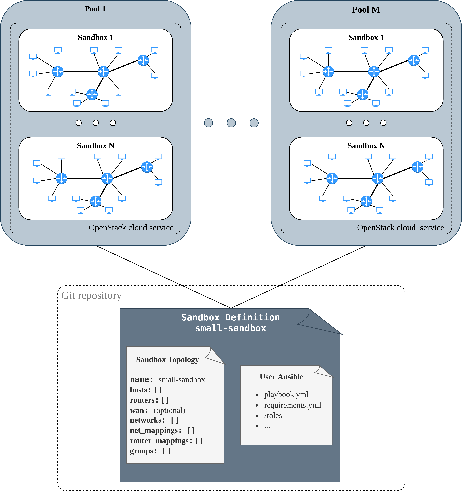

!!! info 
    The following pages describe the creation and management of the sandboxes for the cloud environment. Sandbox definition for the local environment is created using so-called [Cyber Sandbox Creator (CSC)](https://gitlab.ics.muni.cz/muni-kypo-csc/cyber-sandbox-creator/-/wikis/3.0/Home) tool. Detailed instructions on how to create sandbox definitions for local environments can be found on wiki pages [Using-Cyber-Sandbox-Creator](https://gitlab.ics.muni.cz/muni-kypo-csc/cyber-sandbox-creator/-/wikis/3.0/Using-Cyber-Sandbox-Creator).

    Important things to have in mind:

    * Definitions for local and cloud sandboxes are similar in many ways. The structure of the sandbox definition overlaps and is complemented by environment-specific files.
    * Local topology definitions created according to the guide on the [wiki page](https://gitlab.ics.muni.cz/muni-kypo-csc/cyber-sandbox-creator/-/wikis/3.0/Sandbox-Definitions#definitions-file-structure) are fully compatible with cloud one.
    * Cloud topology definitions created according to the following instructions aren't compatible with a local one.
    * If you are intending to use sandbox definition for both environments, it is recommended to create a local one at first.

The KYPO Cyber Range Platform creates and provides an emulated virtual environment. Working with this environment in KYPO requires knowledge of the terms [Sandbox](#sandbox), [Sandbox definition](#sandbox-definition), and [Pool](#pool).

## Sandbox
As mentioned in [terminology](../../../basic-concepts/terminology/#emulated-virtual-environment), it is an isolated testing environment with virtual networks and virtual machines (VMs) in them. Thanks to the infrastructure created using the [OpenStack](https://www.openstack.org/) cloud service, and everything is running without affecting the external infrastructure.

## Sandbox Definition
As mentioned in [terminology](../../../basic-concepts/terminology/#emulated-virtual-environment), it is an isolated testing environment with virtual networks and virtual machines (VMs) in them. Thanks to the infrastructure created using the [OpenStack](https://www.openstack.org/) cloud service, and everything is running without affecting the external infrastructure.

* **Topology Definition**: The file with the sandbox structure definition (hosts, routers, networks, etc.). For more detailed information about the topology definition, check the page [Toplogy Definition](../topology-definition/). Created sandbox inside the cloud is called KYPO [Topology Instance](../topology-instance/).
* **Sandbox Provisioning**: It is used to customize Topology Instances, e.g., set up an environment, create users, install packages, etc. Sandbox Provisioning must specify how to connect to instances, e.g., user name and SSH key. The Ansible tool is used to perform these actions. For more detailed information about the topology definition, check the page [Sandbox Provisioning](../sandbox-provisioning/).

Created sandbox definition must be stored as a Git repository to be used inside the KYPO portal. Git repository must also be accessible by the KYPO platform. For more detailed information, check the page [Sandbox Definition](../sandbox-definition/).

## Pool
Before creating cloud sandboxes, it is essential to create in system so-called pools. Pools are groups of sandboxes created based on the same sandbox definition. A definition is specified before creating the pool. After creating the pool, it is possible to start with the allocation of the sandboxes, which is divided into three phases:
    
1. **Sandbox Allocation**: Creating sandbox (virtual machines) inside the cloud.
2. **Sandbox Networking**: Networking of the virtual machines and user keys distribution to machines. The phase is executed automatically and is not the responsibility of the user. 
3. **Sandbox Provisioning**: Customization of virtual machines already above-mentioned. 
 

