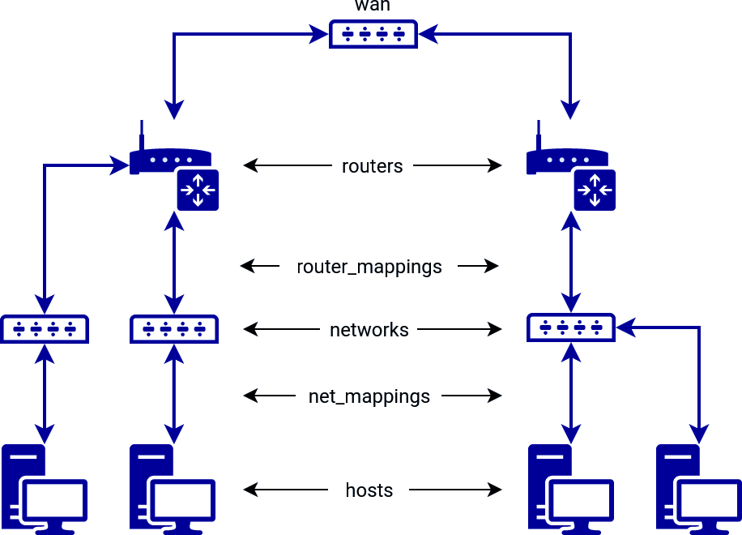

Topology Definition is used for the description of [Topology Instance](topology-instance.md). See the following image to help you visualize what you can define in the topology definition.



## Attributes

Attributes of a Topology Definition (an [example](#example)).

### name

Defines the name of the definition ([name restrictions](#names)).

### hosts

Hosts contains the list of end hosts to be deployed. A host has the following attributes.

* **name**: name of end host VM ([names restriction](#names), [unique names restriction](#unique-names))
* **flavor**: name of flavor (see [how to chose flavor](#flavor))
* **base_box**: (see [how to define base_box](#base_box))
    * **image**: name of image
    * **mgmt_user**: name of user with sudo privileges
    * **mgmt_protocol (optional)**: protocol used for communication with base_box instance. supported options are `ssh` and `winrm` (default: `ssh`)
* **hidden (optional)**: whether the host should be hidden in a topology visualization (default: `False`)
* **volumes (optional)**: list of volumes that will be provisioned on the host in the format `- size: X`, where X is volume size in GB. The first volume will be used as a system drive - the author of the definition utilizing this parameter has to determine how much space the image itself requires to run.
* **extra (optional)**: a map used for defining extra values for the host, has no additional effect.

### routers

The list of routers. Routers are the only nodes through which hosts can communicate with the internet or hosts in networks connected to different Routers. Every router should be connected to some [networks](#networks). A connection can be achieved by [router_mappings](#router_mappings). A router has the following attributes.

* **name**: name of router VM ([names restriction](#names), [unique names restriction](#unique-names))
* **flavor**: name of flavor (see [how to chose flavor](#flavor))
* **base_box**: (see [how to define base_box](#base_box))
    * **image**: name of image
    * **mgmt_user**: name of user with sudo privileges
    * **mgmt_protocol (optional)**: protocol used for communication with base_box instance. supported options are `ssh` and `winrm` (default: `ssh`)
* **extra (optional)**: a map used for defining extra values for the router, has no additional effect.
* **hidden (optional)**: whether the router and its networks and hosts should be hidden in a topology visualization (default: `False`)

    !!! note
        A router's **cidr** attribute has been deprecated since version 21.12.

### wan
A special network that [routers](#routers) uses to communicate with each other and the Internet. [Routers](#routers) are assigned to this network automatically.

* **name**: name of the network (default: `wan`, [names restriction](#names), [unique names restriction](#unique-names))
* **cidr**: IP address range in CIDR notation (default: `100.100.100.0/24`, [unique cidrs restriction](#disjunct-cidrs))

### networks

The list of networks. A network is used to connect the router with the end host. It has the following attributes.

* **name**: name of network ([names restriction](#names), [unique names restriction](#unique-names))
* **cidr**: IP address range in CIDR notation ([unique cidrs restriction](#disjunct-cidrs))
* **accessible_by_user**: optional attribute, specifies which networks will be accessible by user (default: `True`), applies to the all hosts of a network
* **hidden (optional)**: whether the network and its hosts should be hidden in a topology visualization (default: `False`)

### net_mappings

The list of net_mappings. A net_mapping is used to connect the host to the network. Each host should be connected to one network (more are possible but not recommended). A net_mapping has the following attributes.

* **host**: name of host defined in [hosts](#hosts)
* **network**: name of the network defined in [networks](#networks)
* **ip**: IP address for the host, must be from IP address range of the network [address restriction](#address-restriction)

### router_mappings

The list of router_mappings. A router_mapping is used to connect the router to the network. Each network should be connected to one router, but one router can be connected to multiple networks. A router_mapping has the following attributes.

* **router**: name of router defined in [routers](#routers)
* **network**: name of network defined in [networks](#networks)
* **ip**: IP address for the router, must be from IP address range of the network [address restriction](#address-restriction)

### groups

The list of groups. An ansible group is used for better management of nodes. It has the following attributes.

* **name**: name of the group
* **nodes**: list of node names defined in [hosts](#hosts), or [routers](#routers).

The following group names are reserved for monitoring - monitor-os (monitoring of Operating System), monitor-icmp (network availability monitoring on management interface).

### monitoring_targets

List of monitoring targets with TCP ports and interfaces to monitor. A monitoring_target has the following attributes.

* **node**: name of host or router defined in [hosts](#hosts) or [routers](#routers)
* **targets**: list of TCP ports and interfaces to monitor in the following format.
    * **port**: TCP port to monitor
    * **interface**: network interface to monitor

## Glossary

### Base_box

Base_box specifies the `image` of the node boot disk, default user `mgmt_user` with sudo permissions, and a protocol that is needed to communicate with the machine.

The table below contains some examples of possible base_box options.

| image                | user    |
|----------------------|---------|
| centos-8             | centos  |
| cirros-0-x86_64      | cirros  |
| debian-12-x86_64     | debian  |
| kali-2020.4          | debian  |
| ubuntu-noble-x86_64  | ubuntu  |
| windows-10           | windows |
| windows-server-2019  | windows |

!!! warning
    The actual base_box options may differ from the contents of this table. Before using an image, check that it is present in the list of OpenStack images ([How to list OpenStack images](../../installation-guide/installation-guide-overview.md#configuration))

!!! note
    It is strongly recommended to use the `debian-12-x86_64` or `ubuntu-noble-x86_64` images for routers.


### Flavor

Flavor defines virtual machine hardware parameters (VCPUs, RAM, Disk size).

The following flavors can be deployed using the CyberRangeCZ Platform deployment tools.

!!! warning
    In the case of using a public cloud provider (flavors cannot be created without admin rights), the flavors in the topology definition must be replaced by the available flavors of that provider.

[How to list OpenStack flavors](../../installation-guide/installation-guide-overview.md#configuration)

| flavor          | vCPU | RAM (GB) | disk size (GB) |
|-----------------|------|----------|----------------|
| standard.small  | 1    | 2        | 80             |
| standard.medium | 1    | 4        | 80             |
| standard.large  | 2    | 16       | 80             |


## Restrictions

### Names

All names should have only characters: `a-z`, `A-Z`, `1-9`, and `-`, and the first character should be a lower case letter.

### Unique Names

Names of hosts, networks, and routers should be unique in the context of a Topology Definition (they are used for instance identification).

### Disjunct CIDRs

Networks, including wan, should be disjunct (not overlapping), and in `network_mappings` and `router_mappings` IP address should be from the IP address range of the network. Otherwise, networking wouldn't work.
Networks, including wan, shouldn't overlap with [management network's](topology-instance.md#topology-instance-management) CIDR either.

### Address Restriction

During a network creation, the OpenStack will take the first IP address of the specified IP address range for a gateway (a Router), the second IP address for DHCP, and the rest for hosts. The OpenStack will non-deterministically take the first address of the network or the first address after a gateway (a Router) address, and if any of net_mappings has an IP address set to one of these addresses, sandbox creation may fail.

### Group Restriction

Sandbox service does not allow the redefinition of its [default hosts groups](sandbox-provisioning.md#ansible-host-groups). Thus, the Topology Definition in which these groups are defined is invalid.

*[VM]: Virtual machine
*[BR]: Border router
*[UAN]: User Access Node
## Example

An example topology definition in the sandbox definition with the name `small-sandbox` contains the following.

* Two hosts. The host server will not be visible in the topology.
* Two routers.
* The wan network with a custom name.
* Two networks. Only one is user-accessible and therefore connected to the UAN node.
* One group, which contains two nodes.

```yaml
name: small-sandbox
hosts:
  - name: server
    base_box:
      image: debian-12-x86_64
      mgmt_user: debian
    flavor: standard.small
    hidden: True
    volumes:
      - size: 16
      - size: 2
      - size: 9

  - name: home
    base_box:
      image: windows-10-0.2.0
      mgmt_user: windows
      mgmt_protocol: wirm
    flavor: standard.small

routers:
  - name: server-router
    base_box:
      image: debian-12-x86_64
      mgmt_user: debian
    flavor: standard.small

  - name: home-router
    base_box:
      image: debian-12-x86_64
      mgmt_user: debian
    flavor: standard.small

wan:
  name: internet-connection
  cidr: 100.100.100.0/24

networks:
  - name: server-switch
    cidr: 10.10.20.0/24
    accessible_by_user: False

  - name: home-switch
    cidr: 10.10.30.0/24

net_mappings:
    - host: server
      network: server-switch
      ip: 10.10.20.5

    - host: home
      network: home-switch
      ip: 10.10.30.5

router_mappings:
    - router: server-router
      network: server-switch
      ip: 10.10.20.1

    - router: home-router
      network: home-switch
      ip: 10.10.30.1

groups:
  - name: custom-group
    nodes:
      - home
      - home-router
```
