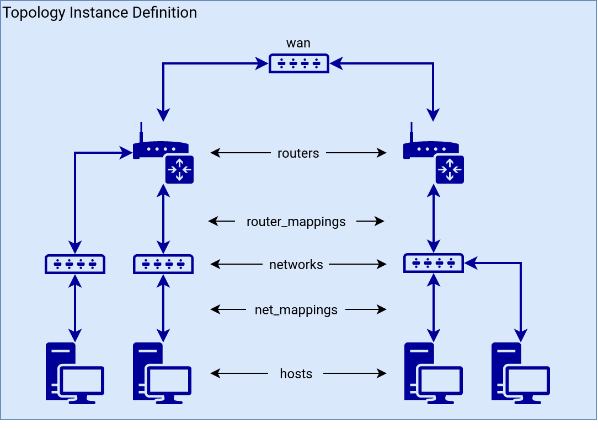

Topology Definition is used for the description of [Topology Instance](../topology-instance/). See the following image to help you visualize what you can define in the topology definition.



## Attributes

Attributes of a Topology Definition (an [example](#example)).

### provider

The provider attribute in a Topology Definition should always have the value `OpenStack` for OpenStack definitions.

### name

Defines the name of the definition ([name restrictions](#names)).

### hosts

Hosta contains the list of end hosts to be deployed. A host has the following attributes.

* **name**: name of end host VM ([names restriction](#names), [unique names restriction](#unique-names))
* **flavor**: name of flavor (see [how to chose flavor](#flavor))
* **base_box**: (see [how to define base_box](#base_box))
    * **image**: name of image
    * **man_user**: name of user with sudo privileges
    * **mng_protocol (optional)**: protocol used for communication with base_box instance. supported options are `ssh` and `winrm` (default: `ssh`)
* **hidden (optional)**: whether the host should be hidden in a topology visualization (default: `False`)


### routers

The list of routers. Routers are the only nodes through which hosts can communicate with the internet or with hosts in networks connected to different Routers. Every router should be connected to some [networks](#networks). A connection can be achieved by [router_mappings](#router_mappings). A router has the following attributes.

* **name**: name of router VM ([names restriction](#names), [unique names restriction](#unique-names)) 
* **flavor**: name of flavor (see [how to chose flavor](#flavor))
* **base_box**: (see [how to define base_box](#base_box))
    * **image**: name of image
    * **man_user**: name of user with sudo privileges
    * **mng_protocol (optional)**: protocol used for communication with base_box instance. supported options are `ssh` and `winrm` (default: `ssh`)
* **cidr**: for network between router and BR ([more about management nodes](../topology-instance/#topology-instance-management), the recommended range of the network is `/29`, [unique cidrs restriction](#disjunct-cidrs))
   
### networks

The list of networks. A network is used to connect the router with the end host. It has the following attributes.

* **name**: name of network ([names restriction](#names), [unique names restriction](#unique-names))
* **cidr**: IP address range in CIDR notation ([unique cidrs restriction](#disjunct-cidrs))
* **accessible_by_user**: optional attribute specifies whether the UAN ([more about management nodes](../topology-instance/#topology-instance-management)) should be connected to this network (default: `True`).

### net_mappings

The list of net_mappings. A net_mapping is used to connect the host to the network. Each host should be connected to one network (more are possible but not recommended). A net_mapping has the following attributes.

* **host**: name of host defined in [hosts](#hosts) 
* **network**: name of the network defined in [networks](#networks)
* **ip**: IP address for the host, must be from IP address range of the network [address restriction](#address-restriction)

### router_mappings

The list of router_mappings. A router_mapping is used to connect the router to the network. Each network should be connected to one router, but one router can be connected to multiple networks. A router_mapping has the following attributes.

* **router**: name of router defined in [routers](#routers) 
* **network**: name of network defined in [networks](#networks)
* **ip**: IP address for the router, must be from IP address range of the network [address restriction](#address-restriction)
 
### groups

The list of groups. An ansible group is used for better management of nodes. It has the following attributes.

* **name**: name of the group
* **nodes**: list of node names defined in [hosts](#hosts), or [routers](#routers).

## Glossary

### Base_box

Base_box specifies the `image` of the node boot disk, default user `man_user` with sudo permissions, and a protocol that is needed to communicate with the machine.

Now (24.9.2020), possible options are as follows.

image | user
----- | ----
centos-7-1809-x86_64                        | centos
centos-8-1-1911-x86_64                      | centos
cirros-0.4.0-x86_64                         | cirros
debian-9-x86_64                             | debian
debian-10-x86_64                            | debian
kali-linux-2019.4-amd64                     | debian
ubuntu-bionic-x86_64                        | ubuntu
  
For routers, it is strongly recommended to use the `debian-9-x86_64` image.

[How to list OpenStack images](../../../../installation-guide/base-infrastructure/#configuration)

### Flavor

Flavor defines virtual machine hardware parameters (VCPUs, RAM, Disk size).

flavor | vCPU | RAM (GB) | disk size (GB)
------ | ---- | -------- | ---------
csirtmu.tiny1x2    | 1  | 2  | 20
csirtmu.tiny1x4    | 1  | 4  | 20
csirtmu.small2x4   | 2  | 4  | 40
csirtmu.small2x8   | 2  | 8  | 40
csirtmu.medium4x8  | 4  | 8  | 40
csirtmu.medium4x16 | 4  | 16 | 40
csirtmu.large8x16  | 8  | 16 | 80
csirtmu.large8x32  | 8  | 32 | 80
csirtmu.jumbo16x32 | 16 | 32 | 100
csirtmu.jumbo16x64 | 16 | 64 | 100

[How to list OpenStack flavors](../../../../installation-guide/base-infrastructure/#configuration)

## Restrictions

### Names

All names should have only characters: `a-z`, `A-Z`, `1-9`, and `-`, and the first character should be a lower case letter.

### Unique Names

Names of hosts, networks, and routers should be unique in the context of a Topology Definition (they are used for instance identification).

### Disjunct CIDRs

Networks and routers CIDRs should be disjunct (not overlapping), and in `network_mappings` and `router_mappings` IP address should be from the IP address range of the network. Other way networking wouldn't work.
Network and routers CIDRs shouldn't overlap with [management networks](../topology-instance/#topology-instance-management) CIDRs too.

[How to set CIDRs of management networks](https://gitlab.ics.muni.cz/muni-kypo-crp/prototypes-and-examples/kypo-crp-demo/-/blob/master/provisioning/roles/kypo-crp-configuration/templates/configuration/sandbox-service/kypo-sandbox-service-config.yml).
        
### Address Restriction

During a network creation, the OpenStack will take the first IP address of the specified IP address range for a gateway (a Router), the second IP address for DHCP, and the rest for hosts. The OpenStack will non-deterministically take the first address of the network or the first address after a gateway (a Router) address, and if any of net_mappings has an IP address set to one of these addresses, sandbox creation may fail.

*[VM]: Virtual machine
*[BR]: Border router
*[UAN]: User Access Node 
## Example

An example topology definition in the sandbox definition with the name `small-sandbox` contains the following.

* Two hosts. The host server will not be visible in the topology.
* Two routers.
* Two networks. Only one is user-accessible and therefore connected to the UAN node.
* One group, which contains only two nodes accessible by the user.

```yaml
name: small-sandbox

provider: OpenStack

hosts:
  - name: server
    base_box:
      image: debian-9-x86_64
      man_user: debian
    flavor: csirtmu.tiny1x2
    hidden: True

  - name: home
    base_box:
      image: debian-9-x86_64
      man_user: debian
    flavor: csirtmu.tiny1x2

routers:
  - name: server-router
    cidr: 100.100.100.0/29
    base_box:
      image: debian-9-x86_64
      man_user: debian
    flavor: csirtmu.tiny1x2

  - name: home-router
    base_box:
      image: debian-9-x86_64
      man_user: debian
    cidr: 200.100.100.0/29
    flavor: csirtmu.tiny1x2

networks:
  - name: server-switch
    cidr: 10.10.20.0/24
    accessible_by_user: False
  - name: home-switch
    cidr: 10.10.30.0/24

net_mappings:
    - host: server
      network: server-switch
      ip: 10.10.20.5

    - host: home
      network: home-switch
      ip: 10.10.30.5

router_mappings:
    - router: server-router
      network: server-switch
      ip: 10.10.20.1

    - router: home-router
      network: home-switch
      ip: 10.10.30.1

groups:
  - name: user-accessible
    nodes:
      - home
      - home-router
```
