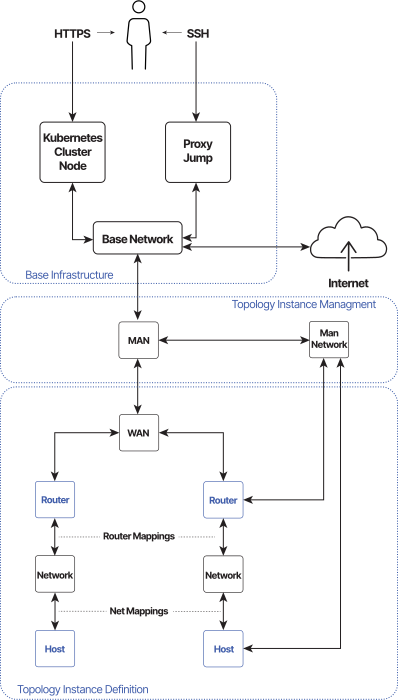

# Topology Instance

The CyberRangeCZ Platform Terraform Client transforms a [Topology Definition](topology-definition.md) (user-defined topology) with the [Topology Instance Management](#topology-instance-management) sub-infrastructure into the Terraform Template, which is then used by [Terraform](https://www.terraform.io) to create a virtual infrastructure we call a Topology Instance.

!!! note
    For clarity reasons, there are missing links from **man-network** to the left **Router** and left **Host**.

## Topology Instance Management

Every Topology Instance is created with management sub-infrastructure, which consists of the following.

* **MAN (Management Access Node)**: The only node connected to the network outside the Topology Instance.

* **man-network (management network)**: All nodes in the Topology Instance are connected to this network so that every node is accessible from `MAN` and can be configured through it. `CIDR` of this network should be specified in the configuration.
