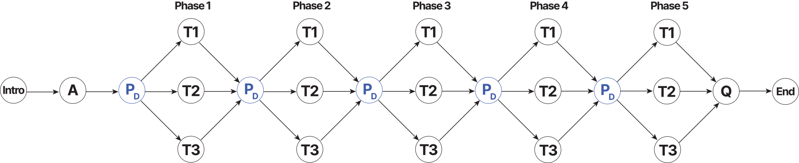
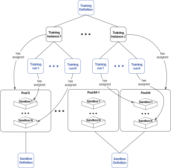

The CyberRangeCZ Platform is also used to create cybersecurity exercises and trainings. When working with the trainings, it is required to familiarize yourself with the following terms [Training Definition](#training-definition), [Training Instance](#training-instance), and [Training Run](#training-run).

## Training Definition

The content of the whole exercise is described using so-called training definitions. We distinguish the two types of definitions: **linear** and **adaptive**. Linear training definition also supports the technique of the [Automatic Problem Generation (APG)](#automatic-generation-problem-apg-in-linear-training-definition). In general, both linear and adaptive training definitions include information about the title, notes for instructors, and learning outcomes. Linear/adaptive training definition further consists of multiple **[levels](#levels)/[phases](#phases)**. A created training definition can be download as a file in JSON format. It is a good practice to store Training Definition in the Git repository next or close to the repository of Sandbox Definition that is specially created for that Training Definition.

!!! note
    Creating APG Training Definition requires field Generate variant sandboxes to be selected while [creating training definition](../../user-guide-basic/training-agenda/training-definition/linear-training-definition.md#create-linear-training-definition-panel).

### Linear

#### Levels
 The *linear definition* consist of three types of levels:

1. **Info Level**: Contains information for the trainee (welcome message or important information about the following levels).
2. **Training Level**: The user has to solve a predefined assignment in the level. By solving the assignment, the trainee acquires a secret answer, and after submitting the answer, they can continue to the next level of the training.
3. **Assessment Level**: It can be either a test or a questionnaire, and it serves to test users’ knowledge or get feedback from users. The assessment can contain one of the following types of questions:
    * **Multiple choice question (MCQ)**: Trainees are asked to select one or multiple answers from the choices offered as a list.
    * **Extended matching item (EMI)**: Trainees are asked to pair items from row and column that are semantically related.
    * **Freeform question (FFQ)**: Trainees are asked to type the answer to the submit field.
4. **Access Level**: Contains information on how to access either local or cloud sandbox.

#### Automatic Generation Problem (APG) in Linear Training Definition
**Automatic Problem Generation** is a technique of defining various problem instances. In CyberRangeCZ Platform, it is achieved by using variant answers for each [Training Run](#training-run) that can reduce the threat of copied or leaked answers. APG training definition requires specific [Sandbox Definition](../../user-guide-advanced/sandboxes/sandbox-definition.md) with **variables.yml** file. The file specifies variables whose values are automatically generated for each sandbox instance. The generated values then can be used during provisioning to set secret answers inside the sandbox (e.g., filename, port, username, etc.). Behind the scenes, generated values are stored to the special **answers storage**.

When creating a training level, a designer can specify either:

* **Correct Answer - Static** *(uncheck Variant Answers)*: All trainees' answers are the same.
* **Correct Answer - Variable Name** *(check Variant Answers)*: Answers are unique for each sandbox and therefore for each trainee. A variable name set to this field must be identical to a variable from **variables.yml**. Therefore, the exact values of the variables don't have to be generated at the creation time of the training definition. The trainee's submitted answer is then compared to a value from the **answers storage**.

!!! note
    Training definition is considered APG if it has at least one training level with field **Correct Answer - Variable Name** set.

### Adaptive

The following figure displays the adaptive format of training. This form of training is defined as a graph structure containing a questionnaire (**A**, **Q**), a list of phases, and a list of tasks. **A** represents a pre-training questionnaire before training on which trainees' knowledge is tested for a given training. Furthermore, the other events/metrics are audited to the internal database, such as answers to tasks, commands entered in the command line in the sandbox, time spent in a given phase, events of displaying the solution. These events are assigned to appropriate phases to use the computational model **PD** component properly. For example, the pre-training questions **A** is assigned to the particular phases, so we know what questions are related to what phase.
Furthermore, after the pre-training question, the first training phase is the **access phase**, which describes how to connect to the sandbox. It is crucial that all the students are connected to the virtual environment before the training begins. Next, the figure contains the **PD** component, which represents the computational node (tutor model) of adaptive trainings, which calculates the theoretical and practical knowledge/skills of the player of the given training. Finally, the component **Q** is a post-training questionnaire collecting feedback from students.

#### Phases
The *adaptive definition* consist of four types of so-called phases:

1. **Info Phase**: Contains information for the trainee (welcome message or important information about the following phases).
2. **Adaptive Questionnaire Phase**: The pre-training questionnaire collects data about students’ knowledge and skills. The questions asked in the pre-training questionnaire are grouped into linked relations to specific training phases. Each question can be assigned into several relations since they can be relevant to more phases. For each training phase, the essential ratio of knowledge is set to determine whether the student’s theoretical knowledge or self-reported phase of skills is sufficient or not. The questionnaire can contain one of the following types of questions:
    * **Multiple choice question (MCQ)**: Trainees are asked to select one or multiple answers from the choices offered as a list.
    * **Free form question (FFQ)**: Trainees are asked to type the answer to the submit field. The submitted answer must match one of the predefined correct answers.
    * **Rating form question (RFQ)**: Trainees are asked to self-rate how they feel about a particular tool, technology, protocol, etc.
3. **General Questionnaire Phase**: Similar to the adaptive questionnaire phase but the questions are not related to the training phases. The questionnaire is instead used to get feedback from trainees. The questionnaire contains the same type of questions as the adaptive one, but they cannot have the predefined correct answer.
4. **Training Phase**: The phase consists of several task variants of various difficulties. Typically from the most difficult to the easiest one, but all on the same topic. Based on the trainee's actions in the previous phases and their answers obtained from the pre-training questionnaire, the task with the most suitable difficulty is provided (task with the lowest order number being the hardest). In the task, the user has to solve a predefined assignment. By solving the assignment, the trainee acquires a secret answer, and after submitting the answer, they can continue to the next phase of the training. To compute the most suitable task for the trainee, the Decision Matrix is defined in each phase. The matrix allows the instructor to set up the weights of the several aspects considered during the computation. The higher the computed value is, the more difficult task is chosen. The used aspects are:
    * **Pre-training Questionnaire** - correctly answered a group of questions related to the phase in the adaptive questionnaire phase.
    * **Keyword Used** - the number of used expected key commands in the command line within the given task.
    * **Completed in Time** - the trainee completes the task in the predefined time.
    * **Solution Displayed** - the trainee has revealed the solution.
    * **Submitted Answers** - the number of the submitted incorrect answers.
For more information about how exactly the specific tasks are chosen and what equations are used, you can view more detailed documentation in this [publication](https://ieeexplore.ieee.org/document/9926178).
5. **Access Phase**: Contains information on how to access either local or cloud sandbox.

## Training Instance

A time-limited instance of a training definition during which trainees have access to training. The whole training instance progress is managed by instructors who can monitor events made by trainees that are displayed in various graphs and tables that may differ based on the type of assigned training definition. Each training instance has an assigned [pool](../../user-guide-advanced/sandboxes/sandboxes-overview.md#pool) with sandboxes.

## Training Run

The training run represents a single run of the training of the particular trainee. The run is accessed based on the access token obtained from the training instance instructor. The trainee enters the access token to the particular field. If the token is valid, the training run starts (behind the scenes, a sandbox is assigned to that training run from the pool associated with the particular training instance).

## Graphical Representation

### Overall
The following picture displays interconnection between trainings and [sandboxes](../sandboxes/sandboxes-overview.md).

