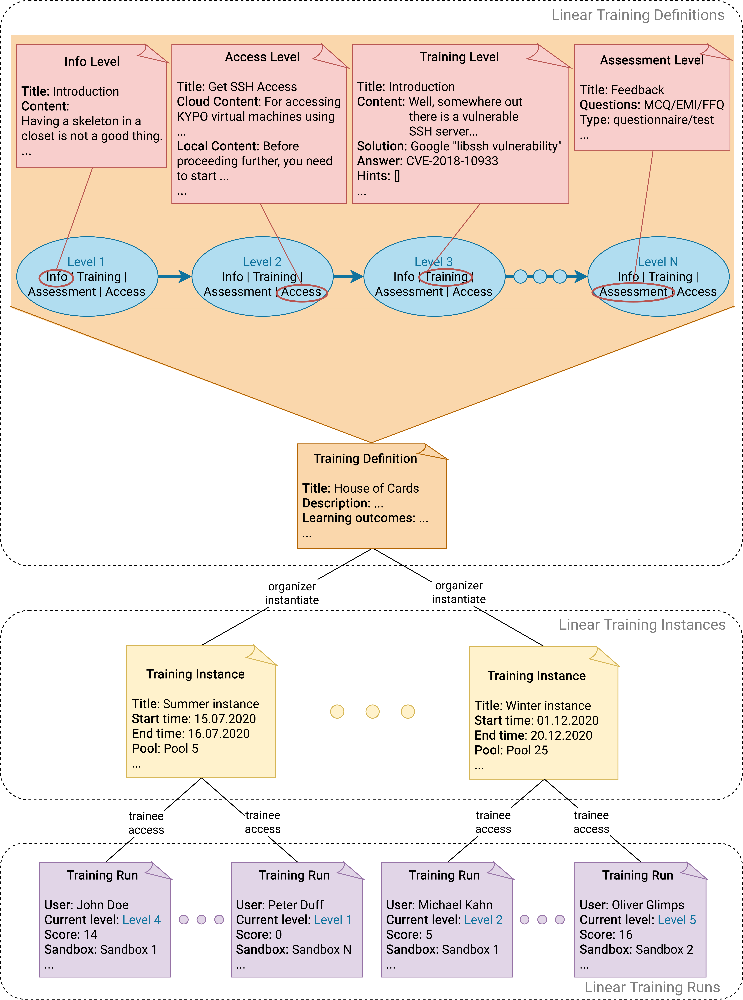

The KYPO platform is also used to create cybersecurity exercises and trainings. When working with the trainings, it is required to familiarize yourself with the following terms [Training Definition](#training-definition), [Training Instance](#training-instance), and [Training Run](#training-run).

## Training Definition

The content of the whole exercise is described using so-called training definitions. We distinguish the two types of definitions: **linear** and **adaptive**. In general, both types include information about the title, notes for instructors, and learning outcomes. Linear/adaptive training definition further consists of multiple **[levels](#levels)/[phases](#phases)**. A created training definition can be download as a file in JSON format. It is a good practice to store Training Definition in the Git repository next or close to the repository of Sandbox Definition that is specially created for that Training Definition.

### Levels   
 The *linear definition* consist of three types of levels: 

1. **Info Level**: Contains information for the trainee (welcome message or important information about the following levels).
2. **Training Level**: In the level, the user has to solve a predefined assignment. By solving the assignment, the trainee acquires a secret answer, and after submitting the answer, they can continue to the next level of the training. 
3. **Assessment Level**: Can be either a test or a questionnaire, and it serves to test users’ knowledge or gets feedback from users. The assessment can contain one of the following types of question: 
    * **Multiple choice question (MCQ)**: Trainees are asked to select one or multiple answers from the choices offered as a list.
    * **Extended matching item (EMI)**: Trainees are asked to pair items from row and column that are semantically related. 
    * **Freeform question (FFQ)**: Trainees are asked to type the answer to the submit field.

### Phases
The *adaptive definition* consist of four types of so-called phases: 
   
1. **Info Phase**: Contains information for the trainee (welcome message or important information about the following phases).
2. **Adaptive Questionnaire Phase**: The pre-training questionnaire is used to collect data about students’ knowledge and skills. The questions asked in the pre-training questionnaire are grouped into linked relations to specific training phases. Each question can be assigned into several relations since they can be relevant to more phases. For each training phase, the essential ratio of knowledge is set to determine whether the student’s theoretical knowledge or self-reported phase of skills is sufficient or not. The questionnaire can contain one of the following types of question: 
    * **Multiple choice question (MCQ)**: Trainees are asked to select one or multiple answers from the choices offered as a list.
    * **Free form question (FFQ)**: Trainees are asked to type the answer to the submit field. The submitted answer must match one of the predefined correct answers.
    * **Rating form question (RFQ)**: Trainees are asked to self-rate how they feel about a particular tool, technology, protocol, etc. 
3. **General Questionnaire Phase**: Similar to the adaptive questionnaire phase but the questions are not related to the training phases. The questionnaire is instead used to get feedback from trainees. The questionnaire contains the same type of questions as the adaptive one, but they cannot have the predefined correct answer. 
4. **Training Phase**: The phase consists of several task variants of various difficulty. Typically from the most difficult to the easiest one, but all on the same topic. Based on the trainee's actions in the previous phases and their answers obtained from the pre-training questionnaire, the task with the most suitable difficulty is provided. In the task, the user has to solve a predefined assignment. By solving the assignment, the trainee acquires a secret answer, and after submitting the answer, they can continue to the next phase of the training. To compute the most suitable task for the trainee, the Decision Matrix is defined in each phase. The matrix allows the instructor to set up the weights of the several aspects considered during the computation. The higher the computed value is, the more difficult task is chosen. The used aspects are: 
    * **Pre-training Questionnaire** - correctly answered a group of questions related to the phase in the adaptive questionnaire phase. 
    * **Keyword Used** - a number of commands entered in the terminal of the hosts inside the sandbox when solving the task.
    * **Completed in Time** - the trainee completes the task in the predefined time.
    * **Solution Displayed** - the solution has been revealed to the trainee. 
    * **Submitted Answers** - the number of the submitted incorrect answers. 

## Training Instance

A time-limited instance of a training definition during which trainees have access to training. The whole training instance progress is managed by instructors who can monitor events made by trainees that are displayed in various graphs and tables that may differ based on the type of assigned training definition. Each training instance has an assigned [pool](../../../user-guide-advanced/sandboxes/sandboxes-overview/#pool) with sandboxes. 

## Training Run

The training run represents a single run of the training of the particular trainee. The run is accessed based on the access token obtained from the training instance instructor. The trainee enters the access token to the particular field, and if the token is valid, the training run starts (behind the scenes, a sandbox is assigned to that training run from the pool that is associated with the particular training instance).

## Graphical Representation

### Linear Training

### Adaptive Training

### Overall 
The following picture displays interconnection between trainings and [sandboxes](../../sandboxes/sandboxes-overview).

