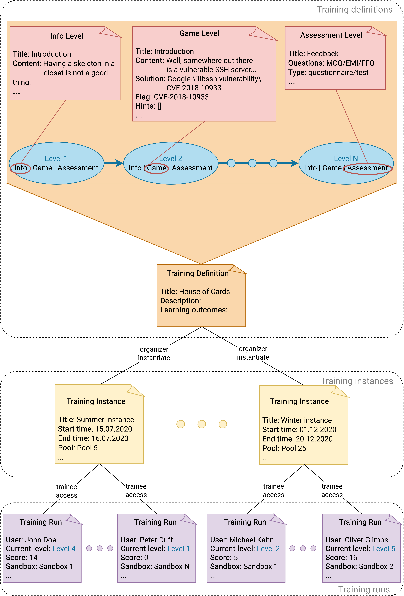

The KYPO platform is also used to create cybersecurity exercises and trainings. When working with the trainings, it is required to familiarize yourself with the following terms [Training Definition](#training-definition), [Training Instance](#training-instance), and [Training Run](#training-run).

## Training Definition

The content of the whole exercise is described using so-called training definitions. They include information about the title, notes for instructors, learning outcomes, and levels that consist of. There are three types of levels: 
   
1. **Info Level**: Contains information for the trainee (welcome message or important information about the following levels).
2. **Game Level**: In the level, the user has to solve a predefined assignment. By solving the assignment, the trainee acquires a secret flag, and after submitting the flag, they can continue to the next level of the training. 
3. **Assessment Level**: Can be either a test or a questionnaire, and it serves to test users’ knowledge or gets feedback from users. The assessment can contain one of the following types of question: 
    * **Multiple choice question (MCQ)**: Trainees are asked to select one or multiple answers from the choices offered as a list.
    * **Extended matching item (EMI)**: Trainees are asked to pair items from row and column that are semantically related. 
    * **Freeform question (FFQ)**: Trainees are asked to type the answer to the submit field.

A created training definition can be download as a file in JSON format. It is a good practice to store Training Definition in the Git repository next or close to the repository of Sandbox Definition that is specially created for that Training Definition.

## Training Instance

A time-limited instance of a training definition during which trainees have access to training. The whole progress of training instance is managed by instructors who can monitor events made by trainees that are displayed in various graphs and tables. Each training instance has an assigned [pool](../../../user-guide-advanced/sandboxes/sandboxes-overview#pool) with sandboxes. 

## Training Run

The training run represents a single run of the training of the particular trainee. The run is accessed based on the access token obtained from the training instance instructor. The trainee enters the access token to the particular field, and if the token is valid, the training run starts (behind the scenes, a sandbox is assigned to that training run from the pool that is associated with the particular training instance).

## Graphical Representation

The following picture displays interconnection between trainings and [sandboxes](../../sandboxes/sandboxes-overview).

