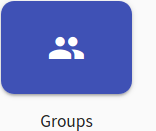
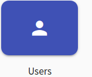
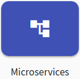
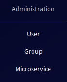

The purpose of the Administration agenda is to assign roles (e.g., trainee, instructor, or administrator) to the other users to work in the KYPO portal as expected. The administration agenda is available only for KYPO portal users with the role [administrator](../../../user-guide-advanced/users-and-groups/roles/#administrator). By default, all the logged-in users are assigned a role [trainee](../../../user-guide-advanced/users-and-groups/roles/#trainee) that is essential to play a training (for that reason, it is not required to do some extra step for students that enroll in the class for playing a training in KYPO portal).
The administration agenda is divided into three sections: 

* **[User Overview](./users.md)** section is used for the management of the users. 
* **[Group Overview](./groups.md)** section is used to manage the user groups and assignment of roles and users to them.
* **[Microservice Registration](microservices.md)** section is used to register new microservices into the KYPO portal. 

To access the sections mentioned above, click the respective button on the front page of the KYPO portal.

     

Or click the button in the global navigation in the section Administration:

  

