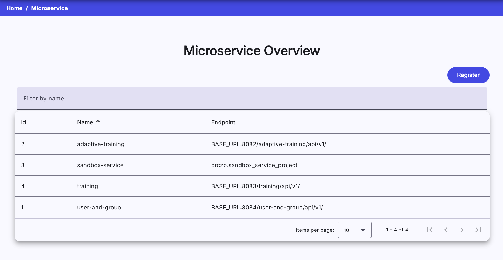
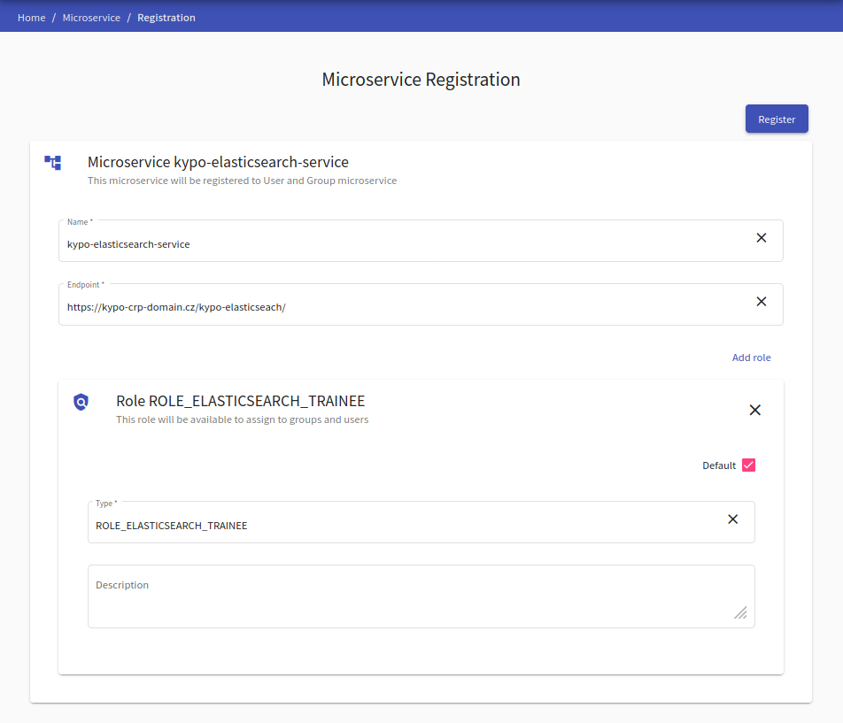

## Microservice Overview
This page lists all microservices that are registered in the CyberRangeCZ Platform. A new microservice can be added to the platform by clicking the  in the top right corner that will redirect an administrator to the [Microservice Registration](#microservice-registration) page.

## Microservice Registration
This page is used to register a new microservice, which is then used in the platform's background. The recommended way is to import the [security-commons library](https://github.com/cyberrangecz/backend-security-commons) into service and register microservice during startup.

