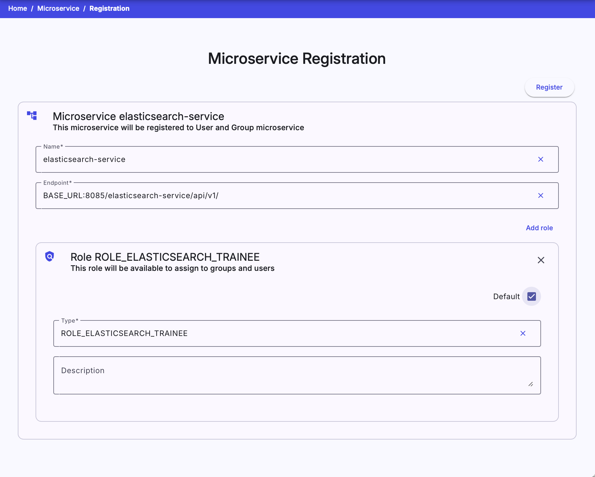

## Microservice Overview
This page lists all microservices that are registered in the KYPO Platform. A new microservice can be added to the platform by clicking the  in the top right corner that will redirect an administrator to the [Microservice Registration](#microservice-registration) page. 

## Microservice Registration
This page is used to register a new microservice which is then used in the background of the platform. The recommended way is to import the [kypo2-security-commons library](https://gitlab.ics.muni.cz/muni-kypo-crp/backend-java/kypo2-security-commons) into service and register microservice during startup.

