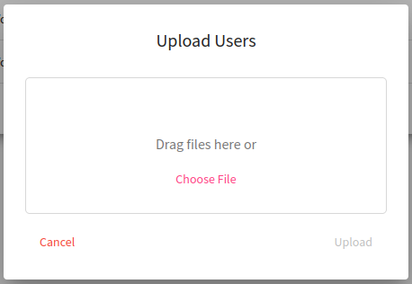

This page is used to list all users that had logged into the KYPO platform using arbitrary OIDC Provider (local issuer, MUNI, etc.). In the following table, each row represents one user. An administrator can view their roles by clicking the user's name that redirects the administrator to the [detail page](#user-detail) of a particular user. One user can be deleted by clicking on the delete button :material-delete:{: .red .icon } or multiple users can be deleted by checking users with checkboxes situated on the left side of the row and clicking the  button.


To download a YAML file with the credentials (login + password) of the users generated/created in the local OIDC provider click the  button. In order to import users who haven't been logged in yet and you would like to assign them roles click the  button. The following pop up window will be displayed: 

<p align="center">
  
</p>

Then click **Choose file** and select the file with the following structure: 

```
{
  "users": [
     {
       "sub": "test-user", (MANDATORY)
       "iss": "https://test.oidc.com/oidc/", (MANDATORY)
       "full_name": "Test User", (OPTIONAL)
       "given_name": "Test", (OPTIONAL)
       "family_name": "User" (OPTIONAL)
     },
     {
       ...
     }
  ]
  "group_name": "TEST GROUP", (OPTIONAL)
}
```

Field `users` represents a list of users to import. Each user object has several fields. Fields `sub` and `iss` must match the user login and URL of the OIDC provider that users will use to log in to KYPO CRP. It’s a good idea to copy the issuer URL from the table (column `Issuer`) on the **User Overview** page. Fields like `full_name`, `given_name`, and `family_name` are optional. They will be filled/updated as soon as the user logs in for the first time. Imported users are always assigned [default roles](../../../user-guide-advanced/users-and-groups/roles/#trainee).
Field `group_name` is also optional. If you don't define it, the users will be created, however, you need to manually assign them to other groups. Otherwise, the group will be created (a group with the same name cannot exist) and users will be assigned to it, so you can easily add roles to the group or import users to another group. 

## User Detail

The page consists of two panels. The first panel displays the username, email (if provided), and the user's number of roles. The second panel shows the list of the roles and the microservice name to which the role belongs. Upon clicking on one of the roles, its description is expanded. It is also possible to expand or collapse all these details at once.


