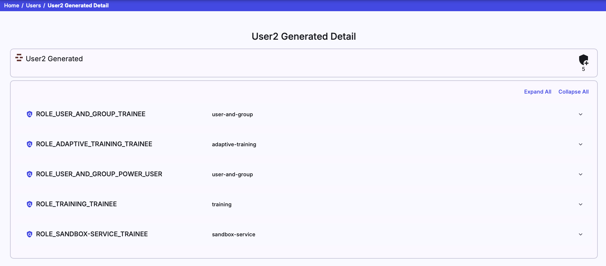

This page is used to list all users that had logged into the KYPO platform using arbitrary OIDC Provider (local issuer, MUNI, etc.). In the following table, each row represents one user. An administrator can view their roles by clicking the user's name that redirects the administrator to the [detail page](#user-detail) of a particular user. One user can be deleted by clicking on the delete button :material-delete:{: .red .icon } or multiple users can be deleted by checking users with checkboxes situated on the left side of the row and clicking the  button.

## User Detail

The page consists of two panels. The first panel displays the username, email (if provided), and the user's number of roles. The second panel shows the list of the roles and the microservice name to which the role belongs. Upon clicking on one of the roles, its description is expanded. It is also possible to expand or collapse all these details at once.

