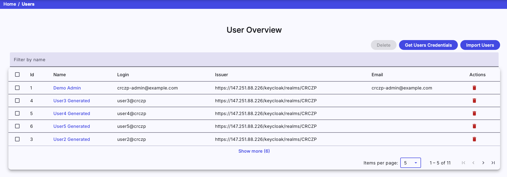

This section is used to list all users that had logged into the KYPO platform using arbitrary OIDC Provider (local issuer, MUNI, ...). In the following table, each row represents one user. An administrator can view their roles by clicking the expand button :material-chevron-down:{: .grey .icon } (next to the name of the user) that expands the row with the list of roles of a particular user. One user can be deleted by clicking on the delete button :material-delete:{: .red .icon } or multiple users can be deleted by checking users with checkboxes situated on the left side of the row and clicking the  button.  

