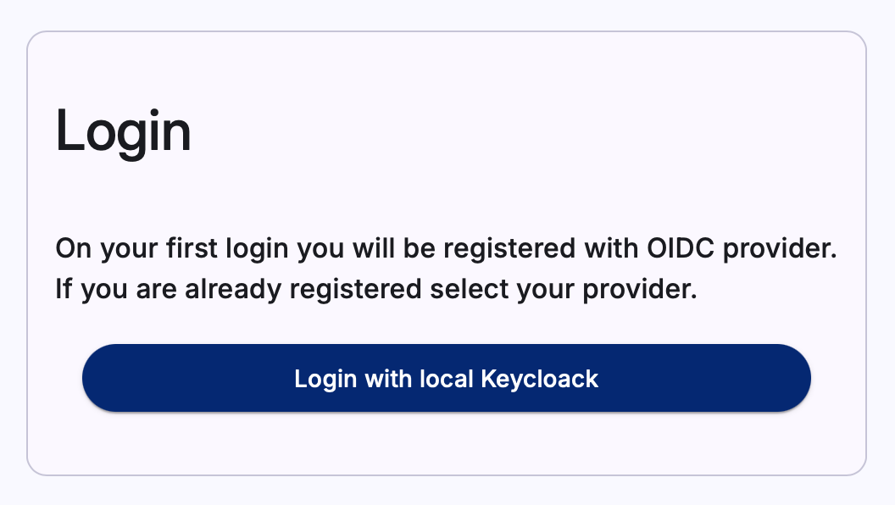
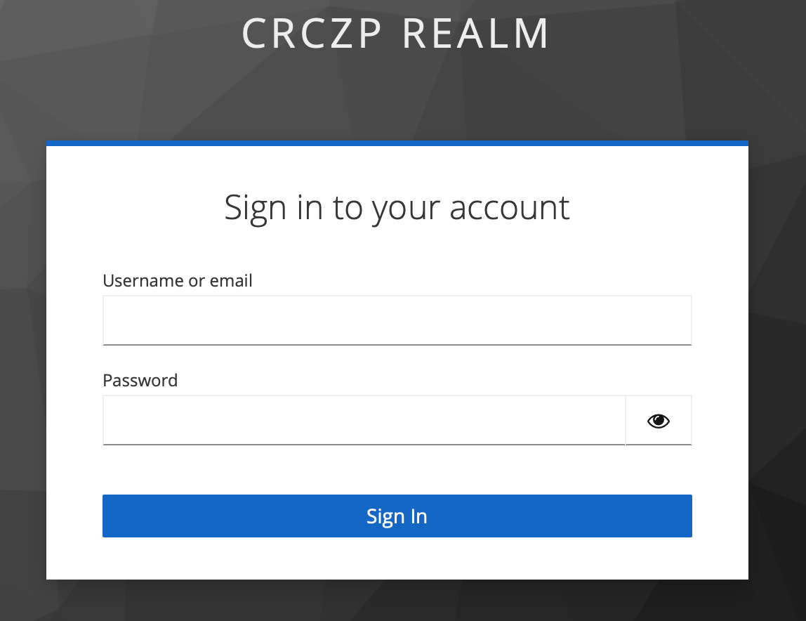
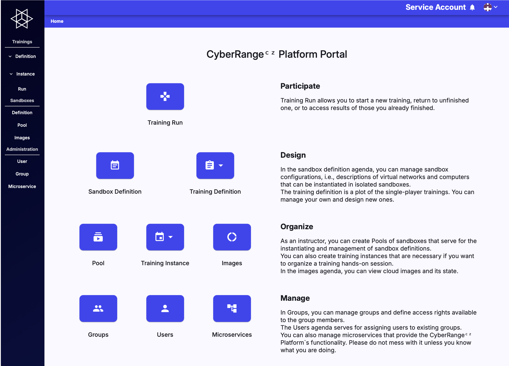

## Login

Enter a URL of the CyberRangeCZ Platform to your web browser to navigate to the CyberRangeCZ Platform Portal web page. Log in using one of the available OIDC providers. If you are not using Keycloak OIDC provider, **you must give access to your name**. If you have to use a Keycloak OIDC provider **(Keycloak issuer)**, which is a part of the CyberRangeCZ Platform, the administrator must provide credentials (username and password) to you.

  

It will redirect you to the selected OIDC provider to sign in. In the case of a Keycloak OIDC provider, the login page would be as follows:

After successful login, you will be redirected to the main page that should look similar to the following figure:

!!! Note
    Based on the roles you have, some buttons might not be displayed.

## Logout

At the top right corner, open the user menu where is the Logout button.

  

You will be redirected to the previously mentioned entry page to login.
