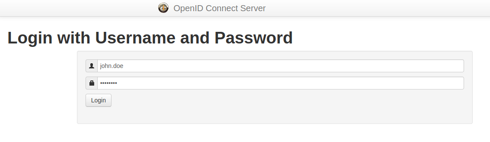
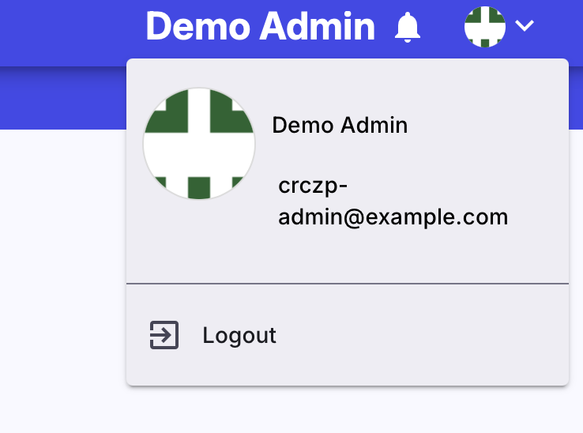

## Login

Enter a URL of the KYPO CRP to your web browser to navigate to the KYPO Portal web page. Log in using one of the available OIDC providers. If you are not using local OIDC provider, **you must give access to your name**. If you have to use a local OIDC provider **(local issuer)**, which is a part of the KYPO CRP, the administrator must provide credentials (username and password) to you.

  

It will redirect you to the selected OIDC provider to sign in. In the case of a local OIDC provider, the login page would be as follows: 

After successful login, you will be redirected to the main page that should look similar to the following figure:

!!! Note
    Based on the roles you have, some buttons might not be displayed. 

## Logout

At the top right corner, open the user menu where is the Logout button. 

  

It will redirect you to the logout confirmation page.

  

After confirmation, you will be redirected to the previously mentioned entry page to login.
