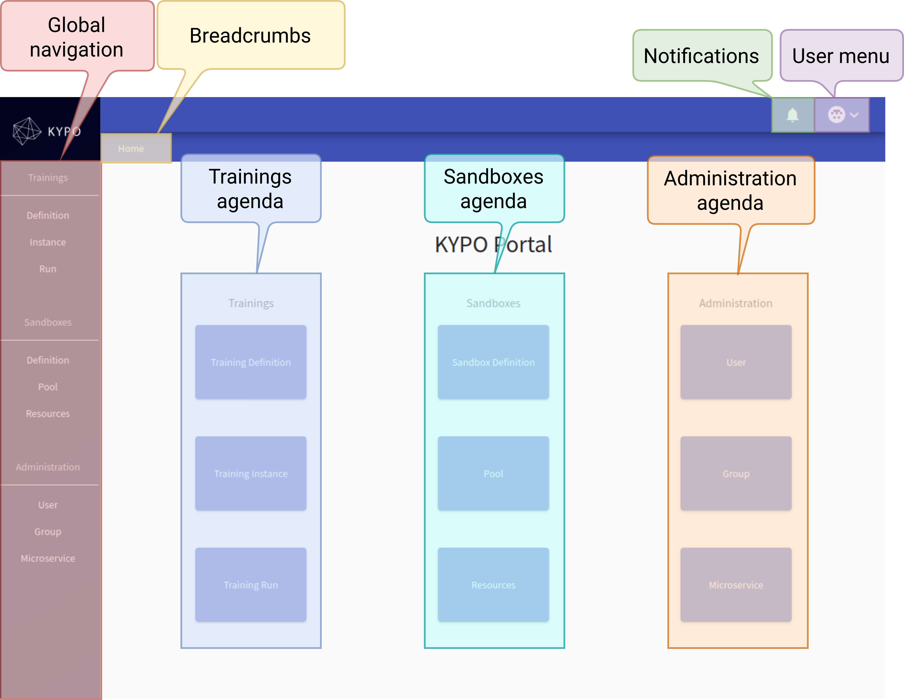
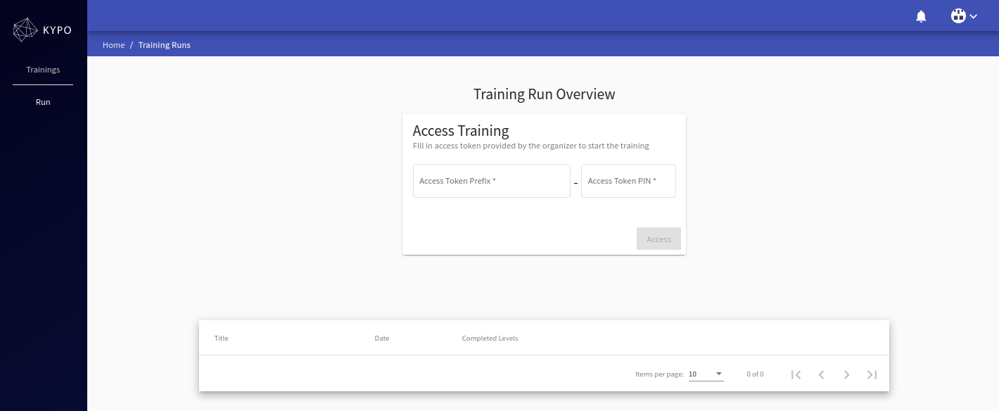
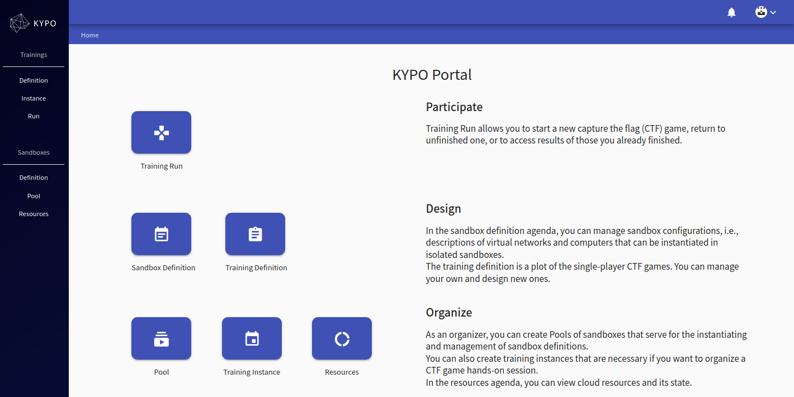
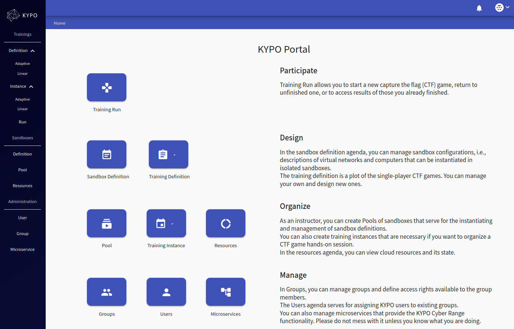

# Overview

The objective of the **User Guide (Basic)** is to provide basic guidelines to the users of the KYPO Portal. KYPO Portal is a graphical user interface that mediates access to the platform for the end-users by providing them with interactive visualization tools. In particular, the portal is designed to cover the microservices that manage the different areas of the KYPO platform and provide core functionalities.

The portal is divided into three **KYPO agendas**:

1. **[Trainings agenda](./training-agenda/training-agenda-overview)** with main focus on creation and organization of trainings.
2. **[Sandboxes agenda](./sandbox-agenda/sandbox-agenda-overview)** specifies guidelines for sandbox creation and realization. 
3. **[Administration agenda](./administration-agenda/administration-agenda-overview)** deals with the administration of users and their access to the specific parts of the KYPO Portal based on user access roles.

Then the User Guide (Basic) section then serves as a manual on how to operate all of the functions that these agendas offer.

## User Roles

Access to KYPO Portal depends a lot on the role you hold as a user. There are three main roles we differentiated and depending on them you can access different pages of agendas and perform various functionalities in the KYPO Portal.

* **[Trainees](#trainees-view):** Everybody who has access to the KYPO Portal and is interested in participating in the training can perform actions inside of the [Traning run](../training-agenda/training-run).
* **[Instructors](#instructors-view):** Users who are responsible for preparing and creating trainings and corresponding sandboxes can access the following pages: 
    * [Training definitions](../training-agenda/training-definition) and [Training instances](../training-agenda/training-instance) for overview and management of trainings. 
    * [Sandbox definitions](../sandbox-agenda/sandbox-definition) and [Pools](../sandbox-agenda/pool) needed for management of sandboxes, and [Resources](../sandbox-agenda/resources) for cloud resources overview.
* **[Administrators](#administrators-view):** Users who are responsible for managing the whole KYPO CRP instance. They have access to every above-mentioned page in the KYPO Portal. Moreover, they can also have the right to manage entities like users, groups, and microservices in [Administration Agenda](../administration-agenda/administration-agenda-overview). 

!!! note
    See the page [Roles](../../user-guide-advanced/users-and-groups/roles) for a better explanation of the meaning of roles.

## KYPO Portal Home Page

After a successful login, the home page of the KYPO Portal contains the elements displayed and marked in the following picture. 

!!! warning "Trainee"
    A trainee cannot see the home page. See [Trainee's Point of View](#the-trainees-point-of-view).

**Global navigation:** A persistent navigation menu, displayed on all pages. The menu is divided based on the agendas and contains links to specific pages.
**User menu:** User-specific information such as name and e-mail, and a logout button.
**Breadcrumbs:** Full path to the current page. Represents the folder structure.
**Notifications:** The list of the latest notifications.
**Agendas:** Buttons that allow to access specific pages of the individual three above-mentioned KYPO agendas. 

### Trainee's View
Each trainee will be after a successful log-in directly redirected to the [Training Run Overview](../training-agenda/training-run/#training-runs-overview) page. 

### Instructor's View
The instructor can access both Trainings Agenda and Sandboxes Agenda. 

### Administrator's View 

An administrator can access any page. 

