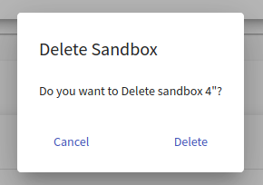

## Pool Overview

This page lists all sandbox pools that are accessible in the KYPO portal. In the following table, each row represents one pool: 

Instructors can click on the title of each pool to see a more [detailed view](#pool-detail) of the given pool. The last column of this table contains actions :material-delete:{: .red .icon} &nbsp; :material-youtube-subscription:{: .blue .icon} &nbsp; :material-dots-vertical:{: .grey .icon}  that can be executed on the given pool: 

??? trash-can "Delete"
    Click the button, and the following confirmation window will be opened:

    

    After confirming, the given pool will be deleted from the KYPO portal.

    !!! warning
        Pools that are **locked** or **not empty** cannot be deleted.

??? allocate-all "Allocate all"
    Click the button to start allocating all missing sandboxes.

    !!! info 
        More about allocation in the [pool detail](#pool-detail) section. 

??? plus-one "Allocate one"
    Click the button to start allocating one new sandbox.

    !!! info 
        More about allocation in the [pool detail](#pool-detail).

??? clear-all "Clear"
    Click the button to delete all allocation requests and sandboxes from the given pool.

    !!! warning
        All sandboxes must be unlocked, and all allocation requests must be finished/stopped.   

??? key "Get SSH Config"
    Click the button to display a pop-up window to download the ZIP archive. The archive contains configuration with the **Management** SSH access to successfully built sandboxes. More about SSH access can be found [here](../../user-guide-advanced/sandboxes/sandbox-access.md).

??? lock "Lock"
    Click the button to change the state of the given pool from **unlocked** to **locked**. The lock symbolizes that pool is in use with some training instance.

??? unlock "Unlock"
    Click the button to change the state of the given pool from **locked** to **unlocked**. Unlock symbolizes that pool is not in use with any training instance.   

-------------------------------------

!!! Note
    Actions 3. - 6. can be accessed in the menu shown after clicking on the **more options** :material-dots-vertical:{: .grey .icon} button.

 To create a new pool, click on the  button. The instructor will be redirected to the page [Create Pool](#create-pool).

## Create Pool
This page contains a short form that needs to be filled out before creating a new pool. The field **Sandbox Pool Size** specifies the maximal number of sandboxes that can be created inside the pool. The instructor must also select one of the available [sandbox definitions](./sandbox-definition.md) created by the instructor. Sandbox definitions define the topology of sandboxes and user configuration of virtual machines created in a sandbox. After filling out all the fields, confirm the creation of a new pool by clicking on the  button. 

The sandboxes built in the pool are always created from the same definition and the same revision. When the pool is created, it is tied to the current revision of the definition. If the definition revision has changed, e.g., new commit has been added to the specific branch, and you want to build sandboxes from a new revision, you need to make a new pool.
 

## Pool Detail
When the instructor clicks the title of a given pool in **Pool Overview** they will be redirected to the **Pool Detail** page, which contains panel addressing [sandbox instances](#sandbox-instances).

In the top right corner, there are control buttons:

 *  allocate all of the missing sandboxes in the pool,
 *  delete sandbox instances with failed stage,
 *  force delete all sandbox instances.

### Sandbox Instances

The instructor can see all the allocated sandboxes in the **Sandbox Instances** table. The last column of this table contains actions :material-delete:{: .red .icon} &nbsp; :bootstrap-topology:{: .blue .icon} &nbsp; :material-dots-vertical:{: .grey .icon} that can be executed on the given sandbox:

??? trash-can "Delete"
    Click the button, and the following confirmation window will be opened:

    

    After the confirmation, a new cleanup request for a given sandbox instance will be created.

    !!! info 
        Only unlocked sandboxes can be deleted.

??? topology "Display topology"
    Click the button to redirect to the page with the virtual network topology of the given sandbox.

    

??? key "Get SSH Config"
    Click the button to display a pop-up window to download the ZIP archive. The archive contains configuration with the **User** SSH access to a respective sandbox. More about SSH access can be found [here](../../user-guide-advanced/sandboxes/sandbox-access.md).

??? lock "Lock"
    Click the button to change the state of the sandbox instance from **unlocked** to **locked**. Lock symbolizes that the sandbox instance is connected to a training run. 

??? unlock "Unlock"
    Click the button to change the state of the sandbox instance from **locked** to **unlocked**. Unlock symbolizes that the sandbox instance can be connected to a training run. 

-----------------------------------------

!!! Note
    Actions lock and unlock can be accessed in the menu shown after clicking on the **more options** :material-dots-vertical:{: .grey .icon} button, and only one of these actions is always available, depending on the current state of the sandbox.

Allocation itself consists of **three** stages (allocation of a sandbox in the cloud, sandbox networking, sandbox provisioning). Each stage can be in one of the following states:

* **In Queue** : Stage is waiting to start.
* **Running** : Stage in progress.
* **Finished** :  Stage was successfully executed.
* **Failed** : An error occurred during the stage execution. 

!!! Note
    Sandbox instances with **failed** stage are unusable. Thus no action can be executed on them apart from delete.

Stage details of the sandbox are available by clicking on **sandbox name**. To see details of stage execution, click the **Stage detail** button of the given stage. In case that stage fails, the error message should be available there.

