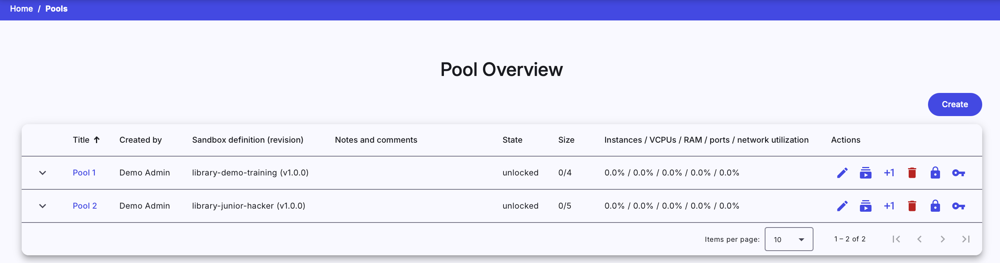
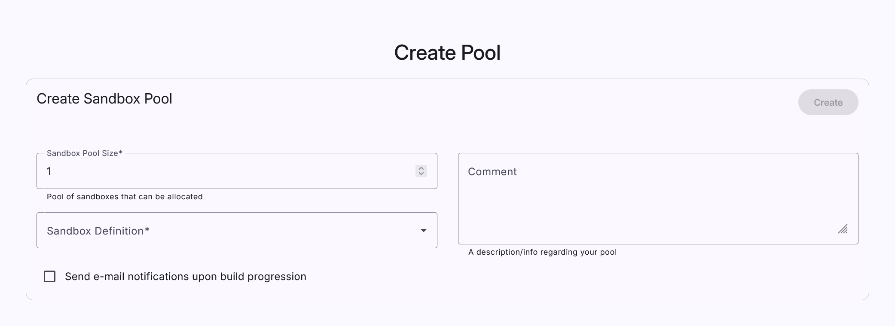
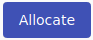

## Pool Overview

This page is used to list all sandbox pools that are accessible in the KYPO portal. In the following table, each row represents one pool: 

Instructors can click on the title of each pool to see a more [detailed view](#pool-detail) of the given pool. The last column of this table contains actions :material-delete:{: .red .icon} &nbsp; :material-youtube-subscription:{: .blue .icon} &nbsp; :material-dots-vertical:{: .grey .icon}  that can be executed on the given pool: 

??? trash-can "Delete"
    Click the button, the following confirmation window will be opened:

    

    After confirming, the given pool will be deleted from the KYPO portal.

    !!! warning
        Pools that are **locked** or **not empty** cannot be deleted.

??? allocate-all "Allocate all"
    Click the button to start allocating all missing sandboxes.

    !!! info 
        More about allocation in the [pool detail](#pool-detail) section. 

??? plus-one "Allocate one"
    Click the button to start allocating one new sandbox.

    !!! info 
        More about allocation in the [pool detail](#pool-detail).

??? clear-all "Clear"
    Click the button to delete all allocation requests and sandboxes from the given pool.

    !!! warning
        All sandboxes must be unlocked, and all allocation requests must be finished/stopped.   

??? download "Download"
    Click the button to display a pop-up window to download the ZIP archive. The archive contains configuration with the SSH access to a respective sandbox. More about SSH access can be found [here](../../user-guide-advanced/sandboxes/sandbox-ssh-access.md).

??? lock "Lock"
    Click the button to change the state of the given pool from **unlocked** to **locked**. The lock symbolizes that pool is in use with some training instance.

??? unlock "Unlock"
    Click the button to change the state of the given pool from **locked** to **unlocked**. Unlock symbolizes that pool is not in use with any training instance.   

-------------------------------------

!!! Note
    Actions 3. - 6. can be accessed in the menu shown after clicking on the **more options** :material-dots-vertical:{: .grey .icon} button.

 To create a new pool, click on the  button. The instructor will be redirected to the page [Create Pool](#create-pool).

## Create Pool
This page contains a short form that needs to be filled out before creating a new pool. The field **Sandbox Pool Size** specifies the maximal number of sandboxes that can be created inside the pool. The instructor must also select one of the available [sandbox definitions](./sandbox-definition.md) created by the instructor. Sandbox definitions define the topology of sandboxes and user configuration of virtual machines created in a sandbox. After filling out all the fields, confirm the creation of a new pool by clicking on the  button.
 

## Pool Detail
When the instructor clicks the title of a given pool in **Pool Overview** they will be redirected to the **Pool Detail** page, which contains panels addressing [sandbox instances](#1-sandbox-instances), [allocation units](#2-allocation-units), [allocation requests](#3-allocation-requests), and [cleanup requests](#4-cleanup-requests).

In the top right corner, there is the  button that can be used to start the allocation of all missing sandboxes in the pool.

### 1. Sandbox Instances

The instructor can see all of the allocated sandboxes in the **Sandbox Instances** table. The last column of this table contains actions :material-delete:{: .red .icon} &nbsp; :bootstrap-topology:{: .blue .icon} &nbsp; :material-dots-vertical:{: .grey .icon} that can be executed on the given sandbox:

??? trash-can "Delete"
    Click the button, the following confirmation window will be opened:

    

    After the confirmation, a new [cleanup request](#4-cleanup-requests) for a given sandbox instance will be created.

    !!! info 
        Only unlocked sandboxes can be deleted.

??? topology "Display topology"
    Click the button to redirect to the page with the virtual network topology of the given sandbox.

    

??? lock "Lock"
    Click the button to change the state of the sandbox instance from **unlocked** to **locked**. Lock symbolizes that the sandbox instance is connected to a training run. 

??? unlock "Unlock"
    Click the button to change the state of sandbox instance from **locked** to **unlocked**. Unlock symbolizes that the sandbox instance can be connected to a training run. 

-----------------------------------------

!!! Note
    Actions lock and unlock can be accessed in the menu shown after clicking on the **more options** :material-dots-vertical:{: .grey .icon} button and only one of these actions is always available, depending on the current state of the sandbox.

### 2. Allocation Units

Each sandbox that is allocating or has been allocated is tied with the allocation unit. It is the object which manages allocation requests and cleanup requests. Allocation is composed of [three stages](#allocation-request-stages). If one of these stages fails, the sandbox cannot be used. The last column of the table contains the **create cleanup request** button :bootstrap-cleaning-services:{: .blue .icon}. In case that all stages of the allocation request are successfully finished, the button works the same as the delete button in the Sandbox Instances table. Otherwise, the respective [allocation request](#3-allocation-requests) must be canceled (to invalidate other stages), and then **create a cleanup request** button can be used.

### 3. Allocation Requests

In the **Allocation Requests** table, the instructor can see all allocation requests. Click on the title of the request will redirect to the [request detail](#allocation-request-stages) page. The last column of the table contains **cancel** button :material-close-circle:{: .red .icon }. If the instructor clicks the button, the ongoing allocation will be canceled and a given sandbox will not be allocated. 

!!! warning
    Canceling a finished allocation request will cause an error.

### 4. Cleanup Requests

In the **Cleanup Requests** table, the instructor can see all cleanup requests. With the completion of cleanup requests the associated **sandbox instance**, **allocation request** and, **allocation unit** are deleted from the KYPO portal. There can be only one cleanup request per sandbox. The last column of the table contains actions :material-close-circle:{: .red .icon } &nbsp; :material-delete:{: .red .icon }:

??? cancel "Cancel request"
    Click the button to cancel the ongoing cleanup request. The respective sandbox won't be removed.

??? trash-can "Delete request"
    Click the button to delete the cleanup request. Only canceled cleanup requests can be deleted.

## Allocation Request Stages 
The page consists of three panels. Each represents one stage of allocation (allocation of a sandbox in the cloud, sandbox networking, sandbox provisioning) and can be in one of the following states: 

* **In Queue**: Stage is waiting to start.
* **Running**: Stage in progress.
* **Finished**:  Stage was successfully executed.
* **Failed**: An error occurred during the stage execution. 

To see details of stage execution click the **Stage detail** button of the given stage. In case that stage will fail, the error message should be available there.

