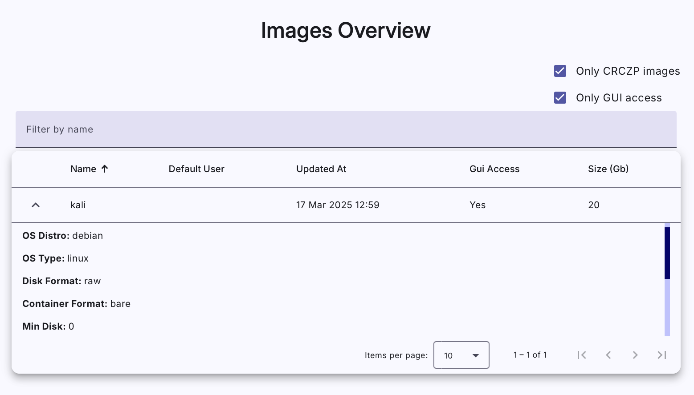

## Resources Overview

Resources Overview consist of panels describing [statistics of OpenStack project utilization](#1-usage-statistics-of-cloud-server) and [overview of available images](#2-overview-of-images).

### 1. Usage Statistics of Cloud Server
* **kypo-platform-testing**: the name of a used OpenStack project,
* **Instances**: Created VMs in the OpenStack project,
* **VCPUs**: Virtual CPUs currently in use by all instances,
* **RAM**: The amount of the main memory currently in use by all instances.

### 2. Overview of Images
It provides a list of available images that can be installed on virtual machines. Each row contains the following values of image parameters:

* **Name**: The unique name of the image.
* **Default User**: User used to login to the virtual machine via GUI or connect via SSH.
* **Updated At**: Last time image was updated.
* **Min Disk**: Minimum amount of disk memory to boot image, in gigabytes.
* **Min RAM**: Minimum amount of main memory to boot image, in megabytes.
* **Status**
* **Visibility**: Public, private, community, shared.

Click extend button :material-chevron-down:{: .icon .grey} to show **detailed information** about image: 

* **OS Distro**: Common name of operating system distribution.
* **OS Type**: Linux or windows.
* **Disk Format**: Format of the underlying disk image, specifies how the disk stores information.
* **Container Format**: Indicates whether image also contains metadata about virtual machine (bare = no metadata).
* **Size**: The size of the image, in bytes.
* **Created At**: Time of the creation.
* **Tags**: Used to filter images.

