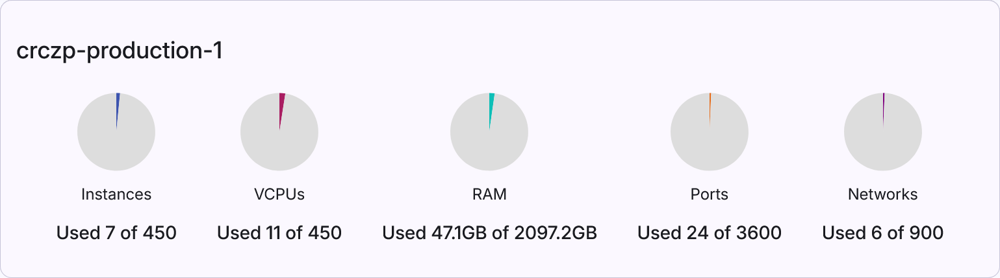

## Resources Overview

Resources Overview consist of two panels:

1. [**Usage statistics of cloud server**](#1-usage-statistics-of-cloud-server)
2. [**Overview of OS images**](#2-overview-of-os-images)

### 1. Usage Statistics of Cloud Server
* **kypo-platform-testing**: the name of a cloud server,
* **Instances**: Created VMs in the cloud server,
* **vCPUs**: Virtual CPUs currently in use by all instances,
* **RAM**: The amount of the main memory currently in use by all instances.

### 2. Overview of OS Images
Provides a list of available OS images that can be installed on VMs. Each row contains the following values of image parameters:

* **Name**: The unique name of the OS image.
* **Default User**: User used to login to VM, or connect via SSH.
* **Updated At**: Last time image was updated.
* **Min Disk**: Minimum amount of disk memory to boot image, in gigabytes.
* **Min RAM**: Minimum amount of main memory to boot image, in megabytes.
* **Status**
* **Visibility**: Public, private, community, shared.

Click extend button :material-chevron-down:{: .icon .grey} to show **detailed information** about image: 

* **OS Distro**: Common name of operating system distribution.
* **OS Type**: Linux or windows.
* **Disk Format**: Format of the underlying disk image, specifies how the VM disk image stores information.
* **Container Format**: Indicates whether image also contains metadata about VM (bare = no metadata).
* **Size**: The size of the image, in bytes.
* **Created At**: Time of the creation.
* **Tags**: Used to filter images.

