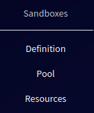

# Overview
The purpose of the Sandbox Agenda is to create and manage sandbox definitions, pools, instances and resources. These activities are mapped onto the [Sandbox Creation](../../../basic-concepts/typical-workflow/#sandboxes-creation) workflow. User with role [instructor](../../../user-guide-advanced/users-and-groups/roles/#instructor) can access this agenda. The sandbox agenda is divided into three parts:

* **[Sandbox Definition](sandbox-definition.md)** section is used to create Sandbox definitions.

* **[Pool](pool.md)** section is used to create Pools from Sandbox definitions and manage created Pools. 

* **[Resources](resources.md)** section is used to display available Instances, VCPUs and RAM in cloud service. It also provides a list of available OS images.

To access the above-mentioned pages, click the respective button on the front page of the KYPO portal. 

  

Or by clicking the respective button in the global navigation in the section Sandboxes:

  

