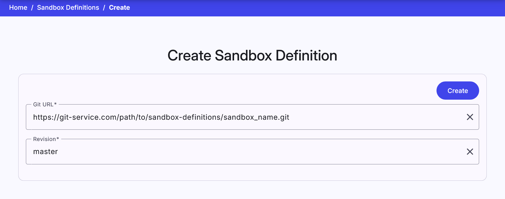

## Sandbox Definition Overview
This page is used to list all sandbox definitions that can be used by instructors to create a pool of sandboxes for training instances. It consists of a table where each row represents one sandbox definition. Click the expand button :material-chevron-down:{: .icon} to show detailed info about the sandbox definition. The definition that is not assigned to any pool can be deleted using the delete button :material-delete:{: .red .icon }. A new sandbox definition can be added by clicking on the  button that redirects the instructor to the [Create Sandbox Definition](#create-sandbox-definition) page. 

 

## Create Sandbox Definition
Before creating a sandbox, the topology of the sandbox and user configuration of the machines in the sandbox needs to be described. To do that, the sandbox definition is used. It contains every information needed to create a sandbox instance in a cloud. In the current version, the sandbox definition is created outside the KYPO platform and then stored as a GIT repository. The process of creation is described [here](../../user-guide-advanced/sandboxes/sandbox-definition.md). 

The page in the KYPO portal contains only one panel with two required fields: 

* **Git URL**: Git clone SSH URL of the sandbox definition. See the picture below.
* **Revision**: A revision parameter typically, but not necessarily, names a commit object (mostly master).

If these fields are correct, a new sandbox definition is created by clicking the  button. 

