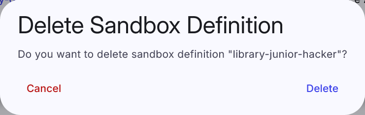

## Sandbox Definition Overview
This page lists all sandbox definitions that instructors can use to create a pool of sandboxes for training instances. It consists of a table where each row represents one sandbox definition.

Instructor can click on the title of each sandbox definition to redirect to the definition Git repository or click the expand button :material-chevron-down:{: .icon} to show detailed info about the sandbox definition. The last column of this table contains actions :bootstrap-topology:{: .blue .icon } &nbsp; :material-delete:{: .red .icon} that can be executed on the given sandbox definition:

??? topology "Display topology"
    Click the button to redirect to the page with the preview of the virtual network topology of the given sandbox definition.

    

??? trash-can "Delete"
    Click the button, and the following confirmation window will be opened:

    

    !!! warning
        Only sandbox definitions not assigned to any pool can be deleted!

A new sandbox definition can be added by clicking on the  button that redirects the instructor to the [Create Sandbox Definition](#create-sandbox-definition) page.

## Create Sandbox Definition
Before creating a sandbox, the sandbox's topology and user configuration of the machines in the sandbox needs to be described by the [sandbox definition](../../user-guide-advanced/sandboxes/sandbox-definition.md). It contains all information needed to create a sandbox instance in a cloud. In the current version, the sandbox definition is created outside the CyberRangeCZ Platform and then stored as a Git repository.

The page in the CyberRangeCZ Platform portal contains only one panel with two required fields:

* **Git URL**: Git clone HTTPS URL of the sandbox definition. See the picture below.
* **Revision**: A revision parameter typically, but not necessarily, names a commit object (mostly master).

If these fields are correct, a new sandbox definition is created by clicking the  button.

