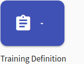
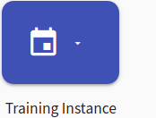
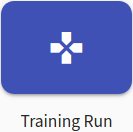
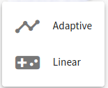
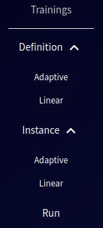

# Overview

The purpose of the Training Agenda is to create and manage trainings that are only available to users with the role [instructor](../../../user-guide-advanced/users-and-groups/roles/#instructor). Another purpose of the agenda is accessing training runs which is available for all users with the role [trainee](../../../user-guide-advanced/users-and-groups/roles/#trainee). These activities are mapped onto the [Training Creation](../../../basic-concepts/typical-workflow-for-training/#training-creation) workflow. The training agenda is divided into four sections:

* **Training Definition** section is used to create and manage training definitions (the content of trainings). You can choose between the [Linear Training Definition](training-definition/linear-training-definition.md) and [Adaptive Training Definition](training-definition/adaptive-training-definition.md)
 
* **[Training Instance](training-instance.md)** section is used to create and manage training instances (a time-limited period to participate in training). You can also choose between **Linear Training Instance** and **Adaptive Training Instance**. 

* **Training Run** section is used to access new training runs and for the overview of already accessed training runs and their results. The runs may differ according to the type of training. See [Linear Training Run](training-run/linear-training-run.md) and [Adaptive Training Run](training-run/adaptive-training-run.md)

!!! note
    To access the above-mentioned pages in the portal, click the respective button on the front page of the KYPO portal. 

* **Visualization Tools** incorporate the visual components from the aforementioned sections. They are used to provide insight into training data visually. For adaptive training, see [Visualizations for Adaptive Training](visualizations/visualizations-for-adaptive.md). For linear training results or progression, see [Visualizations for Linear Training](visualizations/visualizations-for-linear.md).

**Training Definition**, **Training Instance**, or **Training Run** can be accessed from the front page of the KYPO portal.

     

Then in the case of definition and instance choose the respective type. 

  

Or click the button in the global navigation in the section Trainings.

  

!!! note
    If you only have the role `ROLE_TRAINING_TRAINEE` you will be directly forwarded to the page [Training Runs Overview](../training-run/linear-training-run/#training-runs-overview) without any further action after a successful login.
