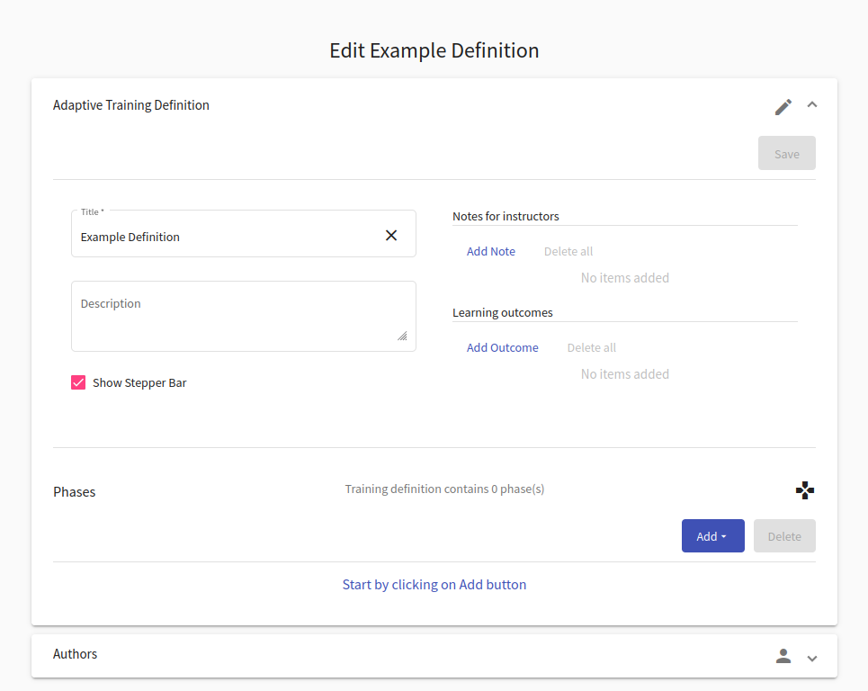
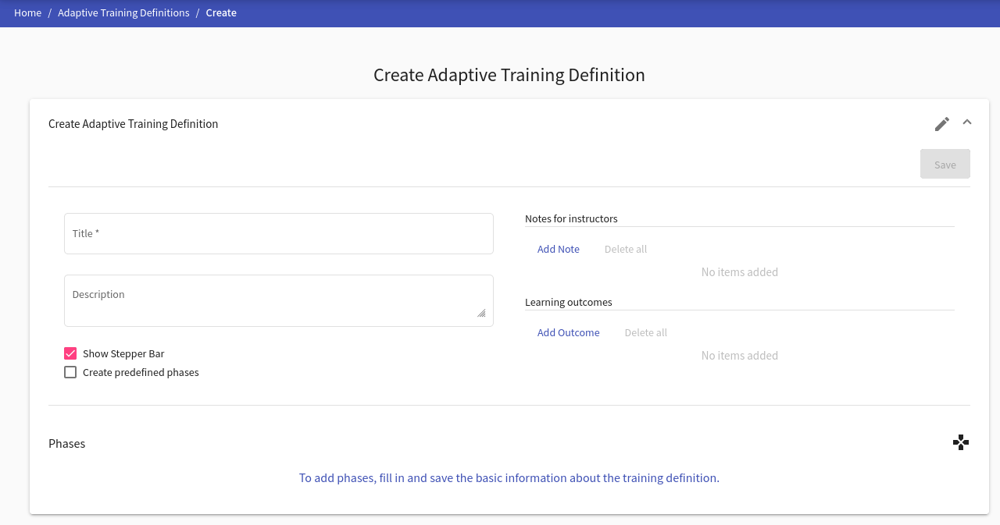
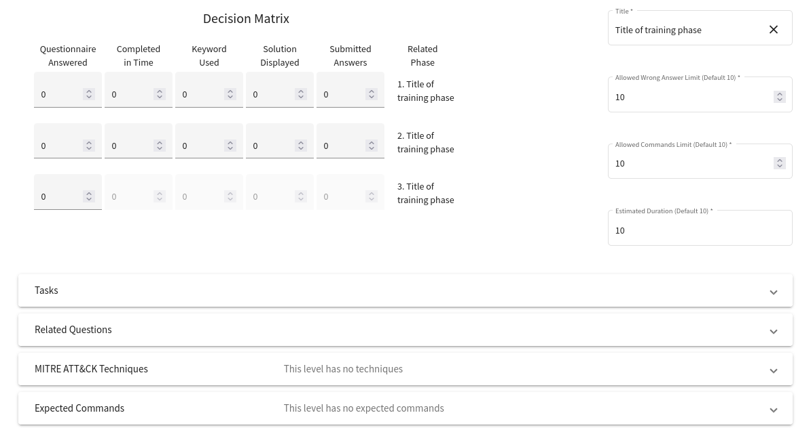
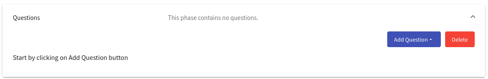

## Adaptive Training Definition Overview
This page lists all adaptive definitions that are available to the instructor (the instructors can see only the ones that they create or the ones that they are co-authors). In the top right corner are located buttons  and  that are used to [add a new definition](#add-a-new-definition) into the KYPO portal. In the following table, each row represents one adaptive training definition. The last column of this table contains actions :material-pencil:{: .blue .icon} &nbsp; :material-delete:{: .red .icon} &nbsp; :material-dots-vertical:{: .grey .icon} that can be executed on a given training definition.

  

!!! info
    Users with the role `ROLE_ADAPTIVE_TRAINING_ADMINISTRATOR` can see all of the training definitions.

??? pencil "Edit"
    
    Click the button, the training definition editor page will be opened:
    
    

        
    

    
    Here the instructor can use given panels to edit a training definition in the same fashion as when they are [creating a new definition](#1-create-a-new-definition). Every change needs to be saved with the  button. 
    
    !!! info
        The instructor can only save changes made in the training definition that is **Unreleased**. **Released** and **Archived** definitions cannot be changed.
    
??? trash-can "Delete"
    
    Click the button, the following confirmation window will be opened: 
    
    

      
    

    
    After confirming, the given training definition will be deleted from the KYPO portal.
    
    !!! info
        Training definitions that are used in any **training instance** cannot be deleted. 

??? clone "Clone"
    
    Click the button, the following window will be opened:
    
    

      
    

    
    Here the instructor can change the name of the new training definition that will be added to the KYPO portal. The contents of this new definition will be identical to the original training definition.
    
??? download "Download"
    
    Click the button to export the respective training definition as a file in JSON format that can be downloaded into the local machine. This file can be used to [upload](#2-upload-a-definition-from-json-file) a given definition back into the KYPO portal. 
    
    
??? lock "Release"
   
    Click the button to change the state of the definition to **Released**. 
    Released definitions cannot have their content changed, but they can have its state changed to either **Unreleased** or **Archived**.

  
??? unlock "Unrelease"
    
    Click the button to change the state of the definition to **Unreleased**.
    Unreleased definitions allow the instructor to edit the content inside of them and can have its state changed to **Released**.
    
??? archive "Archive"
    
    Click the button to change the state of the definition to **Archived**.
    Archived definitions cannot have their content changed and cannot be switched to any other state.

----------------------------------------------------

!!! note
    Actions 3. - 7. can be accessed in the menu shown after clicking on the **more options** button :material-dots-vertical:{: .grey .icon}. 

## Add a New Definition
There are three approaches on how to create a new training definition. 

1. [Create a new definition](#1-create-a-new-definition) from a scratch. 
2. [Upload a definition ](#2-upload-a-definition-from-json-file) from JSON file.
3. Last approach is to clone an already existing definition. More about this it is written in the previous [subsection](#training-definition-overview)).

### 1. Create a New Definition
To create a new training definition click on the top right button . This will open the training definition editor page.

#### Create Training Definition Panel
In the first panel of the training definition editor, the instructor can edit fields that describe the new definition. When the instructor is done, they can either click on:
1.   that will create a new definition and redirect them back to [Adaptive Training Definition Overview](#adaptive-training-definition-overview).
2.   that will allow the instructor to edit **authors** and **phases** of the definition.

    

#### Edit Authors Panel
In the second panel of the training definition editor, the instructor can add and remove authors from the definition.

  

#### Edit Phases Panel
The instructor can add, delete, and edit phases of the training definition in the third panel.

  

To add a new phase the instructor can click  that will roll down a menu in which the instructor can choose a type of the new phase:

  

!!! tip
    To change the order of phases, use the drag-and-drop mechanism. Select a phase in the phase bar by "grabbing" it and dragging it to a different position.

##### I. Training Phase
At the training phase, a trainee gets assigned with one of the provided task variants based on their performance. Trainees can access a virtual network inside the sandbox to find a solution to the assignment. The instructor can fill this form to specify details of the new phase (when the instructor is done editing phase, they must save changes with the  button.

**Decision Matrix** contains weights for five monitored metrics (questionnaire answers, completed in time, the keyword used, solution displayed, and submitted answers). The matrix is used to add relationships between phases and their metrics. For instance, consider training with six phases where the third phase deepens the topic exercised in the first phase. In this case, we set the weights in the third matrix so that the selected weights for the metrics from the first phase are non-zero. The other performance metrics with weights set to zero are ignored. The weights have to be manually set by the instructor since each training is unique. 

Further, based on the decision matrix and a participants' performance a suitable task is computed and assigned to the participant during the adaptive training run.

  

Under the training phase editing form, there is an additional **Tasks** panel that the instructor can use to create, delete, and edit task variants associated with a given training phase.

  

A new task can be added with the  button and edited with the following form (when the instructors finish the editing of tasks, they must save changes with the  button). New tasks can also be created by copying the content of the selected task by using the  button). To change the order of tasks, use the drag-and-drop mechanism. 

  

##### II. Adaptive Questionnaire Phase
In the adaptive questionnaire phase, the trainees answer a list of questions. Questions of the adaptive questionnaire can be further linked to training phases (links affect the Questionnaire Answered aspect of the Decision Matrix). Content of this phase can be edited with the following form (when the instructors finish the editing of this phase they must save changes with the  button:

  

Under the title field, there is a **Questions** panel to create, delete and, edit questions associated with the given adaptive questionnaire phase:   
 

  

A new question can be added with the  button that will roll down the menu where the instructor can choose a type of the new question:

  

Each type has its specific editing form. Each change that has been made must be saved with the  button.

  

Under the **Questions** panel, there is a **Question-Phase Relations** panel used to create relations between the question sets and training phases:

  

A new relation can be added with the  button that will roll down the menu where the instructor can choose one of the training phases from the same training definition: 

  

Relations can be further edited using the following form:

  

!!! note
    Only **saved** questions can be added to the relation. 

##### III. General Questionnaire Phase
In the general questionnaire phase, the trainees answer a list of questions in the same way as in the adaptive questionnaire phase. The difference being that the general questionnaire phase does not contain the question-phase relations, and its questions cannot have correct answers predefined. Instructors can edit this phase in the following form:

  

Under the title field, there is a **Questions** panel to create, delete and, edit questions associated with the given general questionnaire phase:   
 

  

A new question can be added with the  button that will roll down the menu where the instructor can choose a type of the new question:

  

Each type has its specific editing form. Each change that has been made must be saved with the  button.

  

##### IV. Info Phase
In the info phase the trainees read the content of the information written by the instructor in the following form:

  

### 2. Upload a Definition From JSON File
To upload a training definition, on the page **Adaptive Training Definition Overview**, click on the  button on the top right corner. It will open the following window:

  

Upload training definition that has been downloaded as a file in JSON format. This use-case is useful when the instructor wants to re-use the training definition stored in the past.
