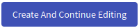

## Linear Training Definition Overview
This page lists all definitions that are available to the instructor (the instructors can see only the ones that they create or the ones that they are co-authors). In the top right corner are located buttons  and  that are used to [add a new definition](#add-a-new-definition) into the KYPO portal. In the following table, each row represents one training definition. The last column of this table contains actions :material-pencil:{: .blue .icon} &nbsp; :material-delete:{: .red .icon} &nbsp; :material-dots-vertical:{: .grey .icon} that can be executed on a given training definition.

  

!!! info
    Users with the role `ROLE_TRAINING_ADMINISTRATOR` can see all of the training definitions.

??? pencil "Edit"
    
    Click the button, the training definition editor page will be opened:
    
    

        
    

    
    Here the instructor can use given panels to edit a training definition in the same fashion as when they are [creating a new definition](#1-create-a-new-definition). Every change needs to be saved with the  button. 
    
    !!! info
        The instructor can only save changes made in the training definition that is **Unreleased**. **Released** and **Archived** definitions cannot be changed.
    
??? trash-can "Delete"
    
    Click the button, the following confirmation window will be opened: 
    
    

      
    

    
    After confirming, the given training definition will be deleted from the KYPO portal.
    
    !!! info
        Training definitions that are used in any **training instance** cannot be deleted. 

??? clone "Clone"
    
    Click the button, the following window will be opened:
    
    

      
    

    
    Here the instructor can change the name of the new training definition that will be added to the KYPO portal. The contents of this new definition will be identical to the original training definition.
    
??? download "Download"
    
    Click the button to export the respective training definition as a file in JSON format that can be downloaded into the local machine. This file can be used to [upload](#2-upload-a-definition-from-json-file) a given definition back into the KYPO portal. 
    
??? preview "Preview"
   
    Click the button to show how the training definition will look from the perspective of the trainee. Solution and hints are automatically revealed in the preview of the training definition, but they remain hidden during the training run and can be revealed by clicking the respective button.
    
    

      
    

    
    !!! info
        Sandbox topologies in the preview are mocked and not connected to any real sandbox, so they cannot be used to access any virtual network.

    
??? lock "Release"
   
    Click the button to change the state of the definition to **Released**. 
    Released definitions cannot have their content changed, but they can have its state changed to either **Unreleased** or **Archived**.

  
??? unlock "Unrelease"
    
    Click the button to change the state of the definition to **Unreleased**.
    Unreleased definitions allow the instructor to edit the content inside of them and can have its state changed to **Released**.
    
??? archive "Archive"
    
    Click the button to change the state of the definition to **Archived**.
    Archived definitions cannot have their content changed and cannot be switched to any other state.

----------------------------------------------------

!!! note
    Actions 3. - 8. can be accessed in the menu shown after clicking on the **more options** button :material-dots-vertical:{: .grey .icon}. 

## Add a New Definition
There are three approaches on how to create a new training definition. 

1. [Create a new definition](#1-create-a-new-definition) from a scratch. 
2. [Upload a definition ](#2-upload-a-definition-from-json-file) from JSON file.
3. Last approach is to clone an already existing definition. More about this it is written in the previous [subsection](#training-definition-overview)).

### 1. Create a New Definition
To create a new training definition click on the top right button . This will open the training definition editor page.

#### Create Training Definition Panel
In the first panel of the training definition editor, the instructor can edit fields that describe the new definition. When the instructor is done, they can either click on:
1.   that will create a new definition and redirect them back to [Training Definition Overview](#training-definition-overview).
2.   that will allow the instructor to edit **authors** and **levels** of the definition.

    

#### Edit Authors Panel
In the second panel of the training definition editor, the instructor can add and remove authors from the definition.

  

#### Edit Levels Panel
The instructor can add, delete, and edit game levels of the training definition in the third panel.

  

To add a new level the instructor can click  that will roll down a menu in which the instructor can choose a type of the new level:

  

!!! tip
    To change the order of levels, use the drag-and-drop mechanism. Select a level in the level bar by "grabbing" it and dragging it to a different position.

##### I. Game Level
At the game level, a trainee can access a virtual network inside the sandbox to find a solution to the assignment. The instructor can fill this form to specify details of the new level (when the instructor is done editing level, they must save changes with the  button.

  

Under the game level editing form, there is a fourth additional **Hints** panel that the instructor can use to create, delete, and edit hints associated with a given game level.

  

A new hint can be added with the  button and edited with the following form (when the instructors finish the editing of hints, they must save changes with the  button). To change the order of hints, use the drag-and-drop mechanism. 

  

##### II. Assessment Level
In the assessment level, the trainees answer a list of questions. Content of this level can be edited with the following form (when the instructors finish the editing of this level they must save changes with the  button:

  

Under the assessment level editing form there is an additional **Questions** panel to create, delete and, edit questions associated with the given assessment level:   
 

  

The instructor can choose to create a test or questionnaire, so the creation of the question may differ based on the type of assessment. A new question can be added with the  button that will roll down the menu where the instructor can choose a type of the new question:

  

Each type has its specific editing form. Each change that has been made must be saved with the  button.

  

##### III. Info Level
In the info level the trainees read the content of the information written by the instructor in the following form:

  

### 2. Upload a Definition From JSON File
To upload a training definition, click in the **Linear Training Definition Overview** on the top right  button. This will open the following window:

  

Upload training definition that has been downloaded as a file in JSON format. This use-case is useful when the instructor wants to re-use the training definition stored in the past.
