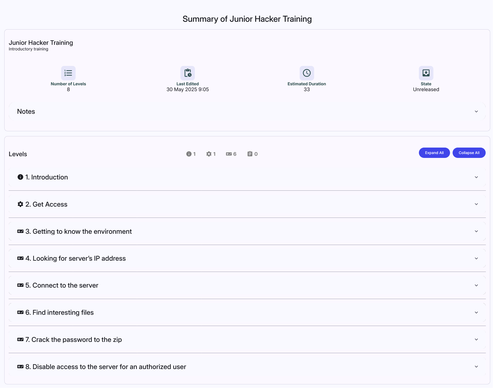

## Linear Training Definition Overview
This page lists all definitions available to the instructor (the instructors can see only the ones they create or the ones they are co-authors of). In the top right corner are located buttons  and  that are used to [add a new definition](#add-a-new-definition) into the KYPO portal. In the following table, each row represents one training definition. The last column of this table contains actions :material-pencil:{: .blue .icon} &nbsp; :material-delete:{: .red .icon} &nbsp; :material-file-multiple:{: .blue .icon} &nbsp; :material-cloud-download:{: .blue .icon} &nbsp; :material-eye:{: .blue .icon} &nbsp; :material-lock:{: .red .icon}/:material-lock-open-outline:{: .red .icon} that can be executed on a given training definition. Click on the training definition name to redirect to the [detail page](#linear-training-definition-detail).

  

!!! info
    Users with the role `ROLE_TRAINING_ADMINISTRATOR` can see all the training definitions.

??? pencil "Edit"
    
    Click the button, and the training definition editor page will be opened:
    
    

        
    

    
    Here the instructor can use given panels to edit a training definition in the same fashion as [creating a new definition](#1-create-a-new-definition). Every change needs to be saved with the  button. 
    
    !!! info
        The instructor can only save changes made in the training definition that is **Unreleased**. **Released** and **Archived** definitions cannot be changed.
    
??? trash-can "Delete"
    
    Click the button, and the following confirmation window will be opened: 
    
    

      
    

    
    After confirming, the given training definition will be deleted from the KYPO portal.
    
    !!! info
        Training definitions used in any **training instance** cannot be deleted. 

??? clone "Clone"
    
    Click the button, and the following window will be opened:
    
    

      
    

    
    Here the instructor can change the name of the new training definition that will be added to the KYPO portal. The contents of this new definition will be identical to the original training definition.
    
??? download "Download"
    
    Click the button to export the respective training definition as a file in JSON format that can be downloaded into the local machine. This file can be used to [upload](#2-upload-a-definition-from-json-file) a given definition back into the KYPO portal. 
    
??? preview "Preview"
   
    Click the button to show how the training definition will look from the trainee's perspective. Solution and hints are automatically revealed in the preview of the training definition, but they remain hidden during the training run and can be revealed by clicking the respective button. Stepper can be used to navigate between levels.
    
    

      
    

    
    !!! info
        Sandbox topologies in the preview are mocked and not connected to any real sandbox, so they cannot be used to access any virtual network.

??? lock "Release"
   
    Click the button to change the definition state to **Released**. 
    Released definitions cannot change their content, but their state can be changed to either **Unreleased** or **Archived**.
 
??? unlock "Unrelease"
    
    Click the button to change the definition state to **Unreleased**.
    Unreleased definitions allow the instructor to edit the content inside them and change its state to **Released**.

??? archive "Archive"

    Click the button to change the definition state from **Released** to **Archived**.
    Archived definitions cannot change their **Archived** state and can no longer be modified.

## Add a New Definition
There are three approaches on how to create a new training definition. 

1. [Create a new definition](#1-create-a-new-definition) from scratch. 
2. [Upload a definition ](#2-upload-a-definition-from-json-file) from a JSON file.
3. The last approach is to clone an already existing definition. More about it is written in the previous [subsection](#linear-training-definition-overview)).

### 1. Create a New Definition
To create a new training definition, click on the top right button . It will open the training definition editor page.

#### Create Linear Training Definition Panel
In the first panel of the training definition editor, the instructor can edit fields that describe the new definition. When the instructor is done, they can either click on  button that will create a new definition and redirect them to the edit page for training definition. It will allow the instructor to edit **designers** and **levels** of the definition.

    

#### Levels Panel
This panel is part of the [Create Linear Training Definition Panel](#create-linear-training-definition-panel), where the instructor can add, delete, and edit training levels of the training definition.

  

To add a new level, the instructor can click  that will roll down a menu in which the instructor can choose a type of the new level:

  

Each change made inside a level must be saved with the  button at the top of [Create Linear Training Definition Panel](#create-linear-training-definition-panel).

!!! tip
    To change the order of levels, use the drag-and-drop mechanism. Select a level in the level bar by "grabbing" it and dragging it to a different position.

##### I. Training Level
At the training level, a trainee can access a virtual network inside the sandbox to find a solution to the assignment. The instructor can fill this form to specify details of the new level. Training definition is considered [APG](../../../user-guide-advanced/trainings/trainings-overview.md#automatic-generation-problem-apg-in-linear-training-definition) if ***Variant Answers*** is checked, and ***Correct Answer - Variable Name*** is filled. **Variant Answers** also require a specific sandbox definition that defines specified **variable name**. If variable names do not match between training definition and sandbox definition, you will get notified during training instance creation.

  

Under the training level editing form, there is an additional **Hints** panel that the instructor can use to create, delete and edit hints associated with a given training level.

  

A new hint can be added with the  button and edited with the following form. To change the order of hints, use the drag-and-drop mechanism. 

  

Under the hints panel, there is a **MITRE ATT&CK Techniques** panel that the instructor can use to add techniques associated with a given training level.

  

Under the MITRE ATT&CK techniques panel is an **Expected Commands** panel that the instructor can use to add commands which should be used to solve a given training level. This functionality will be further enhanced as a part of a future release related to cheating detection.

  

##### II. Assessment Level
At the _assessment level_, the trainees answer a list of questions. Content of this level can be edited with the following form.

  

Under the assessment level editing form, there is an additional **Questions** panel to create, delete and, edit questions associated with the given assessment level:
 

  

The instructor can choose to create a test or questionnaire, so the creation of the question may differ based on the type of assessment. A new question can be added with the  button that will roll down the menu where the instructor can choose a type of the new question:

  

Each type has its specific editing form.

  

  

  

##### III. Info Level
In the _info level_, the trainees read the content of the information written by the instructor in the following form:

  

##### IV. Access Level
In the _access level_, a trainee is provided with information on accessing the cloud or local sandbox. Either cloud or local content is displayed during a training run based on the selected environment in a training instance. In local content, special placeholder variables can be used. The specific variables are listed in the level description below. To use it, they need to be placed in curly brackets inside the text. The variables are then replaced by actual values when the content is displayed to a trainee. A trainee must submit a passkey to proceed to the next level. Passkey can be provided to trainees by an instructor or can be mentioned in the training level content. 

  

#### Designers Panel
In the second panel of the training definition editor, the instructor can add and remove designers from the definition.

  

### 2. Upload a Definition From JSON File
To upload a training definition, click in the **Linear Training Definition Overview** on the top right  button. It will open the following window:

  

Upload training definition that has been downloaded as a file in JSON format. This use case is useful when the instructor wants to re-use the training definition stored in the past. Try downloading and uploading an [example training definition](https://gitlab.ics.muni.cz/muni-kypo-crp/prototypes-and-examples/sandbox-definitions/kypo-crp-demo-training/-/blob/master/training.json) prepared by our team.

## Linear Training Definition Detail
This page provides detail of the selected training definition in two panels. The first panel displays elementary information regarding the number of levels, when it was last edited, its estimated duration, whether the option to display stepper was selected, and its current state. On the other hand, the second panel describes definition levels in detail. Detail for a particular level may vary based on its type and can be opened by clicking the expand button  :material-chevron-down:{: .grey .icon } (on the opposite side to the level name). The detail page provides an option to expand or collapse these details for all levels at once.

Info level detail contains only content of the level. However, Assessment level detail sums all necessary information about the level together with its questions and correct answers.

Training level detail sums all necessary information about the level together with its content, solution, and possible hints.

