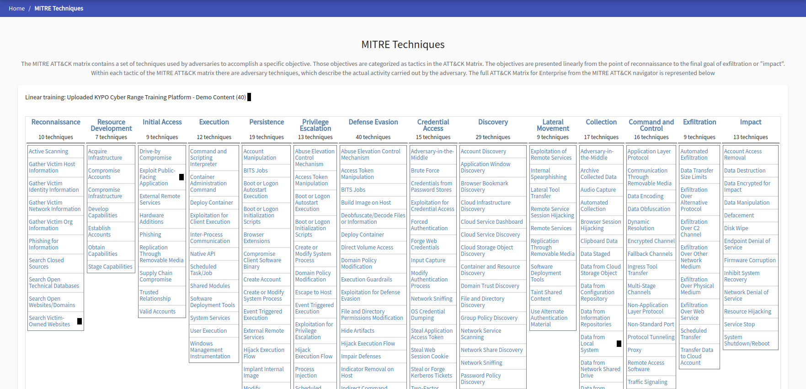
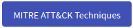

## Mitre Technique Service
This page provides a visualization of [MITRE ATT&CK matrix](https://attack.mitre.org/), extended by additional information about which linear and adaptive training definitions focus on specific tactics. 

  

!!! note
    The version of the MITRE ATT&CK matrix is [this one](https://attack.mitre.org/resources/updates/updates-october-2021/index.html) from October 2021.

It can be accessed by clicking the  button, available on the [Linear](linear-training-definition.md#linear-training-definition-overview) / [Adaptive Training Definition Overview page](adaptive-training-definition.md#adaptive-training-definition-overview). It is meant to help instructors when selecting the right training, as well as the creators of training definitions to show which topics are not covered yet.

!!! note
    The MITRE ATT&CK matrix only displays **released** training definitions.

Another version of this matrix can be accessed by clicking the same button on the [Training Runs Overview page](../training-run/linear-training-run.md#training-runs-overview). This version has a switch in the top right corner and can display both the previous view, and the view with only the training that the particular trainee has played. It is meant to help trainees show the topics in the training they underwent and find out which training to take on next.

!!! note
    The trainees are only able to view the played training definitions as long as the corresponding training runs exist.  
