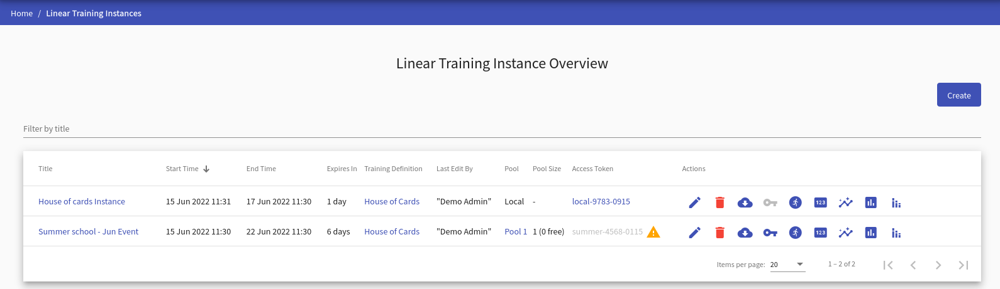
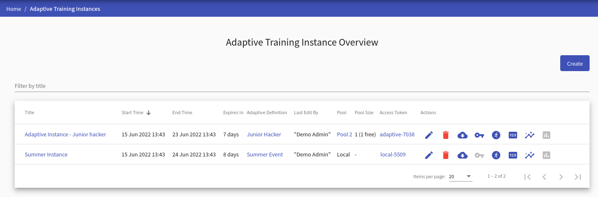
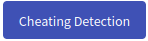

Although the pages for managing linear and adaptive training instances are very similar, they are explicitly divided into two standalone pages for more straightforward and transparent management of both types.

## Training Instance Overview
The page lists all training instances available to the instructor (ones that the given instructor created or is co-author of). The page for the linear training instances looks as follows: 

  

and for the adaptive training instance looks as follows:

  

Regardless of the instance type, on the page, the instructor can do the following actions:

* Click  to redirect to the page [Create/Edit Training Instance](#1-createedit-training-instance).
* Click on the name of the training instance to redirect to the [Summary of Training Instance](#summary-of-training-instance) page.
* Click on the name of the training definition to redirect to the [Detail of Linear Training Definition](../training-definition/linear-training-definition/#linear-training-definition-detail)/[Detail of Adaptive Training Definition](../training-definition/adaptive-training-definition/#adaptive-training-definition-detail) page.
* Click the pool's name (if training instance has disabled local environment and has assigned pool) to redirect to the page with pool detail. 
* Click the access token to copy it into your clipboard. The token cannot be copied if no pool is assigned (:material-alert-circle:{: .red .icon}) or no free sandbox is available (:material-alert:{: .warning .icon}).
* The last column of the table contains actions :material-pencil:{: .blue .icon} &nbsp; :material-delete:{: .red .icon} &nbsp; :material-cloud-download:{: .blue .icon} &nbsp; :material-key:{: .blue .icon} &nbsp; :bootstrap-run-circle:{: .blue .icon} &nbsp; :bootstrap-pin:{: .blue .icon} &nbsp; :bootstrap-insights:{: .blue .icon} &nbsp; :bootstrap-assessment:{: .blue .icon}. In addition, **linear training instance** overview table contains :bootstrap-stacked-bar-chart:{: .blue .icon} action.

    ??? pencil "Edit"
    
        Click the button, and the page [Create/Edit Training Instance](#1-createedit-training-instance) will be opened.
    
    ??? trash-can "Delete"
    
        Click the button to delete the training instance. In the case some conflict occurs (active training instance with assigned training runs, training instance with an assigned pool), the following confirmation window will be opened:
    
        

          
        

    
        Either click the **Ok** button and solve the problems that do not allow the deletion of the training instance, or use the **Force** button, which will delete all data about the training instance.

    ??? download "Get Data"
    
        Click the button to export the training instance results as files in JSON format that can be downloaded into the local machine in the ZIP archive. These files can be used to evaluate the progress of the trainees externally. The ZIP archive contains:

        * base information about the sandbox definition, 
        * description of the training definition with all levels,
        * description of the training instance,
        * folder `training_runs` with base information about all training runs,
        * folder `training_events` with the recorded events of individual training runs,
        * folder `command_histories` with the user actions of individual training runs.

    ??? key "Get SSH Configs"
    
        Click the button, and a pop-up will be displayed will be displayed to download the ZIP archive. The archive contains configuration with SSH access to the respective sandbox. More about SSH access can be found in [Sandbox SSH Access](../../../user-guide-advanced/sandboxes/sandbox-access/).
    
    ??? run-circle "Training Runs"
    
        Click the button to redirect to the [detail page](#training-instance-detail) for training instance.
    
    ??? pin "Display Token"
    
        Click the button to redirect to the page where the access token is displayed and is easily copyable.
   
    ??? insights "Show Progress"
    
        Click the button to redirect to the progress [visualizations for linear training](../visualizations/visualizations-for-linear/#progress-of-training-instance).
    
    ??? assessment "Show Results"
    
        Click the button to redirect to the post training [visualizations for linear training](#linear) or [visualizations for adaptive training](#adaptive).
     
    ??? stacked-bar-chart "Show Aggregated Results"
      
        Click the button to redirect to the post training [aggregated dashboard](../visualizations/visualizations-for-linear/#aggregated-dashboard).

## Training Instance Detail
Lists active training runs. Runs are either in the running or finished state (trainee completed all levels). All active training runs have assigned sandboxes from the pool. There are also columns indicating if there are any events and commands logged from the training run indicated by the icon (:material-check-circle-outline:{: .green .icon}) or if there are no events or commands logged yet (:material-alert:{: .warning .icon}). The instructor can delete the training run along with assigned sandbox from OpenStack by clicking :material-delete:{: .red .icon}. 

  

## Create/Edit Training Instance 
This page consists of two panels allowing an instructor to [create/edit training instance](#1-createedit-training-instance), [assign pool](#assign-pool), and [edit instructors](#2-edit-instructors).

During the creation of the training instance, the second panel is disabled. To make it accessible, the instructor must fill the required fields in the first panel save the training instance by clicking the  button. That creates the new training instance. The instructor will be redirected to the [Edit Training Instance](#1-createedit-training-instance) page and will be able to edit co-instructors of the instance in the panel **Organizers**.

  

### 1. Create/Edit Training Instance 
An instructor can use this panel to edit basic information about the training instance. The title identifies a training instance, among others but doesn't have to be unique. The start and end times define the time frame when trainees can access the training run of the appropriate training instance. Both time values must be in the future, and the start time must be before the end time. The trainees use the access token to access training. The instructor must also choose a Linear/Adaptive Training Definition, but they can only choose from:

* Released training definitions and definitions created by the instructor if they also have the instructor role. 
* All definitions (released/unreleased), if they also have the administrator role. 

An instructor can enable/disable backward mode which allows users to move between already passed levels/phases during the training run.
Moreover, instructors can choose if they will use local or cloud environment. Based on that they will be able to either **assign pool** or **assign sandbox definition**.

#### Assign Pool 
If local environment is disabled, instructors can use the subsection **Pools** to assign a pool with sandboxes to the training instance. Sandbox instances created in the pool are assigned to training runs and their topologies are displayed as part of the training levels/phases. The instructor chooses from the list of [pools](../../sandbox-agenda/pool) created by the sandbox instructor. It is necessary to select the pool properly. Also, a locked pool cannot be assigned to the training instance. To unassign the pool choose the ‘None’ option.

  

#### Assign Sandbox Definition 
If local environment is enabled, instructors can use the subsection **Sandbox Definitions** to assign a sandbox definition to the training instance. Topology of the sandbox definition will be displayed to trainees during the training run. The instructor chooses from the list of [sandbox definitions](../../sandbox-agenda/sandbox-definition) created by the sandbox instructor. It is necessary to select the sandbox definition properly. To unassign the sandbox definition choose the ‘None’ option.

  

### 2. Edit Instructors 
Allows the instructor to add other instructors to participate in managing training instances. Those instructors have the same rights against the training instance as the author, e.g., co-instructors, can edit training instances or see trainees' progress and training results.

## Summary of Training Instance 
Provides a summary of the entire run of the training instance and allows the instructors to see the state of training runs.

  

The first panel displays basic information about training instance, as shown in the above figure. Allows copying access token and provides a link to the detail of the assigned pool and training definition. Click on the  button **(only linear training instance)** to redirect to the [Progress of Training Instance](#progress-of-training-instance) page to see the training progress of participants in time. Click on another button  to redirect to the [Results of Training Instance](#results-of-training-instance) page to see summary results of training instance visualized on various graphs and in tables. Click the button  **(only linear training instance)** to redirect to the [Aggregated results of Training Instance](../visualizations/visualizations-for-linear/#aggregated-dashboard) page to see summary of results of all training instances sharing **the same** training definition visualized on various graphs. The next button  redirects to the page [Cheating Detection Overview](../training-agenda/cheating-detection.md) where you can execute cheating detection methods on the training instance. The last button  downloads an archive with the score of all trainees that played through the training.  

The second panel displays basic information about active training runs. These runs are either in the running or finished state. Clicking the expand button :material-chevron-down:{: .grey .icon } (next to the trainee's name) expands the row with additional information about the training run that displays correct answers for every training level and variable name if the training instance was created from [APG training definition](../../../user-guide-advanced/trainings/trainings-overview/#automatic-generation-problem-apg-in-linear-training-definition).

  

## Progress of Training Instance 
To see how the instance progresses, a dedicated visualization tool is available. It is described in [Visualizations for Linear Training](../visualizations/visualizations-for-linear/#progress-of-training-instance).

## Results of Training Instance 

### Linear

After a training session finishes, additional visualizations display its summary and its trainees' results. The visualizations are described in [Visualizations for Linear Training](../visualizations/visualizations-for-linear/#results-of-training-instance).

### Adaptive

A visualization of trainees' transitions between the tasks is described in [Visualizations for Adaptive Training](../visualizations/visualizations-for-adaptive/).

