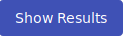

## Training Instance Overview
The page lists all training instances available to the instructor (ones that the given instructor created or is a co-author of). 

  

On this page, the instructor can do the following actions:

* Click  to redirect to the page [Create/Edit Training Instance](#1-createedit-training-instance).
* Click on the name of the training instance to redirect to the [Summary of Training Instance](#summary-of-training-instance) page.
* Click the name of the pool (if training instance has assigned pool) to redirect to the page with pool detail). 
* Click the access token to redirect to the page where the access token is displayed and is easily copyable. 
* The last column of the table contains actions :material-pencil:{: .blue .icon} &nbsp; :material-delete:{: .red .icon} &nbsp; :material-dots-vertical:{: .grey .icon}.

    ??? pencil "Edit"
    
        Click the button, the page [Create/Edit Training Instance](#1-createedit-training-instance) will be opened.
    
    ??? trash-can "Delete"
    
        Click the button to delete the training instance. In the case, some conflict occurs (active training instance with assigned training runs, training instance with an assigned pool), the following confirmation window will be opened:
    
        

          
        

    
        Either click the **Ok** button and solve the problems that do not allow the deletion of the training instance, or use the **Force** button, which will delete all data about the training instance.

    ??? download "Download"
    
        Click the button to export the training instance results as files in JSON format that can be downloaded into the local machine in the ZIP archive. These files can be used to evaluate the progress of the trainees externally. The ZIP archive contains:

        * base information about the sandbox definition, 
        * description of the training definition with all levels,
        * description of the training instance,
        * folder `training_runs` with base information about all training runs,
        * folder `training_events` with the recorded events of individual training runs,
        * folder `command_histories` with the user actions of individual training runs.

    ??? key "Get Access"
    
        Click the button, pop up will be displayed to download the ZIP archive. The archive contains configuration with SSH access to the respective sandbox. More about SSH access can be found in [Sandbox SSH Access](../../../user-guide-advanced/sandboxes/sandbox-ssh-access/).
    
    

## Create/Edit Training Instance 
This page consists of three panels allowing user to [create/edit training instance](#1-createedit-training-instance), [assign pool](#2-assign-pool), and [edit instructors](#3-edit-instructors).

During the creation of the training instance, the second and third panels are disabled. To make them accessible, the instructor must fill the required fields in the first panel and either click: 
1.  that will create the new training instance and redirect the instructor back to the [Training Instance Overview](#training-instance-overview). 
2.  that will allow the instructor to edit **co-instructors** and assing **pools** to the instance.

  

### 1. Create/Edit Training Instance 
An instructor can use this panel to edit basic information about the training instance. The title is used to identify a training instance, among others but doesn't have to be unique. The start time and end time defines the time frame when trainees can access training run of the appropriate training instance. Both time values must be in the future, and the start time must be before the end time. The access token is used by the trainees to access a game. The instructor must also choose a Training Definition, but they can only choose from:

* Released training definitions and definitions created by the instructor, if they also have the instructor role. 
* All definitions (released/unreleased), if they also have the administrator role. 

### 2. Assign Pool 
An instructor can use this panel to assign a pool with sandboxes to the training instance. The instructor chooses from the list of [pools](../../sandbox-agenda/pool/) created by the sandbox instructor. It is necessary to select the pool properly. Also, a locked pool cannot be assigned to the training instance.

### 3. Edit Instructors 
Allows the instructor to add other instructors to participate in managing training instances. Those instructors have the same rights against the training instance as the author, e.g. co-instructors, can edit training instance or see the progress of trainees and training results.

## Summary of Training Instance 
Provides a summary of the entire run of the training instance and allows the instructors to see the state of training runs ([overview](#1-overview), [active training runs](#2-active-training-runs), and [archived training runs](#3-archived-training-runs)) and also perform certain actions on these panels.

  

### 1. Overview
Overview displays basic information about training instance, as shown in the above figure. Provides links to display token and link to the detail of the assigned pool. Click on the  button to redirect to the [Progress of Training Instance](#progress-of-training-instance) page to see the game progress of participants in time. Click on another button  to redirect to the [Results of Training Instance](#results-of-training-instance)  page to see summary results of training instance visualized on various graphs and in tables. 

### 2. Active Training Runs
Lists active training runs. Runs are either in the running state or finished state (trainee completed all levels). All active training runs have assigned sandboxes from the pool. The instructor is able to delete the assigned sandbox from OpenStack by clicking :material-delete:{: .red .icon}. Be careful when deleting the sandbox from a training run in the running state. The trainee will not be able to complete the remaining levels. Those training runs should be archived after that, so trainees could not resume training run. 

Click the archive button :material-package-down:{: .icon .blue } to change the state of a training run to archived, the reference to sandbox is removed, and the training run is displayed among archived training runs.

### 3. Archived Training Runs 
Lists training runs whose references to sandboxes in OpenStack were removed, and their state has been changed to archived. 

## Progress of Training Instance 
Page visualize individual progress of trainees in training runs. The instructor can see the time of particular events made by trainees, like the start of the training run, taken hints, completed level, etc. It is also possible to filter finished and unfinished training runs. 

  

## Results of Training Instance 
The page displays all collected data about the training instance divided into five tabs. The overview tab displays all graphs and tables in a single tab. Tabs [Score Development](#1-score-development), [Score Scatter Plot](#2-score-scatter-plot), and [Progress](#3-progress) provides various views on trainees activity in the training. Tab [Assessments](#4-assessments) provides information about trainees' answers in quizzes and assessments. 

### 1. Score Development 
The tab displays a graph with a real-time development of the trainees' scores marked in the table under the graph. The graph also displays various types of events (displayed by a small circle). To visualize events taken by trainees, check/uncheck a checkbox displayed next to the table with participants. 

  

### 2. Score Scatter Plot 

  

### 3. Progress 

  

### 4. Assessments 
Displays statistics of individual assessment answers.
 

  

