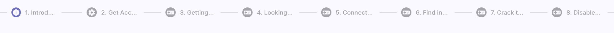
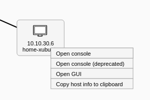

## Training Runs Overview
The page consists of a panel providing [access to training](#1-access-training) and a list of [training runs](#2-training-runs).

  

### 1. Access Training
Enter the access token prefix and PIN provided by the instructor of the training instance into the two fields shown in the above figure. By clicking on  the button the system checks if there are any active training instances with a corresponding access token and if there are any available sandboxes. If those conditions are fulfilled, the trainee will access the training run (particular game) with an assigned unique sandbox.

!!! note
    If a trainee already accessed training run in a particular training instance and haven't finished it yet, the training run will be resumed. 

### 2. Training Runs
It lists all training runs of the logged-in trainee. Each row of the table represents a training run of a particular training instance (trainee can access multiple training runs within training instance). The training run can be unfinished or finished. An unfinished run can be resumed using the :material-launch:{: .blue .icon} button or entering the access token in the Access Training panel.  

## Training Run

In the training run, trainees will go through predesigned phases. There is a bar listing all of the phases in order at the top of the training run page. The finished phases are marked by :material-checkbox-marked-circle:{: .blue .icon}, the current phase is highlighted in blue and the following phases are gray. In the current version, there are available three types of phases ([questionnaire phase](#1-questionnaire-phase), [info phase](#2-info-phase), and [training phase](#3-training-phase)).

### 1. Questionnaire Phase
At the questionnaire phase, a trainee must answer the different types of questions. Questions that are left blank are considered to be wrongly answered. 

There are three types of questions: 

* **Free Form Question (FFQ)**: Trainees are asked to provide the text answer to the predefined field. 
* **Multiple Choice Questions (MCQ)**: Trainees are asked to select only correct answers from the choices offered as a list.
* **Rating Form Questions (RFQ)**: Trainees are asked to choose one option from a spectrum. 

  

### 2. Info Phase
The info phase is used to provide important information to trainees in text form.

  

### 3. Training Phase 
At the training phase, the trainee must complete the assignment specified on the page's left side. On the right, side the sandbox topology is displayed. The layout of the topology can be changed with the controls panel(see the following figure):

  

#### VM Manipulation
Right click on the selected network node (host or router), the following menu will be opened:

  

* **Generate console URL**: Connect to Spice console for a particular network node (this is provided by OpenStack cloud). When you connect to the Spice client, you will see the following console in a new browser tab. If you will provide a correct login and password combination, you will be able to work inside of the corresponding VM:

    

        
    

* **Resume**: Resuming a suspended virtual machine is analogous to waking up a computer that has been in sleep mode.
* **Reboot**: Rebooting a virtual machine is analogous to restarting a computer.
* **Suspend**: Suspending a virtual machine is analogous to putting a computer into sleep mode. 

#### Solution
If trainee feels stuck, they can reveal the solution by clicking the .

#### SSH Access
In addition to connecting to the sandbox using Spice, it is also possible to connect to the sandbox machines locally using SSH. To do that, click the  button and download the ZIP archive with the configuration of a user SSH access to the respective sandbox. More about SSH access can be found in [Sandbox SSH Access](../../../../user-guide-advanced/sandboxes/sandbox-access/#user-access).
